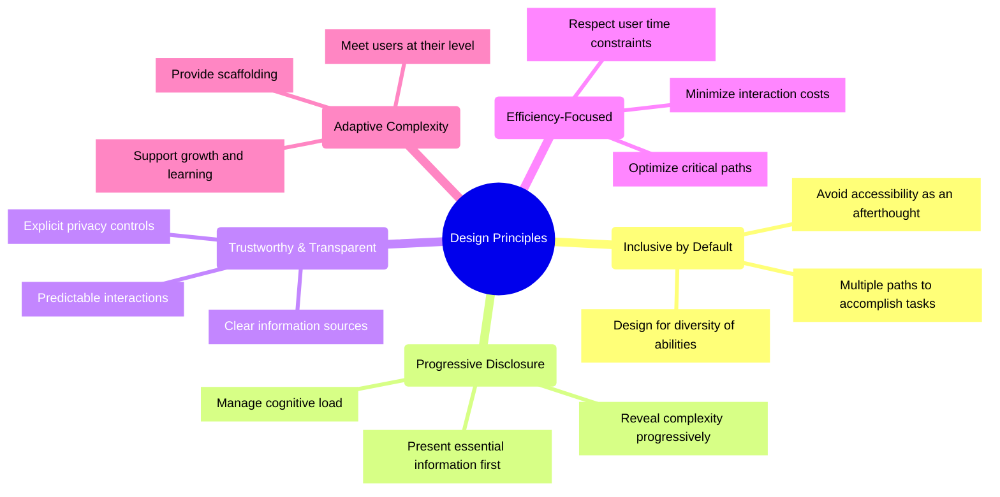

# Patient Advocacy Platform: Design System

## Design Principles

The Patient Advocacy Platform is guided by the following core design principles:



## Brand Identity

### Logo & Brand Assets
- **Primary Logo**: A symbolic representation combining a shield (protection) with a heart (care)
- **Color Variations**: Full color, monochrome, and reversed versions
- **Usage Guidelines**: Clear space requirements, minimum sizes, and improper usages

### Brand Voice
- **Tone**: Compassionate, empowering, clear, and professional
- **Language**: Accessible, jargon-free, and focused on patient empowerment
- **Communication Style**: Direct, supportive, and solution-oriented

## Color System

### Primary Colors
- **Primary Blue**: `#3b82f6` (Tailwind blue-500)
  - Hover: `#2563eb` (blue-600)
  - Active: `#1d4ed8` (blue-700)
  - Light: `#93c5fd` (blue-300)

- **Secondary Indigo**: `#6366f1` (Tailwind indigo-500)
  - Hover: `#4f46e5` (indigo-600)
  - Active: `#4338ca` (indigo-700)
  - Light: `#a5b4fc` (indigo-300)

### Role-Based Colors
- **Patient**: `#818cf8` (Tailwind indigo-400)
- **Advocate**: `#34d399` (Tailwind emerald-400)
- **Provider**: `#60a5fa` (Tailwind blue-400)

### Semantic Colors
- **Success**: `#22c55e` (Tailwind green-500)
- **Warning**: `#f59e0b` (Tailwind amber-500)
- **Error**: `#ef4444` (Tailwind red-500)
- **Info**: `#3b82f6` (Tailwind blue-500)

### Neutral Colors
- **White**: `#ffffff`
- **Gray-50**: `#f9fafb`
- **Gray-100**: `#f3f4f6`
- **Gray-200**: `#e5e7eb`
- **Gray-300**: `#d1d5db`
- **Gray-400**: `#9ca3af`
- **Gray-500**: `#6b7280`
- **Gray-600**: `#4b5563`
- **Gray-700**: `#374151`
- **Gray-800**: `#1f2937`
- **Gray-900**: `#111827`

### Color Usage Guidelines

- **Text**: Gray-900 for primary text, Gray-700 for secondary text
- **Backgrounds**: White for cards, Gray-50 for page backgrounds
- **Borders**: Gray-200 for subtle borders, Gray-300 for pronounced borders
- **Interactive Elements**: Primary colors for clickable items
- **Role-Based Elements**: Use patient, advocate, or provider colors for role-specific interfaces

## Typography

### Font Family

```css
--font-family-base: 'Inter', -apple-system, BlinkMacSystemFont, 'Segoe UI', Roboto, Oxygen, Ubuntu, Cantarell, 'Open Sans', 'Helvetica Neue', sans-serif;
```

### Type Scale

```css
--text-xs: 0.75rem;     /* 12px */
--text-sm: 0.875rem;    /* 14px */
--text-base: 1rem;      /* 16px */
--text-lg: 1.125rem;    /* 18px */
--text-xl: 1.25rem;     /* 20px */
--text-2xl: 1.5rem;     /* 24px */
--text-3xl: 1.875rem;   /* 30px */
--text-4xl: 2.25rem;    /* 36px */
--text-5xl: 3rem;       /* 48px */
```

### Line Heights

```css
--leading-none: 1;
--leading-tight: 1.25;
--leading-snug: 1.375;
--leading-normal: 1.5;
--leading-relaxed: 1.625;
--leading-loose: 2;
```

### Font Weights

```css
--font-thin: 100;
--font-extralight: 200;
--font-light: 300;
--font-normal: 400;
--font-medium: 500;
--font-semibold: 600;
--font-bold: 700;
--font-extrabold: 800;
--font-black: 900;
```

### Typography Usage

- **Headings**: Semi-bold (600) weight
- **Body Text**: Regular (400) weight
- **Interactive Elements**: Medium (500) weight
- **Emphasis**: Semi-bold (600) or medium (500) weight
- **Captions**: Regular (400) weight at small size

## Spacing System

### Spacing Scale

```css
--space-0: 0px;
--space-1: 0.25rem;     /* 4px */
--space-2: 0.5rem;      /* 8px */
--space-3: 0.75rem;     /* 12px */
--space-4: 1rem;        /* 16px */
--space-5: 1.25rem;     /* 20px */
--space-6: 1.5rem;      /* 24px */
--space-8: 2rem;        /* 32px */
--space-10: 2.5rem;     /* 40px */
--space-12: 3rem;       /* 48px */
--space-16: 4rem;       /* 64px */
--space-20: 5rem;       /* 80px */
--space-24: 6rem;       /* 96px */
```

### Spacing Usage

- **Component Padding**: 16px (--space-4) standard internal padding
- **Grid Gap**: 24px (--space-6) between grid items
- **Section Spacing**: 48px (--space-12) vertical spacing between major sections
- **Container Margins**: 32px (--space-8) edge margins for containers on desktop
- **Mobile Margins**: 16px (--space-4) edge margins on mobile devices

## Layout System

### Breakpoints

```css
--screen-sm: 640px;
--screen-md: 768px;
--screen-lg: 1024px;
--screen-xl: 1280px;
--screen-2xl: 1536px;
```

### Container Widths

```css
--container-sm: 640px;
--container-md: 768px;
--container-lg: 1024px;
--container-xl: 1280px;
--container-2xl: 1536px;
```

### Grid System

- 12-column grid system using Tailwind's grid utilities
- Consistent gutters of 24px (--space-6)
- Responsive column configurations:
  - Mobile: 4-column grid
  - Tablet: 8-column grid
  - Desktop: 12-column grid

## Accessibility Standards

Our design system is built to meet WCAG 2.1 AA standards for accessibility:

### Color & Contrast
- All text meets WCAG 2.1 AA standards
  - 4.5:1 contrast ratio for normal text
  - 3:1 contrast ratio for large text
- Non-text elements have sufficient contrast
- Interface does not rely solely on color to convey information

### Typography & Readability
- Line height minimum 1.5 for body text
- Paragraph spacing minimum 1.5 times larger than line spacing
- Text can be resized up to 200% without loss of content
- No justified text to avoid "rivers" of white space

### Keyboard Navigation
- All interactive elements accessible via keyboard
- Logical tab order following visual layout
- Focus states clearly visible (2px outline)
- Skip links for main content areas

### Screen Reader Support
- Semantic HTML throughout the application
- ARIA landmarks for main areas (header, main, nav, etc.)
- Alternative text for all informative images
- Form labels explicitly associated with inputs
- ARIA attributes for custom components

### Motion & Animation
- Respects user preferences via `prefers-reduced-motion` media query
- Essential animations are subtle and brief (≤ 400ms)
- No content flashes more than 3 times per second

## Implementation with Tailwind

The design system is implemented using Tailwind CSS, with customizations to the default theme:

```javascript
// tailwind.config.js example
module.exports = {
  theme: {
    extend: {
      colors: {
        primary: {
          light: '#93c5fd', // blue-300
          DEFAULT: '#3b82f6', // blue-500
          dark: '#1d4ed8', // blue-700
        },
        secondary: {
          light: '#a5b4fc', // indigo-300
          DEFAULT: '#6366f1', // indigo-500
          dark: '#4338ca', // indigo-700
        },
        patient: '#818cf8',
        advocate: '#34d399',
        provider: '#60a5fa',
        // Other custom colors
      },
      fontFamily: {
        sans: ['Inter', 'ui-sans-serif', 'system-ui', /* other fallbacks */],
      },
      // Other theme extensions
    }
  }
}
```

## Component Design Philosophy

Components are designed following these principles:

1. **Composable**: Components should be combinable in various ways
2. **Customizable**: Props allow for variants without forking components
3. **Accessible**: Built with accessibility in mind from the start
4. **Consistent**: Follow similar patterns across the component library
5. **Performant**: Designed for optimal rendering and update cycles

For detailed specifications of individual components, see the `/components` directory and `ui_specifications.md`.
