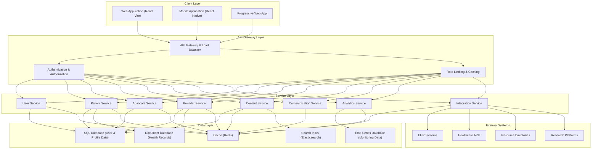
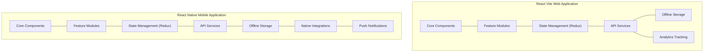
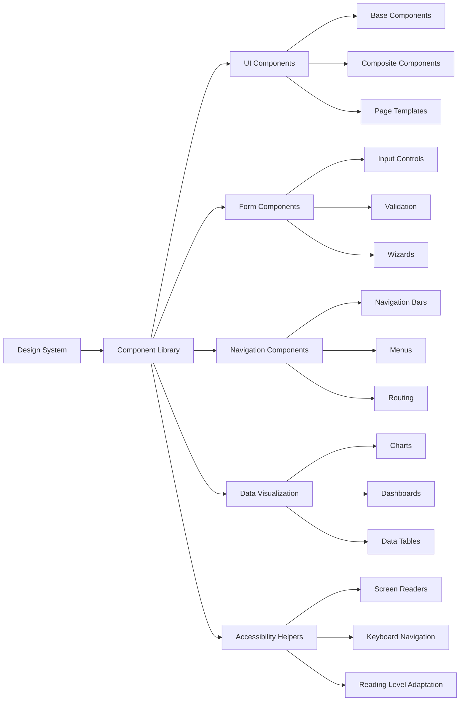
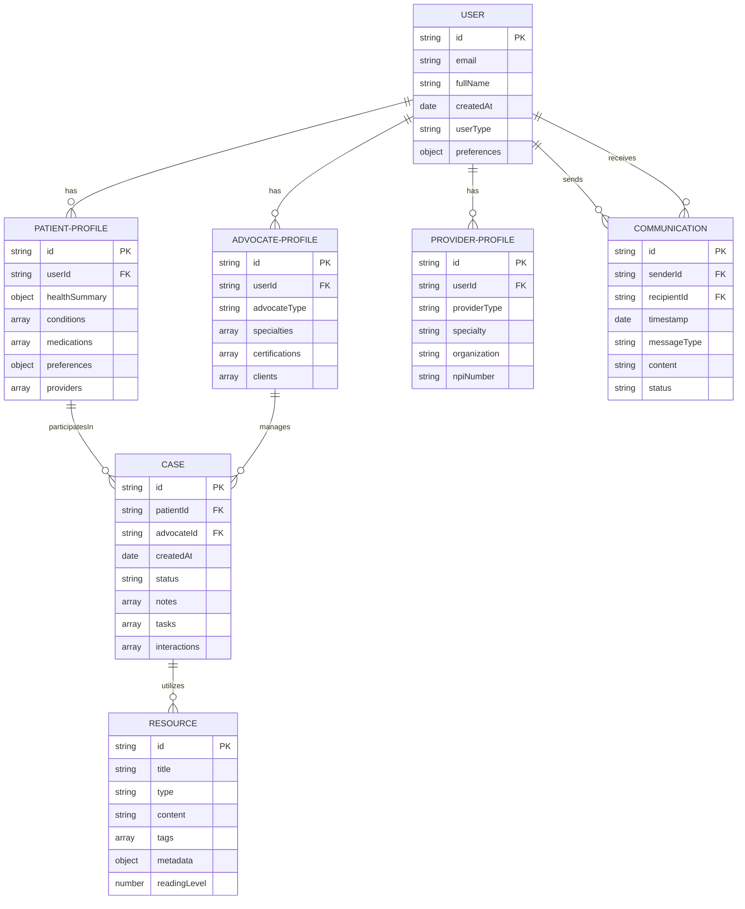
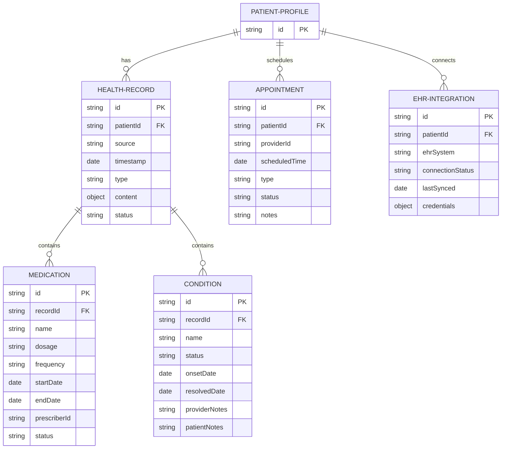
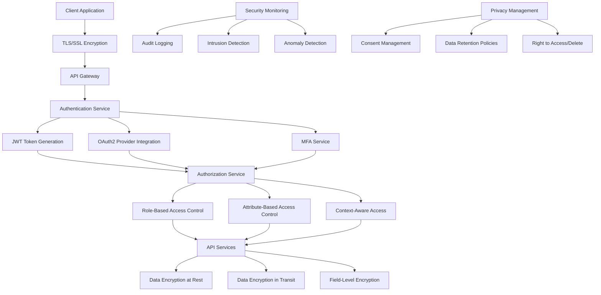
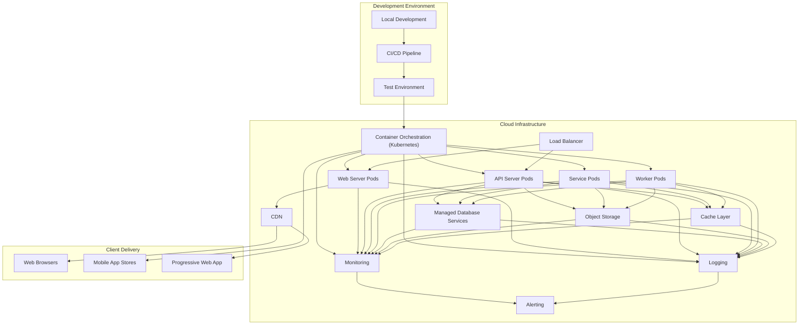
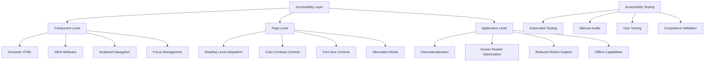
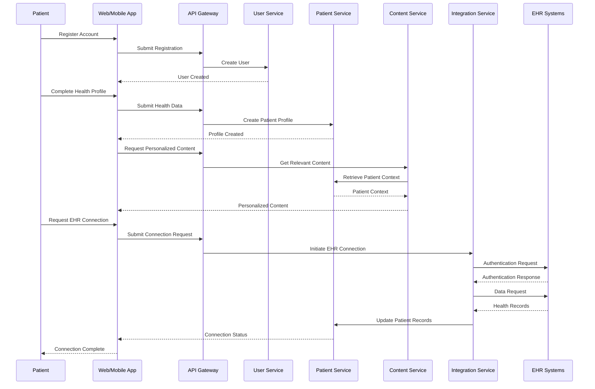
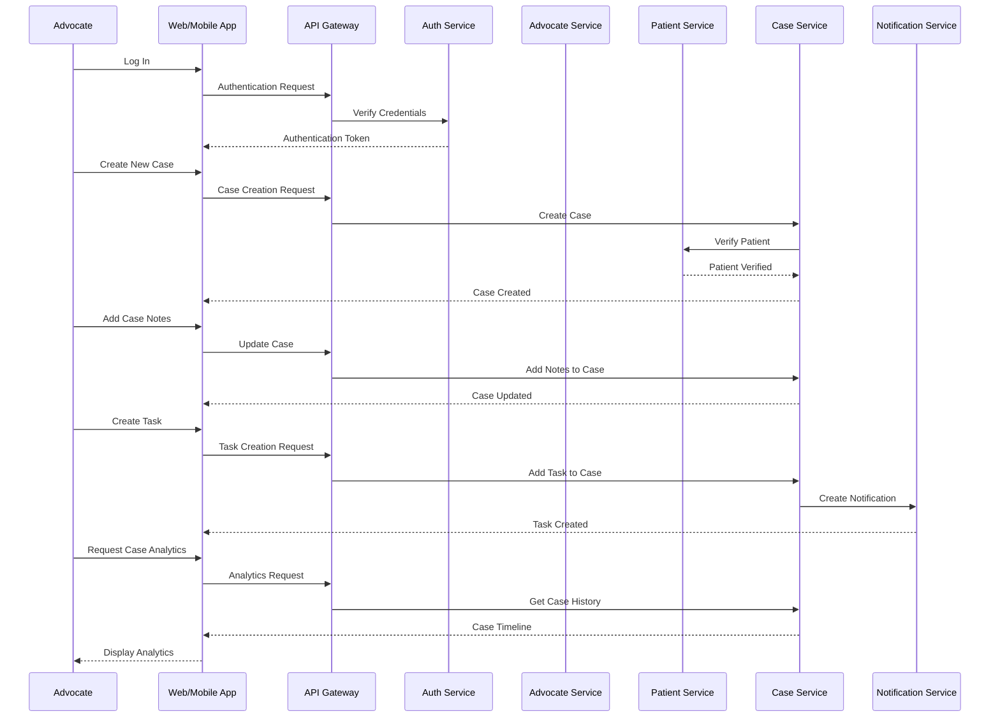

# Patient Advocacy Platform: System Architecture

## Overview

This document outlines the architectural design for the Patient Advocacy Platform, a comprehensive system designed to connect patients, advocates, and healthcare providers. The architecture follows modern best practices for scalable, secure, and maintainable web and mobile applications using React Vite and React Native.

## High-Level Architecture

## Component Architecture

### Client Applications

### Shared Component Library

## Data Architecture

### Core Data Model

### Health Data Integration Model

## Security Architecture

## Deployment Architecture

## Accessibility Architecture

## Data Flow: Patient Onboarding

## Data Flow: Advocacy Case Management

## Technical Stack Details

### Frontend Technologies
- **Framework:** React (Web), React Native (Mobile)
- **Build Tool:** Vite
- **State Management:** Redux Toolkit, Context API
- **UI Components:** Custom component library with Storybook
- **Styling:** Styled Components, Tailwind CSS
- **Accessibility:** react-aria, axe-core for testing
- **Testing:** Jest, React Testing Library, Detox (mobile)
- **Bundling:** Vite, Metro (React Native)

### Backend Technologies
- **API:** Node.js, Express.js
- **API Documentation:** OpenAPI (Swagger)
- **Authentication:** JWT, OAuth2
- **Database:** PostgreSQL (relational data), MongoDB (documents)
- **Caching:** Redis
- **Search:** Elasticsearch
- **Message Queue:** RabbitMQ
- **File Storage:** AWS S3 or equivalent

### DevOps
- **CI/CD:** GitHub Actions
- **Containerization:** Docker
- **Orchestration:** Kubernetes
- **Infrastructure as Code:** Terraform
- **Monitoring:** Prometheus, Grafana
- **Logging:** ELK Stack
- **APM:** New Relic

## Next Steps

1. **Architecture Validation**
   - Review architecture with stakeholders
   - Validate against security and privacy requirements
   - Assess scalability and performance implications

2. **Component Design**
   - Develop detailed component specifications
   - Create component relationships and contracts
   - Define API interfaces and data models

3. **Proof of Concept**
   - Implement core architectural components
   - Validate technical assumptions
   - Test integration points with external systems

4. **Development Planning**
   - Create component development roadmap
   - Assign ownership of architecture domains
   - Establish architecture governance process

## References

1. HIPAA Security Rule Requirements
2. FHIR Implementation Guides
3. Web Content Accessibility Guidelines (WCAG) 2.1
4. React Performance Best Practices
5. Microservices Design Patterns
