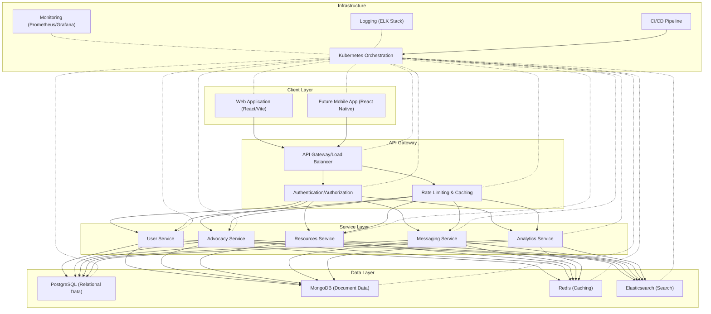
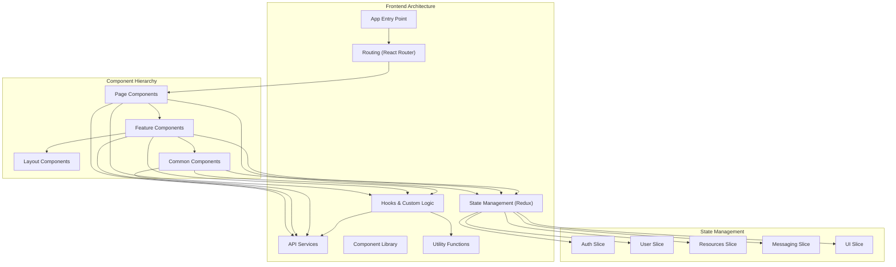
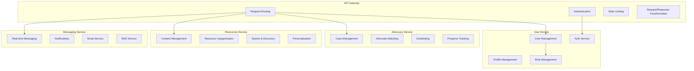
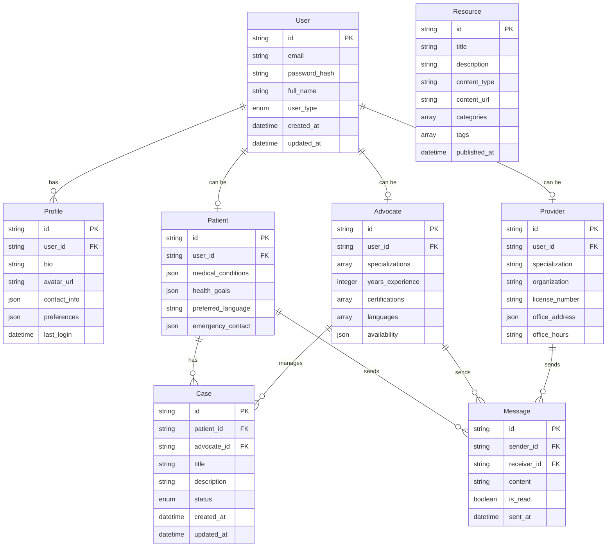

# Patient Advocacy Platform: Architecture, Design & UI/UX Plan

## 1. Architecture Overview

### 1.1 System Architecture

The Patient Advocacy Platform follows a modern microservices architecture pattern designed for scalability, maintainability, and future growth. The architecture consists of several key layers:

### 1.2 Component Architecture

#### 1.2.1 Frontend Architecture (React/Vite)

The frontend application follows a component-based architecture with clear separation of concerns:

#### 1.2.2 Backend Architecture

The backend follows a domain-driven design with microservices architecture:

### 1.3 Data Architecture

## 2. Design System

### 2.1 Design Principles

1. **User-Centered**: Designs prioritize user needs, making complex health advocacy processes accessible and intuitive.
2. **Inclusive**: Interfaces accommodate diverse abilities, literacy levels, and technical comfort.
3. **Trustworthy**: Visual language conveys professionalism, security, and reliability.
4. **Cohesive**: Consistent patterns and components across the platform create familiarity.
5. **Efficient**: Streamlined workflows minimize steps and cognitive load.

### 2.2 Color System

The color palette is designed to be accessible while communicating the brand's core values of trust, compassion, and empowerment.

#### Primary Colors
- **Blue (#3b82f6)**: Conveys trust, stability, and professionalism
- **Indigo (#6366f1)**: Adds depth and dimension to the interface

#### Secondary Colors
- **Green (#22c55e)**: Represents progress, success, and positive outcomes
- **Yellow (#f59e0b)**: Draws attention to important elements and conveys optimism

#### Role-Based Colors
- **Patient (#818cf8)**: Indigo shade for patient-focused elements
- **Advocate (#34d399)**: Teal shade for advocate-focused elements
- **Provider (#60a5fa)**: Blue shade for provider-focused elements

#### Neutral Colors
- **Gray scale**: From white (#ffffff) to dark gray (#111827)
- Used for text, backgrounds, and UI structure

### 2.3 Typography

#### Font Families
- **Headings**: Inter (Sans-serif)
- **Body**: Inter (Sans-serif)
- **Accents**: Inter (Sans-serif, medium weight)

#### Type Scale
- **Display**: 48px/60px
- **Heading 1**: 36px/44px
- **Heading 2**: 30px/38px
- **Heading 3**: 24px/32px
- **Heading 4**: 20px/28px
- **Body Large**: 18px/28px
- **Body**: 16px/24px
- **Body Small**: 14px/20px
- **Caption**: 12px/16px

### 2.4 Spacing System

Based on a 4px grid system:
- **4px**: Minimal spacing, icon padding
- **8px**: Tight spacing, between related elements
- **16px**: Standard spacing, component padding
- **24px**: Medium spacing, section padding
- **32px**: Large spacing, between major sections
- **48px**: Extra large spacing, page margins

### 2.5 Component Library

#### Core Components
- **Buttons**: Primary, Secondary, Tertiary, Icon
- **Inputs**: Text, Number, Date, Select, Checkbox, Radio, Toggle
- **Navigation**: Navbar, Sidebar, Tabs, Breadcrumbs
- **Feedback**: Alerts, Toasts, Progress Indicators
- **Data Display**: Cards, Lists, Tables, Charts
- **Dialogs**: Modals, Popovers, Tooltips
- **Layout**: Containers, Grids, Flexboxes

#### Specialized Components
- **Profile Cards**: For patients, advocates, and providers
- **Resource Cards**: For educational content
- **Case Management Cards**: For tracking advocacy cases
- **Timeline Component**: For tracking progress
- **Matching Interface**: For connecting patients with advocates

## 3. Feature Specification

### 3.1 Core Features

#### User Management
- **Registration & Authentication**
  - Role-based registration (Patient, Advocate, Provider)
  - Email/password authentication
  - Social login options
  - Multi-factor authentication
  - Password recovery

- **Profile Management**
  - Role-specific profile fields
  - Avatar/photo management
  - Contact information
  - Privacy settings
  - Account preferences

#### Dashboard System
- **Patient Dashboard**
  - Case overview
  - Assigned advocate information
  - Upcoming appointments
  - Recent messages
  - Recommended resources
  - Health progress metrics

- **Advocate Dashboard**
  - Active cases overview
  - Patient list
  - Task management
  - Schedule/calendar
  - Performance metrics
  - Resource library access

- **Provider Dashboard**
  - Patient overview
  - Advocate collaborations
  - Referral management
  - Schedule/calendar
  - Clinical resources

#### Advocacy Case Management
- **Case Creation**
  - Initial assessment
  - Goal setting
  - Document uploading
  - Medical history input

- **Advocate Matching**
  - Search filters (specialization, language, etc.)
  - Match recommendations
  - Advocate profiles
  - Rating and reviews

- **Case Tracking**
  - Status updates
  - Milestone tracking
  - Document management
  - Notes and observations

#### Resource Center
- **Educational Content**
  - Condition-specific information
  - Treatment guides
  - Insurance/billing resources
  - Patient rights information

- **Content Management**
  - Categorization
  - Search functionality
  - Favoriting/saving
  - Sharing capabilities

#### Communication
- **Messaging System**
  - Direct messaging
  - Group conversations
  - File sharing
  - Read receipts

- **Notification System**
  - In-app notifications
  - Email notifications
  - SMS alerts (optional)
  - Preference settings

### 3.2 Advanced Features (Future Phases)

#### Analytics & Reporting
- **Patient Progress Tracking**
- **Advocate Performance Metrics**
- **Resource Effectiveness Measurement**
- **System Usage Analytics**

#### Integration Capabilities
- **EHR/EMR Integration**
- **Calendar Synchronization**
- **Insurance Verification**
- **Telehealth Services**

#### AI-Assisted Features
- **Personalized Resource Recommendations**
- **Intelligent Advocate Matching**
- **Automated Documentation Assistance**
- **Predictive Health Insights**

## 4. UI/UX Implementation Plan

### 4.1 User Flows

#### Patient Journey
1. **Registration & Onboarding**
   - Sign up with role selection
   - Profile completion
   - Initial needs assessment
   - Preference setting

2. **Advocate Matching**
   - Search for advocates
   - Filter by needs
   - View advocate profiles
   - Select and connect

3. **Case Management**
   - Create new case
   - Track progress
   - Communicate with advocate
   - Access relevant resources

4. **Resource Utilization**
   - Browse resource library
   - Save and organize resources
   - Track learning progress
   - Provide feedback

#### Advocate Journey
1. **Registration & Verification**
   - Sign up with credentials
   - Profile completion
   - Expertise specification
   - Verification process

2. **Case Acceptance**
   - Browse available cases
   - Review patient information
   - Accept case assignment
   - Initial planning

3. **Case Management**
   - Track multiple cases
   - Document progress
   - Schedule interactions
   - Connect with providers

4. **Knowledge Management**
   - Access specialized resources
   - Track continuing education
   - Maintain resource library
   - Share with patients

### 4.2 Screen Designs

#### Key Screens
1. **Home Page**
   - Hero section with platform overview
   - Testimonials from users
   - Feature highlights
   - Call-to-action buttons

2. **Dashboard**
   - Role-specific information display
   - Summary metrics
   - Quick action buttons
   - Recent activity feed

3. **Profile Page**
   - Personal information
   - Role-specific fields
   - Profile completion indicator
   - Settings access

4. **Advocate Match Page**
   - Search interface
   - Filter controls
   - Results display
   - Detailed profiles

5. **Resource Library**
   - Category navigation
   - Search functionality
   - Content cards
   - Saved items

6. **Messaging Interface**
   - Conversation list
   - Message thread
   - Attachment capabilities
   - Notification indicators

### 4.3 Responsive Design Strategy

The platform will follow a mobile-first approach with responsive breakpoints:
- **Mobile**: 320px - 639px
- **Tablet**: 640px - 1023px
- **Desktop**: 1024px - 1439px
- **Large Desktop**: 1440px and above

Key responsive considerations:
- **Navigation**: Transforms to hamburger menu on smaller screens
- **Layout**: Single column on mobile, multi-column on larger screens
- **Touch Targets**: Minimum 44px × 44px for all interactive elements
- **Typography**: Fluid type scaling based on viewport
- **Images**: Responsive sizing and resolution switching

### 4.4 Accessibility Implementation

WCAG 2.1 AA compliance will be achieved through:
- **Semantic HTML**: Proper document structure and landmarks
- **Keyboard Navigation**: Full functionality without mouse
- **Focus Management**: Visible focus indicators
- **Screen Reader Support**: ARIA attributes and proper labeling
- **Color Contrast**: Minimum 4.5:1 for normal text, 3:1 for large text
- **Text Resizing**: Support for 200% text size without loss of content
- **Reduced Motion**: Respecting user preferences for animations

### 4.5 Implementation Priority

#### Phase 1: Foundation
- Core UI components
- Authentication system
- Basic profile management
- Responsive layouts

#### Phase 2: Core Features
- Dashboard implementation
- Resource library
- Basic messaging
- Advocate matching (simple version)

#### Phase 3: Advanced Features
- Advanced matching algorithm
- Case management tools
- Interactive resources
- Analytics dashboard

#### Phase 4: Integration & Optimization
- Third-party integrations
- Performance optimization
- Advanced accessibility
- Enhanced security features

## 5. Implementation Guidelines

### 5.1 Frontend Development

#### Technology Stack
- **Framework**: React with TypeScript
- **Build Tool**: Vite
- **State Management**: Redux Toolkit
- **Styling**: Tailwind CSS
- **Component Library**: Custom components
- **Form Handling**: React Hook Form
- **Data Fetching**: Axios + React Query
- **Testing**: Jest + React Testing Library

#### Development Workflow
1. **Component Development**
   - Build atomic components
   - Document in Storybook
   - Implement accessibility
   - Write unit tests

2. **Page Assembly**
   - Compose from components
   - Implement state management
   - Connect to API services
   - Optimize performance

3. **Testing & Validation**
   - Unit testing
   - Integration testing
   - Accessibility audit
   - Cross-browser testing

### 5.2 Backend Integration

#### API Structure
- RESTful endpoints for CRUD operations
- GraphQL for complex data requirements
- WebSockets for real-time features

#### Authentication
- JWT token-based authentication
- Role-based authorization
- Secure credential storage

#### Data Validation
- Schema validation for all inputs
- Sanitization of user inputs
- Error handling and feedback

### 5.3 Monitoring & Analytics

#### Performance Monitoring
- Core Web Vitals tracking
- Load time optimization
- Error tracking

#### User Analytics
- Feature usage metrics
- User flow analysis
- Conversion tracking
- Satisfaction measurement

## 6. Conclusion

This comprehensive plan provides a blueprint for developing the Patient Advocacy Platform with a focus on user experience, accessibility, and scalability. By following this architectural, design, and feature specification, the platform will deliver a cohesive and effective tool for patients, advocates, and healthcare providers.

The modular approach allows for progressive implementation, with each phase building upon the previous to create an increasingly robust and feature-rich platform while maintaining a consistent user experience and technical foundation.
