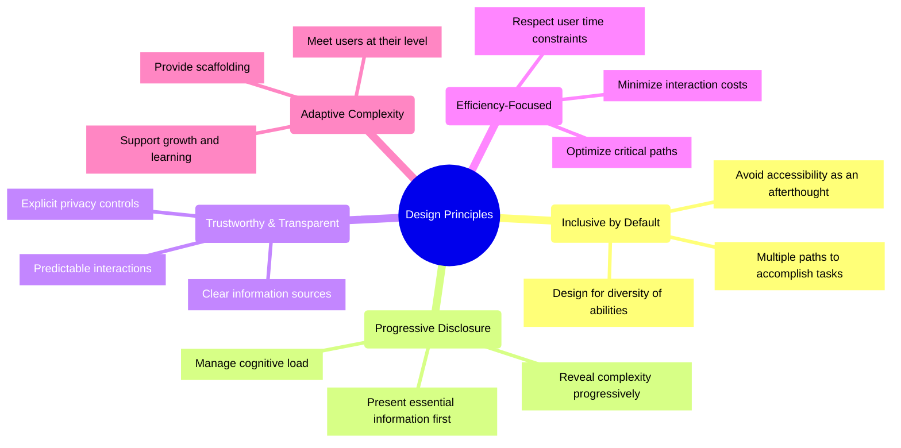
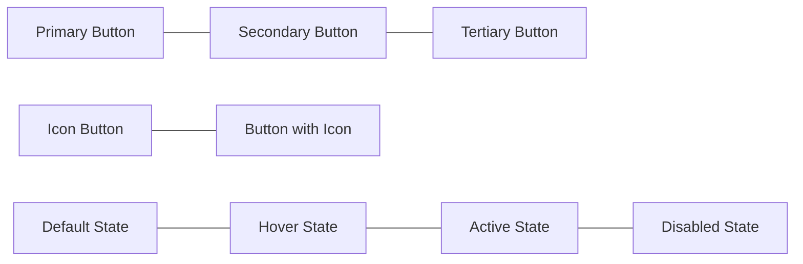
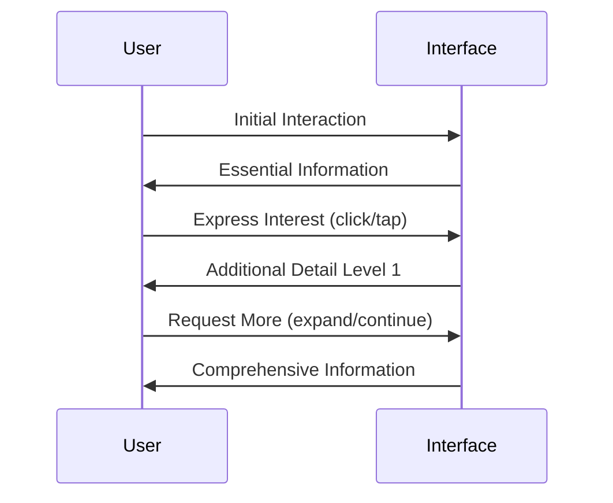
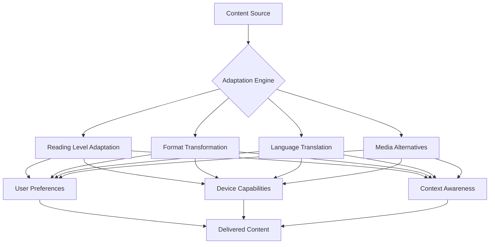
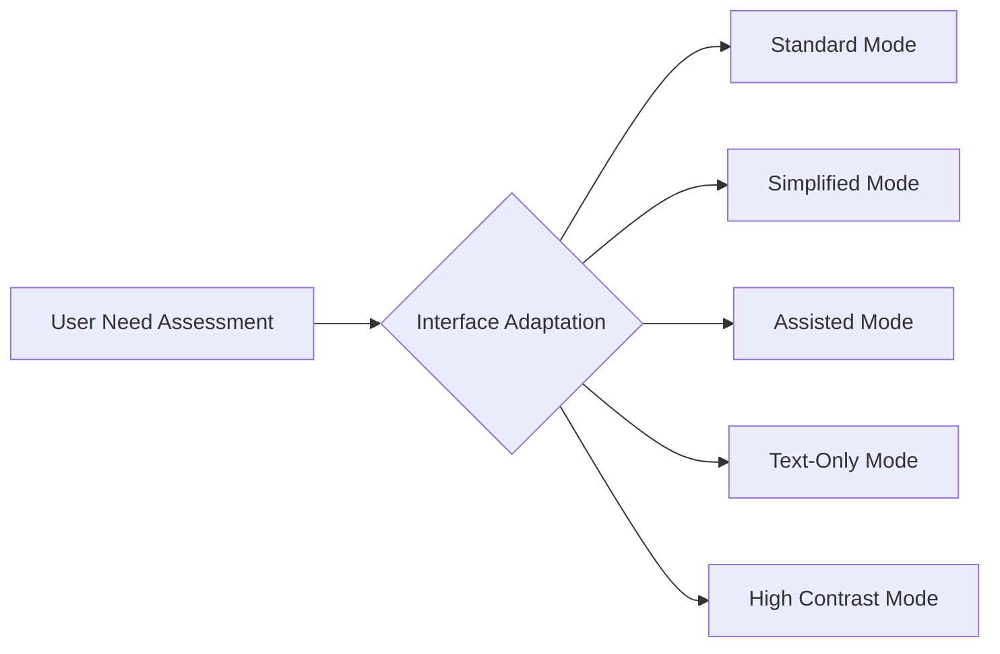
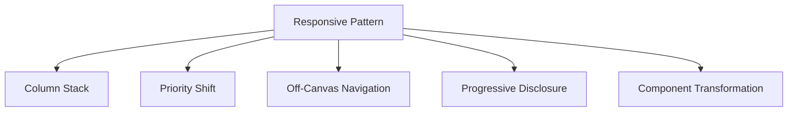
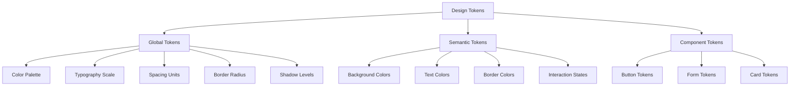

# Patient Advocacy Platform: UI/UX Design System

## Overview

This document outlines the design system for the Patient Advocacy Platform, providing guidelines for visual elements, interaction patterns, and accessibility considerations. The design system ensures consistency across web and mobile applications while addressing the diverse needs of our user personas.

## Design Principles



## Color System

### Primary Palette

The primary palette is designed for accessibility while conveying trust, clarity, and compassion. All color combinations meet WCAG 2.1 AA standards for contrast.

| Color | Hex Code | Usage |
|-------|----------|-------|
| Primary Blue | #1A73E8 | Primary actions, highlights |
| Secondary Teal | #00A3A3 | Secondary actions, accents |
| Neutral Slate | #4A5568 | Body text, labels |
| Background Light | #F8FAFC | Page backgrounds |
| Background Dark | #1A202C | Dark mode backgrounds |

### Semantic Colors

| Color | Hex Code | Usage |
|-------|----------|-------|
| Success Green | #38A169 | Confirmations, completed states |
| Warning Amber | #D69E2E | Alerts, cautions |
| Error Red | #E53E3E | Errors, critical notifications |
| Info Blue | #3182CE | Informational messages |

### Accessibility Considerations

- Each color has 5 tints and 5 shades for flexible contrast options
- Text on colored backgrounds always meets 4.5:1 contrast ratio minimum
- Color is never the sole indicator of meaning
- High contrast mode available with enhanced color differences
- Dark mode available with optimized color values

## Typography

### Font Families

- **Primary Font:** Inter (sans-serif)
- **Secondary Font:** Merriweather (serif)
- **Monospace:** IBM Plex Mono (for code or technical information)

### Type Scale

| Name | Size (px) | Weight | Line Height | Usage |
|------|-----------|--------|-------------|-------|
| Display | 40+ | 700 | 1.2 | Major headings, landing pages |
| Heading 1 | 32 | 700 | 1.3 | Page titles |
| Heading 2 | 24 | 700 | 1.35 | Section headings |
| Heading 3 | 20 | 600 | 1.4 | Subsections |
| Heading 4 | 18 | 600 | 1.45 | Minor headings |
| Body Large | 18 | 400 | 1.5 | Featured content |
| Body | 16 | 400 | 1.6 | Primary reading text |
| Body Small | 14 | 400 | 1.6 | Secondary information |
| Caption | 12 | 400 | 1.5 | Annotations, labels |

### Accessibility Considerations

- Dynamic type support (text scales with user system preferences)
- Line heights optimized for readability
- Letter spacing adjusted for legibility at all sizes
- Font weights available to maintain contrast when colors insufficient
- Font sizes in relative units (rem) for user scaling

## Component Library

### Core Components

#### Buttons



**Properties:**
- Size variants: small, medium, large
- Width variants: auto, fixed, full
- Icon position: left, right, icon-only
- States: default, hover, active, focus, disabled
- Visual feedback on interaction (ripple effect)

**Accessibility:**
- Adequate touch targets (minimum 44x44px)
- Focus indicators visible in all modes
- ARIA roles and states
- Support for keyboard activation

#### Text Inputs

**Properties:**
- Size variants: small, medium, large
- States: default, focus, filled, error, disabled
- Optional leading/trailing icons
- Helper text and error message slots
- Character count option

**Accessibility:**
- Associated labels
- Visible focus states
- Clear error indication not relying solely on color
- Input validation with clear feedback

#### Cards

**Properties:**
- Elevation levels: flat, raised, elevated
- Interactive/non-interactive variants
- Header, content, footer slots
- Media support (images, videos)
- Action areas

**Accessibility:**
- Proper heading structure
- Clear interaction affordances
- Logical tab order for interactive elements
- Appropriate ARIA landmarks

#### Navigation Components

**Properties:**
- Top navigation (desktop)
- Bottom navigation (mobile)
- Sidebar navigation (tablet/desktop)
- Breadcrumbs
- Tabs and segmented controls

**Accessibility:**
- Clear current state indication
- Keyboard navigation support
- Screen reader announcements for state changes
- Skip links for keyboard users

### Composite Components

#### Form Layouts

- Input groups
- Form sections
- Validation summaries
- Progressive disclosure forms
- Multi-step forms with progress indicators

#### Data Visualization

- Charts (bar, line, pie) with accessible alternatives
- Data tables with sorting and filtering
- Progress indicators
- Metric displays
- Comparison widgets

#### Content Containers

- Resource cards with metadata
- Information panels with expandable sections
- Timeline displays
- Activity feeds
- Notification centers

#### Messaging Components

- Chat interfaces
- Conversation threads
- Message status indicators
- File sharing widgets
- Quick response templates

## Interaction Patterns

### Progressive Disclosure



**Implementation:**
- Collapsible sections
- "Read more" expansions
- Information layers
- Progressive form fields
- Guided tutorials

### Multi-Modal Input

Supporting diverse interaction methods:
- Touch
- Keyboard
- Mouse
- Voice
- Screen readers
- Switch devices

**Implementation:**
- Consistent keyboard shortcuts
- Voice command patterns
- Touch targets with appropriate spacing
- Gesture recognition with alternatives

### Content Adaptation



**Implementation:**
- Reading level toggles
- Media format switching (text/audio/video)
- Language selection
- Bandwidth-aware delivery
- Print-friendly versions

### Feedback Systems

- Loading states with appropriate timing information
- Success confirmations with next steps
- Error recovery with clear guidance
- Progress tracking for multi-step processes
- Undo capabilities for critical actions

## Accessibility Framework

### WCAG 2.1 Compliance Strategy

| Principle | Implementation |
|-----------|----------------|
| Perceivable | - Text alternatives for non-text content<br>- Captions and audio descriptions<br>- Adaptable content presentation<br>- Distinguishable content with sufficient contrast |
| Operable | - Keyboard accessibility for all functions<br>- Adequate time for reading and interaction<br>- No content that could cause seizures<br>- Multiple ways to find content<br>- Descriptive headings and labels |
| Understandable | - Readable text content<br>- Predictable operation<br>- Input assistance and error prevention<br>- Consistent navigation and identification |
| Robust | - Compatible with assistive technologies<br>- Valid HTML/ARIA implementation<br>- Status messages with appropriate roles |

### Adaptive Interface Levels



**Standard Mode:**
- Full feature set with standard UI density
- All visual enhancements
- Default interaction patterns

**Simplified Mode:**
- Reduced options per screen
- Increased guidance
- Linear task flows
- Enhanced explanation

**Assisted Mode:**
- Step-by-step guidance
- Contextual help visible by default
- Reduced cognitive load
- Expanded touch targets

**Text-Only Mode:**
- Minimal graphics
- Linear content presentation
- Optimized for screen readers
- Bandwidth-efficient

**High Contrast Mode:**
- Enhanced color contrast
- Simplified visual presentation
- Enlarged touch targets
- Bold focus indicators

### Reading Level Adaptation

The platform supports content presentation at multiple reading levels:

| Level | Description | Grade Level | Example |
|-------|-------------|-------------|---------|
| Standard | Professional terminology with explanations | 10-12 | "The treatment regimen includes an immunosuppressant to prevent rejection of the transplanted organ." |
| Simplified | Everyday language with examples | 6-9 | "The treatment includes medicine that helps your body accept the new organ without fighting it." |
| Basic | Simple sentences with visual support | 3-5 | "This medicine helps your new kidney work in your body." |

## Responsive Design Framework

### Breakpoint System

| Breakpoint | Width Range | Target Devices |
|------------|-------------|----------------|
| XS | 0-576px | Small mobile phones |
| SM | 577-768px | Large phones, small tablets |
| MD | 769-992px | Tablets, small laptops |
| LG | 993-1200px | Laptops, desktops |
| XL | 1201px+ | Large desktops, wide screens |

### Layout Grid

- 12-column grid system
- Fluid gutters (proportional to screen size)
- Consistent component spacing
- Content width constraints for readability

### Responsive Patterns



**Implementation:**
- Navigation transforms (top nav → hamburger menu)
- Data table adaptations (table → cards)
- Layout shifts (side-by-side → stacked)
- Touch-optimized controls on small screens
- Content prioritization by device context

## Empty States & Guidance

### First-Time User Experience

- Welcome sequences tailored to user role
- Guided tours of key features
- Progressive onboarding tied to actual tasks
- Contextual help and tooltips
- Success state celebration

### Empty States

- Informative empty states with clear actions
- Visual illustrations reflecting user context
- Guidance for initial content creation
- Sample data offers where appropriate
- Educational content tied to empty states

## Design for Diverse Contexts

### Low Connectivity Support

- Offline-first essential features
- Progressive loading patterns
- Background synchronization
- Bandwidth-aware media loading
- Transaction queuing

### Digital Literacy Accommodation

- Icon labels always visible in simplified modes
- Consistent placement of common actions
- Undo support for accidental actions
- Help content with multiple media formats
- Guided paths for complex tasks

### Cultural Adaptations

- Internationalization support
- Cultural sensitivity in imagery
- Flexible name field handling
- Date/time format localization
- Directional layout support (LTR/RTL)

## Pattern Library Implementation

### React Component Structure

```
/components
  /core             # Base elements
    Button.tsx
    Input.tsx
    Typography.tsx
  /composite        # Composed components
    Card.tsx
    Form.tsx
    Navigation.tsx
  /patterns         # Usage patterns
    ProgressiveDisclosure.tsx
    MultiStepFlow.tsx
  /templates        # Page layouts
    Dashboard.tsx
    Detail.tsx
    Settings.tsx
```

### Usage Guidelines

- Props API documentation
- Accessibility requirements
- Responsive behavior
- State management
- Common patterns and anti-patterns

## Design Token System

### Token Categories



### Implementation

- CSS variables with fallbacks
- JSON token files
- Theme switching support
- Mode-specific token sets (light/dark)
- Accessibility variant tokens

## Next Steps

1. **Component Development**
   - Implement core component library in React
   - Create Storybook documentation
   - Develop accessibility testing suite

2. **Design Assets**
   - Finalize icon system
   - Create illustration library
   - Develop animation patterns

3. **User Testing**
   - Test with diverse user groups
   - Validate accessibility with assistive technology users
   - Iterate based on feedback

4. **Documentation**
   - Comprehensive component API docs
   - Usage guidelines and patterns
   - Implementation examples

## References

1. Web Content Accessibility Guidelines (WCAG) 2.1
2. Patient Persona Documentation
3. Advocate Persona Documentation
4. Healthcare Provider Persona Documentation
5. Material Design Guidelines
6. Human Interface Guidelines
7. NNGroup Usability Heuristics
