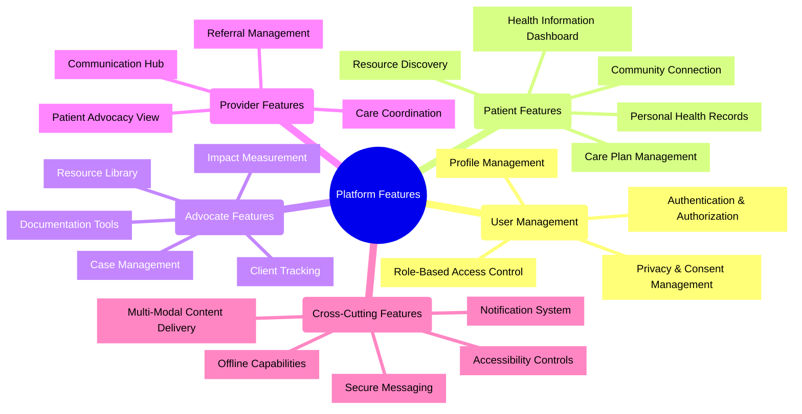

# Patient Advocacy Platform: Core Feature Specifications

## Overview

This document provides detailed specifications for the core features of the Patient Advocacy Platform. These features have been prioritized based on user research, persona needs, and the development roadmap. Each feature is described with functional requirements, user stories, UI/UX considerations, and technical implementation details.

## Feature Categories

## 1. User Management

### 1.1 Authentication & Authorization

**Feature Description:**  
A comprehensive system for user authentication and authorization that supports multiple roles, delegation, and secure access controls while meeting healthcare security standards.

**User Stories:**
- As a user, I want to create an account with email or phone number so I can access the platform
- As a user, I want to log in securely with multi-factor authentication to protect my health information
- As a user, I want to recover my account if I forget my password
- As a caregiver, I want to access my family member's account with their permission
- As an advocate, I want role-specific access to client information

**Functional Requirements:**
1. User registration with email verification
2. Password-based authentication with strong password requirements
3. Multi-factor authentication option (SMS, authenticator app)
4. Social login integration with privacy controls
5. Password recovery workflow
6. Session management with appropriate timeouts
7. Delegated access controls for caregivers and advocates
8. Role-based permission system
9. Audit logging of authentication activities
10. Account lockout after multiple failed attempts

**UI/UX Requirements:**
- Minimalist registration form with progressive disclosure
- Clear security status indicators
- Accessibility considerations for authentication steps
- Mobile-friendly authentication flows
- Guided recovery process for forgotten credentials

**Technical Specifications:**
- JWT-based authentication
- OAuth2 integration for social login
- Bcrypt password hashing
- Redis-based session management
- RBAC permission model
- FIDO2/WebAuthn support for passwordless options

**Metrics & Success Criteria:**
- Registration completion rate > 85%
- Authentication failure rate < 5%
- Account recovery success rate > 95%
- MFA adoption rate > 40%

### 1.2 Profile Management

**Feature Description:**  
Comprehensive profile management allowing users to maintain their demographic, contact, and preference information with appropriate privacy controls.

**User Stories:**
- As a patient, I want to update my contact information so advocates can reach me
- As a user, I want to set my communication preferences to receive notifications appropriately
- As a user, I want to control what information is visible to different platform participants
- As a user with accessibility needs, I want to set my interface preferences once and have them apply across the platform

**Functional Requirements:**
1. Basic profile information management (name, contact, demographics)
2. Communication preference settings (channels, frequency, content types)
3. Privacy control panel for information sharing
4. Accessibility preference settings
5. Language and localization preferences
6. Profile completion tracking
7. Profile verification mechanisms
8. Profile data export capability

**UI/UX Requirements:**
- Clean, intuitive profile management interface
- Progressive profile building with clear progress indicators
- Privacy settings with visual feedback on visibility
- Preference preview functionality
- Mobile-responsive design

**Technical Specifications:**
- Secure storage of PII with field-level encryption
- Preference propagation across services
- Caching strategy for profile data
- Change history tracking
- Profile data validation rules

**Metrics & Success Criteria:**
- Profile completion rate > 80%
- Profile information currency (regular updates)
- User confidence in privacy controls (survey)

## 2. Patient Features

### 2.1 Health Information Dashboard

**Feature Description:**  
A personalized dashboard presenting relevant health information, resources, and next steps based on the patient's conditions, preferences, and care plan.

**User Stories:**
- As a newly diagnosed patient, I want to see trusted information about my condition
- As a patient, I want to track my upcoming appointments and tasks in one place
- As a patient with multiple conditions, I want information prioritized by relevance
- As a patient with low health literacy, I want information presented at my preferred reading level
- As a rural patient with connectivity issues, I want critical information available offline

**Functional Requirements:**
1. Personalized health resource recommendations
2. Upcoming appointment and task visualization
3. Care plan progress tracking
4. Health resource bookmarking and history
5. Reading level adaptation for content
6. Condition-specific content sections
7. Quick access to advocacy support
8. Recent communications summary
9. Offline access to critical information

**UI/UX Requirements:**
- Clean, uncluttered design prioritizing key information
- Visual hierarchy based on urgency and relevance
- Progressive disclosure of complex information
- Multiple visualization options (timeline, cards, lists)
- Accessibility-first design approaches

**Technical Specifications:**
- Personalization algorithm based on user profile and behavior
- Content caching for offline access
- Content adaptation pipeline for reading levels
- Server-side rendering for performance
- Client-side state management for interactive elements

**Metrics & Success Criteria:**
- Dashboard engagement rate (DAU/MAU)
- Resource click-through rate
- Task completion rate
- User-reported understanding of condition (survey)
- Reduction in information-seeking outside platform

### 2.2 Personal Health Records

**Feature Description:**  
A secure system for patients to store, organize, and selectively share their health information, including conditions, medications, healthcare providers, and documents.

**User Stories:**
- As a patient, I want to store my health history in one place for easy reference
- As a patient with multiple providers, I want to track all my medications in one list
- As a patient, I want to upload and organize my health documents securely
- As a patient, I want to selectively share my health information with providers and advocates
- As a caregiver, I want to help manage my family member's health records with their permission

**Functional Requirements:**
1. Health profile with conditions, allergies, and history
2. Medication list with detailed information
3. Healthcare provider directory
4. Document storage and categorization
5. Health record sharing with granular permissions
6. Manual and connected data sources (EHR, devices)
7. Version history and audit trail
8. Health timeline visualization
9. Emergency access information

**UI/UX Requirements:**
- Intuitive organization of health information
- Clear data entry forms with guidance
- Visual indicators for shared information
- Easy document upload and management
- Mobile-friendly viewing of health records

**Technical Specifications:**
- Encrypted storage for health information
- Document processing pipeline for OCR and metadata
- FHIR-compatible data structures
- Consent management system for sharing
- Interoperability with common EHR systems

**Metrics & Success Criteria:**
- Health record completeness score
- Document organization rate
- Information sharing utility (provider feedback)
- Reduction in duplicate medical procedures

## 3. Advocate Features

### 3.1 Case Management

**Feature Description:**  
Comprehensive system for advocates to manage their client cases, including intake, documentation, task tracking, and outcome measurement.

**User Stories:**
- As a professional advocate, I want to track all interactions with my clients
- As an advocate, I want to document issues and resolutions for each case
- As an advocate, I want to assign and track tasks related to each case
- As a peer advocate, I want a simplified case tracking appropriate for my role
- As an advocate manager, I want to oversee case progress across my team

**Functional Requirements:**
1. Case creation and intake workflow
2. Client information management
3. Case notes and documentation
4. Issue tracking and resolution
5. Task assignment and tracking
6. Case status and progress tracking
7. Document management for case files
8. Case timeline visualization
9. Outcome and goal tracking
10. Reporting and analytics
11. Role-appropriate views based on advocate type

**UI/UX Requirements:**
- Efficient case dashboard with prioritization
- Streamlined note-taking interface
- Task management with clear status indicators
- Timeline visualization of case activities
- Mobile-friendly for field work

**Technical Specifications:**
- Case data model with flexible metadata
- Full-text search for case information
- Optimization for quick note entry
- Offline synchronization for field work
- Analytics data warehouse integration

**Metrics & Success Criteria:**
- Case documentation completeness
- Task completion rate and timeliness
- Client outcome achievement rate
- Advocate satisfaction with workflow (survey)

### 3.2 Resource Library

**Feature Description:**  
Curated collection of advocacy resources, education materials, and templates that advocates can use and share with clients, customized by condition, demographic, and needs.

**User Stories:**
- As an advocate, I want to find trusted resources to share with my clients
- As an advocate, I want to filter resources by condition, language, and reading level
- As an advocate, I want to track which resources I've shared with which clients
- As an organization admin, I want to add custom resources for my advocacy team
- As a peer advocate, I want suggested resources appropriate for my role and expertise

**Functional Requirements:**
1. Searchable resource database
2. Multiple filtering dimensions (condition, type, language, etc.)
3. Quality and currency indicators
4. Resource sharing workflow
5. Usage tracking and analytics
6. Private organizational resources
7. Resource recommendation engine
8. Resource collections and playlists
9. Version management for updated resources

**UI/UX Requirements:**
- Intuitive search and discovery interface
- Rich preview of resources before sharing
- Clear indicators of resource recency and quality
- Easy tracking of previously shared resources
- Mobile-friendly resource viewing

**Technical Specifications:**
- Metadata-rich content management system
- Full-text search implementation
- Tagging and classification system
- Content delivery network integration
- Usage analytics tracking

**Metrics & Success Criteria:**
- Resource discovery effectiveness
- Resource sharing volume
- Resource usefulness ratings
- Time saved finding resources (advocate survey)

## 4. Provider Features

### 4.1 Patient Advocacy View

**Feature Description:**  
A streamlined interface for healthcare providers to view relevant patient advocacy activities, shared health information, and coordination opportunities.

**User Stories:**
- As a provider, I want to see a summary of my patient's advocacy activities
- As a provider, I want to access patient-shared health information easily during visits
- As a provider, I want to identify care gaps detected through advocacy work
- As a provider, I want minimal disruption to my existing workflow
- As a rural provider, I want to connect with distant advocates effectively

**Functional Requirements:**
1. Patient advocacy activity summary
2. Shared health information display
3. Care gap and barrier notifications
4. Integration points with EHR systems
5. Secure messaging with advocacy team
6. Resource and service recommendations
7. Delegation to care team members
8. Mobile access for rounds and remote work

**UI/UX Requirements:**
- Extremely efficient information design
- Clear visual hierarchy for critical information
- Minimal-click interactions for busy providers
- EHR integration where possible
- Consistent information architecture with clinical systems

**Technical Specifications:**
- EHR integration via FHIR and SMART on FHIR
- Single sign-on with clinical systems
- Lightweight, fast-loading interfaces
- Standards-compliant data exchange
- Privacy-preserving information sharing

**Metrics & Success Criteria:**
- Provider adoption rate
- Time spent reviewing advocacy information
- Action rate on identified care gaps
- Provider satisfaction with integration (survey)

### 4.2 Referral Management

**Feature Description:**  
System for managing patient referrals to and from advocacy services, with tracking, communication, and outcome measurement.

**User Stories:**
- As a provider, I want to refer patients to advocacy services easily
- As an advocate, I want to receive and triage referrals efficiently
- As a provider, I want to track the status of my advocacy referrals
- As a patient, I want to be kept informed about my referral process
- As a rural provider, I want to find appropriate remote advocacy services

**Functional Requirements:**
1. Referral creation workflow
2. Referral routing and assignment
3. Referral status tracking
4. Bidirectional communication about referrals
5. Outcome documentation
6. Referral analytics and reporting
7. Template-based referral forms
8. Bulk referral capabilities for programs
9. Referral prioritization framework

**UI/UX Requirements:**
- Streamlined referral creation process
- Clear status visualization
- Communication history in context
- Mobile support for on-the-go referrals
- Intelligent form filling to reduce data entry

**Technical Specifications:**
- Integration with provider systems
- Workflow engine for referral routing
- Notification system for status changes
- Analytics for referral patterns and outcomes

**Metrics & Success Criteria:**
- Referral completion rate
- Time from referral to initial contact
- Referring provider satisfaction
- Successful outcome rate for referrals

## 5. Cross-Cutting Features

### 5.1 Secure Messaging

**Feature Description:**  
HIPAA-compliant secure messaging system connecting patients, advocates, and providers with appropriate access controls, auditing, and integrations.

**User Stories:**
- As a patient, I want to securely communicate with my advocate team
- As an advocate, I want to message clients and track our conversation history
- As a provider, I want to securely communicate with patient advocates
- As a user, I want to control notification preferences for messages
- As a rural user, I want messages to work despite intermittent connectivity

**Functional Requirements:**
1. End-to-end encrypted messaging
2. Individual and group conversations
3. Message status tracking (sent, delivered, read)
4. File and image sharing with security controls
5. Message categorization and prioritization
6. Template messages for common communications
7. Automated translation options
8. Accessibility features (voice-to-text, text-to-speech)
9. Message search and archiving
10. Conversation export for records
11. Offline message queuing

**UI/UX Requirements:**
- Clean, intuitive messaging interface
- Clear indicators of message status
- Conversation organization and filtering
- Mobile-first design approach
- Accessibility for diverse users

**Technical Specifications:**
- End-to-end encryption implementation
- Real-time messaging infrastructure
- Message synchronization across devices
- Offline storage and conflict resolution
- Compliance with healthcare communication standards

**Metrics & Success Criteria:**
- Message response time
- User satisfaction with communication
- Security and compliance metrics
- Reduction in phone tag and communication delays

### 5.2 Accessibility Controls

**Feature Description:**  
Comprehensive accessibility features allowing users with diverse needs to effectively use the platform, including adaptive interfaces, alternative formats, and assistive technology support.

**User Stories:**
- As a user with low vision, I want to adjust text size and contrast
- As a user with cognitive disabilities, I want simplified interfaces and instructions
- As a user with motor limitations, I want keyboard navigation and voice control
- As a user with low digital literacy, I want guided assistance and simplified workflows
- As a user with limited connectivity, I want offline access to critical features

**Functional Requirements:**
1. Text size and contrast controls
2. Screen reader optimization
3. Keyboard navigation support
4. Reading level adaptation
5. Voice control integration
6. Simplified interface mode
7. Color vision deficiency accommodations
8. Reduced motion option
9. Alternative format content (audio, simplified text)
10. Guided assistance mode
11. Offline functionality for critical features

**UI/UX Requirements:**
- Accessibility controls easily discoverable
- Consistent implementation across platform
- User preference persistence
- Testing with diverse user groups
- Compliance with WCAG 2.1 AA standards

**Technical Specifications:**
- Component-level accessibility properties
- ARIA implementation
- Keyboard navigation system
- Content adaptation pipeline
- User preference storage and application
- Testing with assistive technologies

**Metrics & Success Criteria:**
- WCAG 2.1 AA compliance
- Successful completion of tasks by users with disabilities
- User satisfaction across diverse needs
- Reduction in accessibility barriers

### 5.3 Multi-Modal Content Delivery

**Feature Description:**  
System for delivering content in multiple formats based on user preferences, device capabilities, connectivity status, and accessibility needs.

**User Stories:**
- As a user with limited bandwidth, I want low-data versions of content
- As a user with reading difficulties, I want audio versions of written content
- As a visual learner, I want information presented with graphics and diagrams
- As a user with cognitive disabilities, I want content at my preferred reading level
- As a non-native English speaker, I want content in my preferred language

**Functional Requirements:**
1. Content format transformation (text, audio, video, simplified)
2. Reading level adaptation
3. Multilingual content support
4. Bandwidth-aware content delivery
5. Offline content caching
6. Device-appropriate formatting
7. User preference-based delivery
8. Alternative format selection interface
9. Content effectiveness feedback

**UI/UX Requirements:**
- Clear format selection options
- Preview of alternative formats
- Seamless switching between formats
- Consistent experience across formats
- Accessibility of format controls themselves

**Technical Specifications:**
- Content transformation services
- Natural language processing for adaptation
- Translation integration
- Responsive media delivery
- Offline caching strategy
- Format preference storage

**Metrics & Success Criteria:**
- Content comprehension across formats
- User satisfaction with format options
- Accessibility measures for diverse users
- Content delivery success in low-connectivity

## Implementation Priorities

The following table outlines the implementation priority for each feature based on the development roadmap:

| Feature | Phase | Priority | Dependencies |
|---------|-------|----------|-------------|
| Authentication & Authorization | 1 | P0 | None |
| Profile Management | 1 | P0 | Authentication |
| Health Information Dashboard | 2 | P0 | Profile Management |
| Personal Health Records | 2 | P1 | Profile Management |
| Case Management | 3 | P1 | Authentication, Profile Management |
| Resource Library | 3 | P1 | Content Management System |
| Secure Messaging | 2 | P1 | Authentication |
| Accessibility Controls | 1 | P0 | UI Component Library |
| Patient Advocacy View | 4 | P2 | Personal Health Records, Case Management |
| Referral Management | 4 | P2 | Case Management, Provider Authentication |
| Multi-Modal Content Delivery | 2 | P1 | Content Management System |

## Technical Requirements Summary

To implement these features effectively, the following technical capabilities must be in place:

1. **Security Infrastructure**
   - End-to-end encryption for sensitive data
   - Role-based access control system
   - Audit logging framework
   - Consent management system

2. **Content Management**
   - Structured content repository
   - Content transformation pipeline
   - Metadata and tagging system
   - Content delivery optimization

3. **Integration Framework**
   - FHIR-compatible data structures
   - API gateway for external services
   - EHR integration connectors
   - Authentication federation

4. **Offline Capabilities**
   - Strategic data caching
   - Offline-first architecture
   - Synchronization protocols
   - Conflict resolution

5. **Accessibility Infrastructure**
   - Component-level accessibility
   - Content adaptation services
   - User preference management
   - Testing infrastructure

## User Experience Guidelines

All features should adhere to these core UX principles:

1. **Progressive Disclosure**
   - Present essential information first
   - Reveal complexity progressively
   - Avoid overwhelming cognitive load

2. **Consistent Patterns**
   - Maintain consistent interaction patterns
   - Use familiar UI components
   - Ensure predictable behavior

3. **Efficiency First**
   - Minimize clicks for common tasks
   - Optimize for the critical path
   - Support keyboard shortcuts and navigation

4. **Inclusive Design**
   - Design for diversity of abilities
   - Provide multiple paths to accomplish tasks
   - Test with diverse user groups

5. **Context Awareness**
   - Adapt to user context and environment
   - Support different devices and connectivity
   - Respect user preferences

## Next Steps

1. **Feature Detailing**
   - Create detailed specifications for each feature
   - Develop user flow diagrams
   - Define data models and API contracts

2. **Design System**
   - Establish component library
   - Define visual design language
   - Create accessibility standards

3. **Prototyping**
   - Develop interactive prototypes
   - Conduct usability testing
   - Iterate based on feedback

4. **Technical Planning**
   - Define service boundaries
   - Establish data architecture
   - Plan for scalability and performance

## References

1. User Persona Documentation
2. Development Roadmap
3. System Architecture Design
4. Web Content Accessibility Guidelines (WCAG) 2.1
5. HIPAA Security Rule Requirements
6. FHIR Implementation Guidelines
