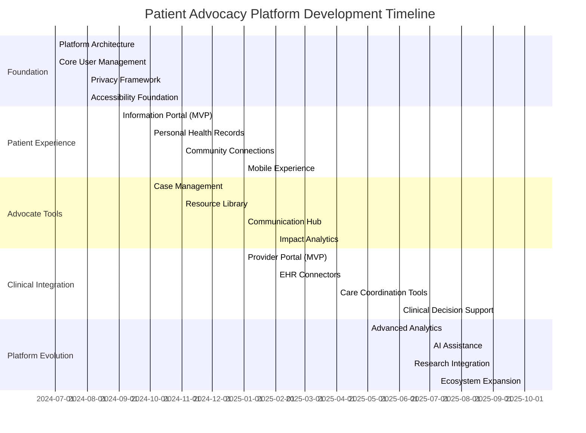
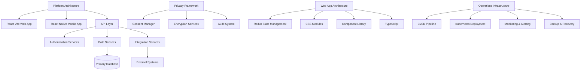
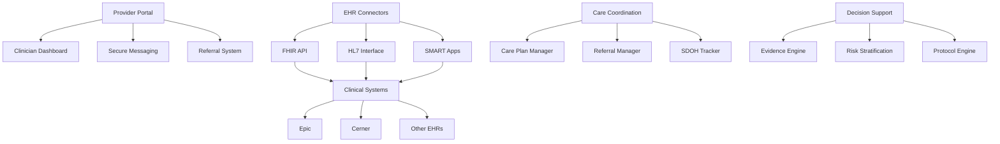
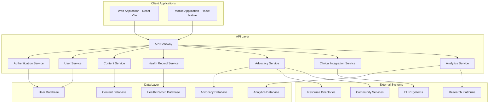

# Development Roadmap: Patient Advocacy Platform

## Executive Summary

This roadmap outlines the strategic development plan for the Patient Advocacy Platform over the next 18 months. Based on comprehensive user research and persona development, we've identified a phased approach that balances technical feasibility, user needs, and resource constraints. The roadmap is designed to deliver incremental value while building toward a comprehensive ecosystem that serves patients, advocates, and healthcare providers.

## Strategic Objectives

1. **Bridge Information Gaps**: Connect patients with accurate, personalized health information
2. **Facilitate Meaningful Advocacy**: Empower advocates with tools to provide effective support
3. **Integrate with Healthcare**: Create seamless connections to clinical workflows
4. **Address Equity Barriers**: Ensure platform accessibility across the digital divide
5. **Protect Patient Privacy**: Implement privacy-by-design principles throughout

## Development Phases

## Phase 1: Foundation (Months 1-3)

### Key Deliverables

1. **Platform Architecture**
   - Core technology stack implementation (React Vite, TypeScript)
   - CSS Modules for component styling (replacing Tailwind CSS)
   - Database schema and API architecture design
   - Authentication and authorization framework
   - DevOps pipeline and deployment infrastructure (utilizing established operations framework)
   - Testing frameworks and quality assurance processes

2. **Core User Management**
   - User registration and profile management
   - Role-based access controls (patients, advocates, providers)
   - Redux state management for authentication and user profiles
   - Multi-factor authentication
   - Account recovery and security protocols

3. **Privacy Framework**
   - Consent management system
   - Data classification and handling policies
   - Encryption implementation for sensitive data
   - Audit logging and access controls
   - Privacy impact assessment toolkit

4. **Accessibility Foundation**
   - Responsive design implementation
   - Screen reader compatibility
   - Keyboard navigation support
   - Semantic HTML and ARIA attributes for all components
   - Progressive enhancement for varied connectivity

### Technical Specifications

### Milestones
- Architecture design approval
- Development environment setup complete
- Core authentication system functioning
- Privacy framework review by legal/compliance
- Accessibility audit of foundation components
- Initial deployment pipeline established

## Phase 2: Patient Experience (Months 3-6)

### Key Deliverables

1. **Information Portal (MVP)**
   - Personalized health information dashboard
   - Condition-specific resource collections
   - Health education content with varying complexity levels
   - Search and filtering capabilities
   - Feedback mechanisms on content usefulness

2. **Personal Health Records**
   - Basic health profile management
   - Medication tracking and history
   - Appointment calendar and reminders
   - Document storage and organization
   - Health goal setting and tracking

3. **Community Connections**
   - Peer support group discovery
   - Virtual meeting integration
   - Moderated discussion spaces
   - Resource sharing mechanisms
   - Privacy-preserving community engagement tools

4. **Mobile Experience**
   - Native mobile application (iOS/Android)
   - Offline functionality for critical features
   - Push notification framework
   - Mobile-optimized user experience
   - Low-bandwidth operation modes

### User Stories Addressed

From our personas, this phase addresses key needs:

- Maria (Newly Diagnosed) can find trustworthy information about her condition at an appropriate reading level
- Sophia (Digital Native) can integrate her health data and connect with innovative peers
- James (Rural Patient) can access critical resources despite connectivity limitations
- Eleanor (Older Adult) can manage her health information with an accessible interface

### Milestones
- Information portal MVP launch
- Personal health record beta release
- Community features security review
- Mobile application store submissions
- User acceptance testing with patient personas

## Phase 3: Advocate Tools (Months 5-8)

### Key Deliverables

1. **Case Management**
   - Client/patient relationship tracking
   - Case notes and documentation tools
   - Task management and reminders
   - Issue tracking and resolution workflow
   - Client progress visualization

2. **Resource Library**
   - Curated resource collections by topic
   - Evidence rating and quality indicators
   - Cultural and linguistic adaptation tools
   - Accessibility-tagged resource finder
   - Customizable resource sharing templates

3. **Communication Hub**
   - Secure messaging system
   - Multi-channel communication preferences
   - Template library for common communications
   - Automated follow-up tracking
   - Communication history and audit trail

4. **Impact Analytics**
   - Outcome tracking framework
   - Service delivery metrics
   - Client satisfaction measurement
   - Customizable reporting tools
   - Data visualization for impact stories

### User Stories Addressed

From our personas, this phase addresses key needs:

- Jessica (Professional Advocate) can efficiently manage her caseload and document her impact
- Marcus (Peer Support) can access appropriate resources and track mentee interactions
- Elena (Family Caregiver) can coordinate care and share information with providers
- Terrell (Community Advocate) can measure program impact for grant reporting

### Milestones
- Case management system beta launch
- Resource library content partnerships established
- Communication hub security and compliance review
- Analytics framework validation with advocate testers
- Integration testing with patient experience features

## Phase 4: Clinical Integration (Months 7-12)

### Key Deliverables

1. **Provider Portal (MVP)**
   - Clinician view of relevant patient advocacy activities
   - Secure messaging with advocacy team
   - Patient-authorized health information sharing
   - Referral management system
   - Clinical summary generation

2. **EHR Connectors**
   - FHIR-based integration framework
   - HL7 interface for legacy systems
   - SMART on FHIR applications
   - EHR-specific adapters (Epic, Cerner, etc.)
   - Clinical data synchronization protocols

3. **Care Coordination Tools**
   - Shared care planning features
   - Cross-organization collaboration tools
   - Care gap identification
   - Social determinants of health tracking
   - Closed-loop referral management

4. **Clinical Decision Support**
   - Evidence-based recommendation engine
   - Care pathway visualization
   - Risk stratification tools
   - Clinical protocol integration
   - Provider-specific notification preferences

### Technical Specifications

### User Stories Addressed

From our personas, this phase addresses key needs:

- Dr. Chen (Primary Care) can efficiently stay informed about advocacy activities
- Dr. Patel (Specialist) can coordinate with the care team across organizations
- Rebecca (Nurse) can track social determinants and care barriers
- Dr. Wilson (Rural Provider) can coordinate effectively with distant specialists
- Lisa (Pharmacist) can participate in medication management across transitions

### Milestones
- Provider portal MVP launch
- First EHR integration certification
- Care coordination pilot program launch
- Clinical decision support validation
- Security and compliance certification

## Phase 5: Platform Evolution (Months 11-18)

### Key Deliverables

1. **Advanced Analytics**
   - Population health insights
   - Predictive modeling for intervention needs
   - Outcome analytics across patient populations
   - Social determinant impact analysis
   - Quality improvement dashboards

2. **AI Assistance**
   - Natural language processing for documentation
   - Personalized information recommendations
   - Pattern recognition for early intervention
   - Conversational interface for navigation
   - Intelligent workflow optimization

3. **Research Integration**
   - De-identified data warehouse
   - Research study matching
   - Patient-reported outcome collection
   - Participatory research tools
   - Evidence generation framework

4. **Ecosystem Expansion**
   - API marketplace for third-party developers
   - Integration with wearables and home monitoring
   - Expanded health and social service partners
   - International/multi-language expansion
   - Specialized condition-specific modules

### User Stories Addressed

This phase expands capabilities for all personas and enables:
- Predictive intervention before crisis points
- Reduced administrative burden through intelligent assistance
- Participation in cutting-edge research
- Ecosystem of specialized tools through third-party development
- Global reach and specialized condition support

### Milestones
- Advanced analytics framework release
- AI assistance feature validation
- Research platform IRB approval
- Developer portal and API documentation release
- International pilot program launch

## Feature Prioritization Matrix

| Feature | Impact | Development Effort | User Value | Technical Risk | Priority |
|---------|--------|-------------------|------------|----------------|----------|
| Core User Management | High | Medium | High | Low | P0 |
| Privacy Framework | High | Medium | High | Medium | P0 |
| Information Portal | High | Medium | High | Low | P0 |
| Personal Health Records | High | High | High | Medium | P1 |
| Mobile Experience | High | High | High | Medium | P1 |
| Case Management | High | Medium | High | Low | P1 |
| Resource Library | Medium | Low | High | Low | P1 |
| Communication Hub | High | Medium | High | Medium | P1 |
| Provider Portal | Medium | Medium | Medium | Medium | P2 |
| EHR Connectors | High | High | Medium | High | P2 |
| Care Coordination Tools | High | Medium | High | Medium | P2 |
| Advanced Analytics | Medium | High | Medium | Medium | P3 |
| AI Assistance | Medium | High | Medium | High | P3 |
| Research Integration | Medium | Medium | Low | Medium | P3 |
| Ecosystem Expansion | Medium | High | Medium | Medium | P3 |

## Technical Architecture Overview

## Risk Assessment and Mitigation

| Risk | Impact | Probability | Mitigation Strategy |
|------|--------|------------|---------------------|
| EHR Integration Complexity | High | High | Start with standards-based approach (FHIR), create adapter pattern for flexibility, pilot with one EHR vendor first |
| Privacy Regulatory Compliance | High | Medium | Regular privacy impact assessments, legal review of features, implementation of privacy by design principles |
| Digital Divide Exclusion | High | High | Develop multiple accessibility paths, low-bandwidth alternatives, offline capabilities, proxy access features |
| User Adoption Barriers | Medium | Medium | Early and continuous user testing, progressive feature introduction, champion programs, training materials |
| Data Security Breaches | High | Low | Security by design, encryption, regular security audits, limiting sensitive data collection |
| Clinical Workflow Disruption | Medium | Medium | Provider co-design, workflow analysis, minimal data entry requirements, value demonstration |
| Resource Constraints | Medium | Medium | Modular architecture, prioritize high-impact features, leverage open-source components, scalable infrastructure |
| Integration Partner Limitations | Medium | High | API-first approach, standards adoption, flexible integration options, degradation strategies |

## Success Metrics

### Phase 1: Foundation
- System uptime and performance benchmarks met
- Security audit passed with no critical findings
- Accessibility WCAG 2.1 AA compliance achieved

### Phase 2: Patient Experience
- User registration targets achieved
- Engagement metrics (DAU/MAU) above industry benchmarks 
- Information resource utilization data showing value
- Positive feedback from diverse user testing groups

### Phase 3: Advocate Tools
- Advocate productivity metrics showing time savings
- Case management adoption rates meeting targets
- Resource sharing volume indicating platform utility
- Measurable impact metrics from advocacy activities

### Phase 4: Clinical Integration
- Number of successful EHR integrations deployed
- Clinical referral volume through platform
- Provider adoption and engagement metrics
- Reduced coordination gaps in patient care

### Phase 5: Platform Evolution
- Predictive model accuracy metrics
- Time savings from AI assistance features
- Research participation rates
- Ecosystem partner growth metrics
- Geographic and demographic expansion

## Next Steps

1. **Immediate Actions (Next 30 Days)**
   - Finalize technology stack decisions 
   - Create detailed specifications for Phase 1 components
   - Establish development environment and toolchain
   - Begin component library development
   - Recruit initial user testing group

2. **Resource Allocation**
   - Frontend development team (React Vite, React Native)
   - Backend API development team
   - UX/UI design specialists with accessibility focus
   - Security and privacy expertise
   - Clinical systems integration specialists
   - Quality assurance and testing resources

3. **Critical Path Dependencies**
   - Privacy framework must precede data collection features
   - Core authentication required before any user-specific features
   - Component library needed for consistent implementation
   - API definitions required before parallel frontend/backend development

## Appendix: User Persona Integration

This roadmap has been developed with direct reference to our comprehensive user personas, including:

**Patient Personas:**
- Maria Rodriguez (Newly Diagnosed)
- Robert Johnson (Complex Care Coordinator)
- Sophia Chen (Digital Native)
- James Williams (Rural Patient)
- Eleanor Washington (Older Adult)

**Advocate Personas:**
- Jessica Park (Professional Patient Advocate)
- Marcus Brown (Peer Support Advocate)
- Dr. Aisha Johnson (Clinical Care Coordinator)
- Elena Diaz (Family Caregiver Advocate)
- Terrell Washington (Community Advocacy Leader)

**Healthcare Provider Personas:**
- Dr. Michael Chen (Primary Care Physician)
- Dr. Samantha Patel (Specialist Physician)
- Nurse Rebecca Torres (Clinical Care Team)
- Dr. David Wilson (Rural Healthcare Provider)
- Lisa Martinez (Clinical Pharmacist)

Each phase and feature has been designed to address specific needs identified in these personas, ensuring the platform serves its diverse stakeholders effectively.
