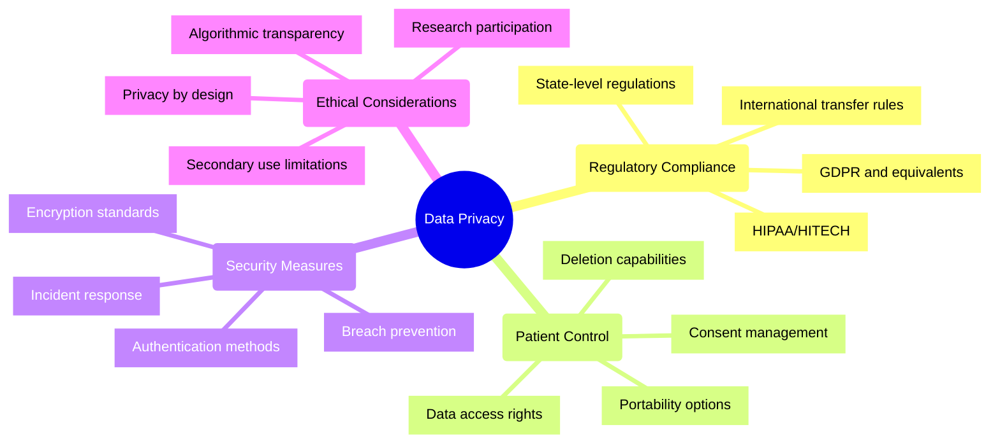
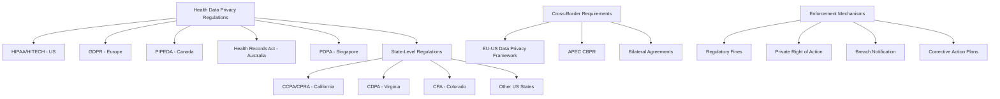
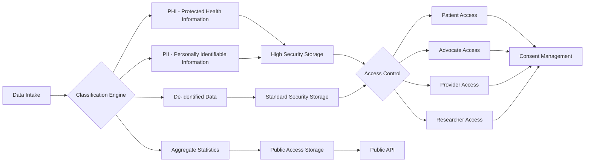
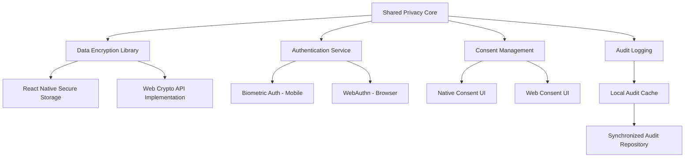
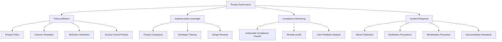

# Data Privacy in Patient Advocacy: 2024-2025 Challenges

## Overview
By 2025, data privacy has emerged as a critical concern in patient advocacy platforms, as these systems collect, process, and share increasingly sensitive health information. The intersection of advocacy activities with protected health information creates complex regulatory, ethical, and technical challenges that must be addressed in modern cross-platform applications.

## Key Privacy Dimensions



## Regulatory Landscape 2025



## Technical Implementation Challenges

### Data Segmentation and Classification

In React Vite (Web) and React Native (Mobile) applications, proper data classification is essential for applying appropriate privacy controls:



### Consent Management Architecture

**Technical Implementation for React Applications:**

```javascript
// Example of consent management module architecture for React applications

// Core consent data model
interface ConsentOption {
  id: string;
  category: 'essential' | 'functional' | 'analytics' | 'research' | 'marketing';
  description: string;
  required: boolean;
  defaultValue: boolean;
  dataRetentionPeriod: number; // in days
}

// User's consent choices
interface UserConsent {
  userId: string;
  choices: {
    [consentId: string]: {
      value: boolean;
      timestamp: string;
      expiresAt: string;
      method: 'explicit' | 'default' | 'inherited';
    }
  };
  version: string;
  lastUpdated: string;
}

// Consent management service
class ConsentManager {
  // Fetch current consent options based on user context
  async getConsentOptions(userContext: UserContext): Promise<ConsentOption[]> { ... }
  
  // Record user consent choices
  async recordConsent(userId: string, choices: Record<string, boolean>): Promise<void> { ... }
  
  // Check if user has consented to specific data use
  async hasConsent(userId: string, dataUseCategory: string): Promise<boolean> { ... }
  
  // Generate audit trail for consent changes
  async getConsentHistory(userId: string): Promise<ConsentHistoryEntry[]> { ... }
  
  // Propagate consent changes to integrated systems
  async propagateConsentChanges(userId: string): Promise<void> { ... }
}
```

### Cross-Platform Data Protection Implementation

For a unified privacy approach across React Vite and React Native:



**Implementation Example: Secure Storage Abstraction**

```typescript
// Abstract storage service for cross-platform implementation
export interface SecureStorageService {
  storeSecurely(key: string, value: string): Promise<void>;
  retrieveSecurely(key: string): Promise<string | null>;
  removeSecurely(key: string): Promise<void>;
  clearAllSecurely(): Promise<void>;
}

// Web implementation using IndexedDB with encryption
export class WebSecureStorage implements SecureStorageService {
  private async getEncryptionKey(): Promise<CryptoKey> {
    // Implementation of WebCrypto API key management
    // ...
  }
  
  async storeSecurely(key: string, value: string): Promise<void> {
    const encryptionKey = await this.getEncryptionKey();
    const encoder = new TextEncoder();
    const data = encoder.encode(value);
    
    // Encrypt data using WebCrypto
    const iv = window.crypto.getRandomValues(new Uint8Array(12));
    const encryptedData = await window.crypto.subtle.encrypt(
      { name: 'AES-GCM', iv },
      encryptionKey,
      data
    );
    
    // Store in IndexedDB with IV
    await this.db.put('secureStore', {
      key,
      value: {
        data: encryptedData,
        iv
      }
    });
  }
  
  // Other methods implementation...
}

// React Native implementation using Keychain/Keystore
export class NativeSecureStorage implements SecureStorageService {
  async storeSecurely(key: string, value: string): Promise<void> {
    await Keychain.setGenericPassword(key, value, {
      service: 'com.patientadvocacy.app',
      accessControl: Keychain.ACCESS_CONTROL.BIOMETRY_ANY_OR_DEVICE_PASSCODE,
      accessible: Keychain.ACCESSIBLE.WHEN_UNLOCKED_THIS_DEVICE_ONLY
    });
  }
  
  // Other methods implementation...
}

// Factory to get the appropriate implementation
export function getSecureStorage(): SecureStorageService {
  if (Platform.OS === 'web') {
    return new WebSecureStorage();
  } else {
    return new NativeSecureStorage();
  }
}
```

## Privacy Design Patterns for Patient Advocacy

### Data Minimization Strategy

**Implementation Approach:**
- Just-in-time data collection based on specific advocacy needs
- Function-based access scopes for advocate interfaces
- Automatic data aging and purging policies
- Differential privacy techniques for aggregated insights

**Pattern Implementation in React:**
```typescript
// Data minimization HOC for React components

import React, { ComponentType } from 'react';
import { usePermissions } from '../hooks/usePermissions';

// Higher-order component for data minimization
export function withMinimalData<P>(
  Component: ComponentType<P>,
  requiredDataFields: string[]
) {
  return function MinimalDataComponent(props: P) {
    const { hasPermission, userPermissions } = usePermissions();
    
    // Filter data based on permissions
    const filteredProps = { ...props };
    Object.keys(filteredProps).forEach(key => {
      const dataField = key.replace('data', '').toLowerCase();
      if (
        key.startsWith('data') && 
        !requiredDataFields.includes(dataField) && 
        !hasPermission(`view:${dataField}`)
      ) {
        delete filteredProps[key];
      }
    });
    
    return <Component {...filteredProps} />;
  };
}

// Usage example
const PatientSummary = withMinimalData(
  PatientSummaryBase,
  ['demographics', 'conditions']
);
```

### Privacy-Preserving Analytics

**Implementation Strategy:**
- Client-side aggregation before data transmission
- Randomized response mechanisms for sensitive queries
- Synthetic data generation for development and testing
- Federated analytics across patient populations

**Technical Implementation:**
```typescript
// Privacy-preserving analytics service

export class PrivacyPreservingAnalytics {
  // Add random noise to numeric values to preserve privacy
  private addDifferentialPrivacyNoise(value: number, sensitivity: number, epsilon: number): number {
    const noise = this.laplaceNoise(sensitivity / epsilon);
    return value + noise;
  }
  
  // Generate Laplace distributed noise
  private laplaceNoise(scale: number): number {
    const u = Math.random() - 0.5;
    return -scale * Math.sign(u) * Math.log(1 - 2 * Math.abs(u));
  }
  
  // Track event with privacy guarantees
  public async trackEvent(eventName: string, properties: Record<string, any>): Promise<void> {
    // Apply privacy transformations to properties
    const privatizedProperties = this.privatizeProperties(properties);
    
    // Only then send to analytics service
    await this.analyticsClient.trackEvent(eventName, privatizedProperties);
  }
  
  // Create aggregate reports with privacy guarantees
  public async createAggregateReport(
    metricName: string,
    filters: Record<string, any>,
    privacyConfig: PrivacyConfig
  ): Promise<AggregateReport> {
    // Ensure minimum threshold for aggregation
    const count = await this.getCountForFilters(filters);
    if (count < privacyConfig.minimumThreshold) {
      throw new Error('Insufficient data for privacy-preserving aggregation');
    }
    
    // Proceed with privatized aggregation
    // ...
  }
}
```

## Implementation Recommendations

### Cross-Platform Privacy Architecture

For React Vite and React Native applications:

1. **Unified Core Privacy Framework**
   - Shared data protection logic between platforms
   - Platform-specific storage and encryption implementations
   - Common consent management infrastructure
   - Cross-platform audit mechanisms

2. **React-Specific Implementation Considerations**
   - Use of React Context for permission-based rendering
   - Privacy-aware data fetching through custom hooks
   - Form handling with built-in data minimization
   - Local state management prioritized for sensitive data

3. **Mobile-Specific Enhancements**
   - Biometric authentication integration
   - App-level encryption
   - Secure clipboard handling
   - Camera and media permission isolation
   - Background data access limitations

### Development Practices

1. **Privacy by Design Approach**
   - Privacy impact assessments before feature development
   - Data protection requirements in user stories
   - Privacy-focused code reviews
   - Regular privacy audits of existing functionality

2. **Testing Strategy**
   - Automated privacy compliance verification
   - Data leakage detection in test suites
   - Consent flow validation tests
   - Cross-platform privacy consistency testing

3. **Documentation Requirements**
   - Data flow diagrams for all patient information
   - Retention policy documentation
   - Access control matrices
   - API privacy annotations

## Governance Framework



## References

1. Office for Civil Rights. (2024). *"HIPAA and Patient Advocacy Platforms: Guidance for Developers."*
2. European Data Protection Board. (2025). *"Guidelines on Health Data Processing in Advocacy Applications."*
3. International Association of Privacy Professionals. (2024). *"Privacy Engineering for Cross-Platform Health Applications."*
4. Journal of Health Technology. (2025). *"Implementing Privacy by Design in Patient Support Systems."*
