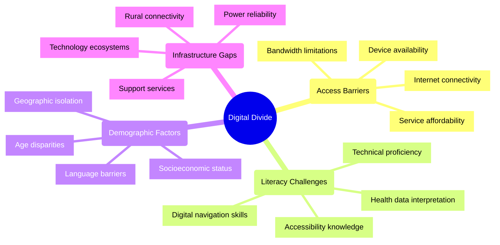
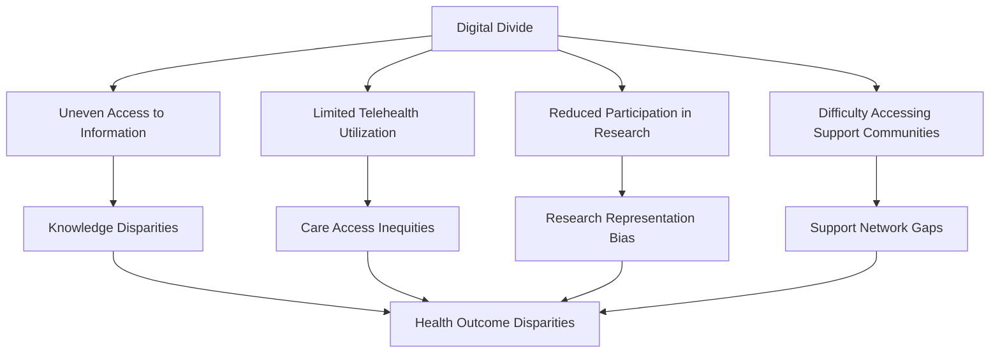
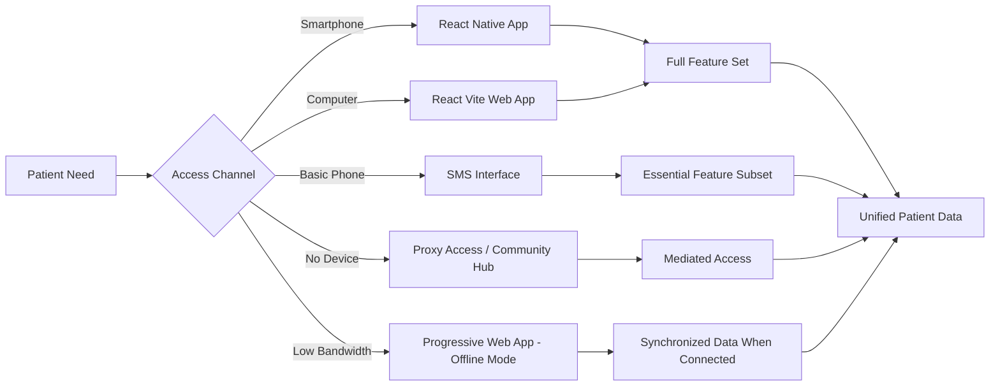

# Digital Divide in Patient Advocacy: 2024-2025 Challenges

## Overview
Despite tremendous advancements in digital health technologies by 2025, a significant digital divide persists, creating barriers to equitable access to patient advocacy resources. This divide manifests across multiple dimensions including technological access, digital literacy, infrastructure limitations, and socioeconomic factors.

## Dimensions of the Digital Divide



## Impact on Patient Advocacy



## Current State Analysis (2025)

### Connectivity Disparities
- 15% of the global population still lacks reliable internet access
- Rural-urban connectivity gap of 23% in developed nations
- Mobile-only internet access for 34% of lower-income patients
- Intermittent connectivity affecting 28% of remote healthcare facilities

### Device Access Limitations
- 22% of patients over 65 lack appropriate digital devices
- Shared device usage in 31% of lower-income households
- Limited data plans restricting usage for 27% of mobile-dependent users
- Outdated devices incompatible with modern applications for 19% of users

### Digital Literacy Barriers
- 38% of patients report difficulty navigating complex healthcare platforms
- Health information comprehension challenges for 42% of users with limited education
- Password management and security concerns preventing engagement for 29% of seniors
- Settings configuration barriers for 33% of first-time digital health platform users

## Solution Approaches for Cross-Platform Applications

### Multi-modal Access Strategies

For React Vite (Web) and React Native (Mobile) applications:



### Adaptive Complexity Implementation

**Technical Approach for React Applications:**
- Progressive enhancement architecture serving core functionality to all users
- Feature detection to tailor experience to device capabilities
- Responsive design with mobile-first approach
- Performance budgeting to ensure functionality on lower-end devices
- Asset optimization for bandwidth-constrained environments

**Code Example: Adaptive Loading Pattern in React**
```javascript
// Sample React component implementing adaptive loading
import { useState, useEffect } from 'react';

function AdaptiveFeature({ children, fallback }) {
  const [canSupportFeature, setCanSupportFeature] = useState(false);
  
  useEffect(() => {
    // Detect device capabilities
    const checkCapabilities = async () => {
      const memory = navigator.deviceMemory || 4; // Default to mid-range if not available
      const connection = navigator.connection || { effectiveType: '4g' };
      const batteryData = await (navigator.getBattery?.() || { level: 1 });
      
      // Determine if device can support advanced features
      const hasCapacity = memory >= 2 && 
                          ['4g', '3g'].includes(connection.effectiveType) &&
                          batteryData.level > 0.2;
                          
      setCanSupportFeature(hasCapacity);
    };
    
    checkCapabilities();
  }, []);
  
  return canSupportFeature ? children : fallback;
}
```

### Offline-First Design

**Implementation Strategy:**
- Local data storage using SQLite for React Native and IndexedDB for React Vite
- Synchronization protocols for data consistency when connectivity returns
- Essential functionality preserved in offline state
- Clear indicators of connectivity status and data recency
- Bandwidth-aware synchronization prioritizing critical data

**Code Example: Offline Data Synchronization**
```javascript
// Service worker registration for PWA
if ('serviceWorker' in navigator) {
  window.addEventListener('load', () => {
    navigator.serviceWorker.register('/service-worker.js').then(registration => {
      console.log('ServiceWorker registered successfully');
    }).catch(error => {
      console.log('ServiceWorker registration failed: ', error);
    });
  });
}

// Data synchronization logic
import { syncData } from './api/sync';

function useSyncManager() {
  const [isSyncing, setIsSyncing] = useState(false);
  const [lastSync, setLastSync] = useState(null);
  
  // Attempt sync when online
  useEffect(() => {
    const handleOnline = async () => {
      setIsSyncing(true);
      try {
        await syncData();
        setLastSync(new Date());
      } catch (error) {
        console.error('Sync failed', error);
      } finally {
        setIsSyncing(false);
      }
    };
    
    window.addEventListener('online', handleOnline);
    return () => window.removeEventListener('online', handleOnline);
  }, []);
  
  return { isSyncing, lastSync };
}
```

## Implementation Recommendations

### Technical Approaches
1. **Tiered Feature Implementation**
   - Essential core features available to all users regardless of device
   - Progressive enhancement adding capabilities based on device capacity
   - Clear feature roadmaps identifying minimum requirements

2. **Bandwidth Optimization**
   - Asset compression and lazy loading
   - Content caching strategies
   - Text-based alternatives to rich media
   - Data usage controls and transparency

3. **Alternative Access Pathways**
   - SMS-based information access
   - Voice interface options
   - Proxy access through advocates or community centers
   - Printable resources generated from digital content

### Design Considerations
1. **Inclusive Design Principles**
   - Simple navigation patterns
   - Consistent interface elements
   - Minimal cognitive load
   - High contrast and readable typography
   - Voice-guided options

2. **Multi-literacy Support**
   - Visual instructions and iconography
   - Simplified language options
   - Video/audio tutorials for key functions
   - Contextual help systems
   - Step-by-step wizards for complex tasks

3. **Connected Experience**
   - Seamless transition between online and offline states
   - Clear status indicators for connectivity
   - Transparent data synchronization processes
   - Prioritized critical functions in offline mode

## Measurement Framework

To track progress in addressing the digital divide:

1. **Access Metrics**
   - Unique users across device types
   - Session statistics by connectivity quality
   - Feature utilization across demographic segments
   - Offline usage patterns

2. **Usability Indicators**
   - Task completion rates across user segments
   - Time-to-competency for new users
   - Support request frequency by demographic
   - Feature abandonment patterns

3. **Outcome Measures**
   - Engagement equity across demographics
   - Information recall and application
   - Self-efficacy improvements
   - Health outcome correlations

## References

1. Powerful Patients. (2025). *"The Future of Patient Advocacy: 5 Key Trends for 2025 and Beyond."*
2. International Telecommunication Union. (2024). *"Global Connectivity Report 2024."*
3. Journal of Digital Health Equity. (2025). *"Bridging Digital Divides in Healthcare Platforms."*
4. Web Accessibility Initiative. (2024). *"Inclusive Design for Health Applications."*
