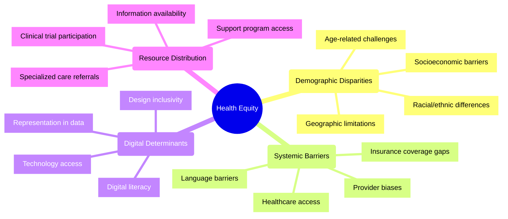
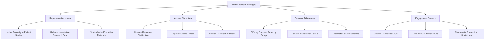
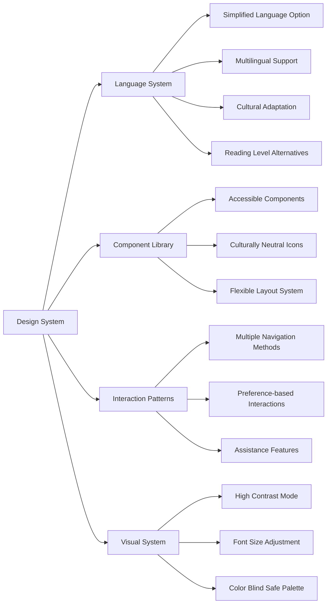

# Health Equity in Patient Advocacy: 2024-2025 Challenges

## Overview
By 2025, health equity has become a central focus in patient advocacy platforms, with growing recognition that digital health technologies can either reduce or exacerbate existing healthcare disparities. Patient advocacy platforms must intentionally address systemic inequities to ensure that all patients, regardless of background or circumstance, can benefit equally from advocacy services and resources.

## Dimensions of Health Inequity



## Manifestations in Advocacy Systems



## Technical Implementation Challenges for React Platforms

### Inclusive Design Patterns



### React Implementation Strategies

**1. Language and Localization Architecture:**

```typescript
// i18n configuration for React Native and React Vite with cultural adaptations

// Types for enhanced localization
interface LocaleConfig {
  languageCode: string;
  countryCode?: string;
  direction: 'ltr' | 'rtl';
  culturalAdaptations: {
    iconography: 'western' | 'eastern' | 'neutral';
    examples: 'western' | 'eastern' | 'neutral';
    metaphors: 'western' | 'eastern' | 'neutral';
    timeFormat: '12h' | '24h';
    dateFormat: 'mdy' | 'dmy' | 'ymd';
    colorAssociations: Record<string, string>;
  };
}

// Enhanced translation service
class EquitableI18nService {
  private currentLocale: LocaleConfig;
  private translations: Record<string, Record<string, string>>;
  private culturalAssets: Record<string, Record<string, any>>;
  private readingLevels: string[] = ['standard', 'simplified', 'clinical'];
  private currentReadingLevel: string = 'standard';
  
  constructor() {
    // Initialize with system locale and load appropriate resources
  }
  
  // Get translation with appropriate reading level
  translate(key: string, readingLevel?: string): string {
    const level = readingLevel || this.currentReadingLevel;
    const localeKey = `${this.currentLocale.languageCode}_${level}`;
    return this.translations[localeKey]?.[key] || this.translations[`en_${level}`]?.[key] || key;
  }
  
  // Get culturally appropriate asset
  getAsset(key: string): any {
    const adaptation = this.currentLocale.culturalAdaptations.iconography;
    return this.culturalAssets[adaptation]?.[key] || this.culturalAssets['neutral']?.[key];
  }
  
  // Set reading level preference
  setReadingLevel(level: string): void {
    if (this.readingLevels.includes(level)) {
      this.currentReadingLevel = level;
    }
  }
}

// React hook for equitable translations
function useEquitableTranslation() {
  const i18nService = useContext(I18nContext);
  const [readingLevel, setReadingLevel] = useState(i18nService.currentReadingLevel);
  
  return {
    t: (key: string) => i18nService.translate(key, readingLevel),
    setReadingLevel,
    currentReadingLevel: readingLevel,
    availableLevels: i18nService.readingLevels,
    getAsset: (key: string) => i18nService.getAsset(key)
  };
}
```

**2. Equity-Focused Component Library:**

```tsx
// React Native / React Vite shared components with equity focus

// Inclusive text component with reading level support
interface EquitableTextProps extends TextProps {
  textKey: string;
  readingLevel?: string;
  supplementaryAudio?: boolean;
  showDefinitions?: boolean;
}

function EquitableText({
  textKey,
  readingLevel,
  supplementaryAudio = false,
  showDefinitions = false,
  ...props
}: EquitableTextProps) {
  const { t, currentReadingLevel } = useEquitableTranslation();
  const [showingDefinitionFor, setShowingDefinitionFor] = useState<string | null>(null);
  const audioRef = useRef<Audio | null>(null);
  
  const level = readingLevel || currentReadingLevel;
  const content = t(textKey);
  
  // Handle medical terms with definitions if enabled
  const processedContent = showDefinitions
    ? highlightMedicalTerms(content)
    : content;
    
  useEffect(() => {
    if (supplementaryAudio) {
      // Load audio version of the content
      loadAudioForContent(textKey, level);
    }
    return () => {
      if (audioRef.current) {
        audioRef.current.unload();
      }
    };
  }, [textKey, level, supplementaryAudio]);
  
  return (
    <View>
      <Text {...props}>
        {processedContent}
      </Text>
      
      {supplementaryAudio && (
        <AudioControls
          audioRef={audioRef}
          label={t('listen_to_text')}
        />
      )}
      
      {showingDefinitionFor && (
        <DefinitionPopover
          term={showingDefinitionFor}
          onClose={() => setShowingDefinitionFor(null)}
        />
      )}
    </View>
  );
}

// Resource card with equity considerations
interface EquitableResourceCardProps {
  resource: Resource;
  showAccessibility?: boolean;
  showLanguages?: boolean;
  showCost?: boolean;
}

function EquitableResourceCard({
  resource,
  showAccessibility = true,
  showLanguages = true,
  showCost = true
}: EquitableResourceCardProps) {
  const { t } = useEquitableTranslation();
  
  return (
    <Card>
      <CardTitle>{resource.title}</CardTitle>
      <CardContent>{resource.description}</CardContent>
      
      {showAccessibility && resource.accessibility && (
        <AccessibilityFeatures features={resource.accessibility} />
      )}
      
      {showLanguages && resource.languages && (
        <LanguageBadges languages={resource.languages} />
      )}
      
      {showCost && (
        <CostIndicator 
          cost={resource.cost}
          insuranceInfo={resource.insuranceCoverage}
          assistancePrograms={resource.assistancePrograms}
        />
      )}
      
      <CardActions>
        <PrimaryButton
          onPress={() => navigateToResource(resource)}
          label={t('view_resource')}
        />
        <SecondaryButton
          onPress={() => checkEligibility(resource)}
          label={t('check_eligibility')}
        />
      </CardActions>
    </Card>
  );
}
```

**3. Bias Detection in Recommendation Systems:**

```typescript
// Equity monitoring for recommendation algorithms

interface DemographicDistribution {
  gender: Record<string, number>;
  age: Record<string, number>;
  ethnicity: Record<string, number>;
  location: Record<string, number>;
  socioeconomic: Record<string, number>;
}

class EquityAwareRecommender {
  // Track demographic distribution of recommendations
  private recommendationStats: DemographicDistribution = {
    gender: {},
    age: {},
    ethnicity: {},
    location: {},
    socioeconomic: {}
  };
  
  // Reference population distribution
  private populationStats: DemographicDistribution;
  
  // Thresholds for disparity alerts
  private disparityThreshold: number = 0.15; // 15% difference
  
  constructor(populationStats: DemographicDistribution) {
    this.populationStats = populationStats;
  }
  
  // Generate recommendations with equity checks
  async getRecommendations(userId: string, context: RequestContext): Promise<Recommendation[]> {
    // Get base recommendations
    const baseRecommendations = await this.baseRecommender.getRecommendations(userId, context);
    
    // Check for potential biases
    const biasAssessment = this.assessBias(baseRecommendations);
    
    // Apply corrections if needed
    const finalRecommendations = biasAssessment.hasSignificantBias
      ? this.correctBias(baseRecommendations, biasAssessment)
      : baseRecommendations;
      
    // Record stats for monitoring
    this.updateStats(finalRecommendations);
    
    return finalRecommendations;
  }
  
  // Assess potential bias in recommendations
  private assessBias(recommendations: Recommendation[]): BiasAssessment {
    // Calculate representation in recommendations
    const distribution = this.calculateDemographicDistribution(recommendations);
    
    // Compare with population distribution
    const disparities = this.calculateDisparities(distribution, this.populationStats);
    
    return {
      hasSignificantBias: this.hasSignificantDisparity(disparities),
      disparities,
      underrepresentedGroups: this.identifyUnderrepresentedGroups(disparities)
    };
  }
  
  // Apply equity-based corrections to recommendations
  private correctBias(
    recommendations: Recommendation[],
    biasAssessment: BiasAssessment
  ): Recommendation[] {
    // Implementation of bias correction strategies
    // ...
    
    return balancedRecommendations;
  }
}
```

## Strategy Framework for Health Equity

```mermaid
flowchart TD
    A[Health Equity Strategy] --> B[Assessment]
    A --> C[Design]
    A --> D[Implementation]
    A --> E[Measurement]
    A --> F[Improvement]
    
    B --> G[Demographic Analysis]
    B --> H[Barrier Identification]
    B --> I[Representation Audit]
    
    C --> J[Inclusive Design System]
    C --> K[Accessibility Standards]
    C --> L[Cultural Adaptation Framework]
    
    D --> M[Tiered Access Approach]
    D --> N[Alternative Modes of Delivery]
    D --> O[Community Partnership Model]
    
    E --> P[Equity Metrics Dashboard]
    E --> Q[Outcome Disparities Analysis]
    E --> R[Engagement Pattern Monitoring]
    
    F --> S[Targeted Feature Enhancements]
    F --> T[Content Diversification]
    F --> U[Algorithm Bias Correction]
```



## React Vite and React Native Implementation Plan

### Shared Architecture Components

1. **Equity-Aware Design System**
   - Common component library with built-in accessibility
   - Adaptive rendering based on user needs
   - Cultural variation support in visual elements
   - Reading level adaptations for text content

2. **Demographic Data Framework**
   - Privacy-preserving demographic collection
   - Optional self-identification for personalization
   - Aggregate analysis for equity monitoring
   - Representative test user profiles

3. **Alternative Access Pathways**
   - Web-first development with progressive enhancement
   - SMS fallback for critical notifications
   - Voice interface integration
   - Proxy access mechanisms for assistive support

### React Native-Specific Considerations

1. **Offline-First Architecture**
   - Essential functionality without connectivity
   - Bandwidth-efficient synchronization
   - Local-first data operations
   - Background synchronization when conditions permit

2. **Device Capability Adaptation**
   - Feature detection for device capabilities
   - Graceful degradation on lower-end devices
   - Battery and data usage optimization
   - Alternative UI for limited screen sizes

3. **Community Access Models**
   - Shared device usage patterns
   - Quick user switching
   - Privacy controls for shared usage
   - Proxy authorization for caregivers

### React Vite (Web) Specific Considerations

1. **Progressive Enhancement**
   - Core functionality with minimal JavaScript
   - Performance budgeting for low-resource environments
   - Server-side rendering options for faster loading
   - Print-friendly versions of critical resources

2. **Kiosk and Public Computer Support**
   - Privacy-conscious session handling
   - Memory-efficient operation
   - Compatible with older browsers
   - Accessibility overlays for public settings

3. **Integration Capabilities**
   - Embeddable components for partner sites
   - API-first design for service integration
   - Standardized data exchange formats
   - Widget-based distribution model

## Measurement Framework

To evaluate health equity impact in the platform:

1. **Equity Indicators**
   - User demographic representation vs. target population
   - Feature usage patterns across demographic groups
   - Outcome differences between populations
   - Resource allocation proportionality

2. **Access Metrics**
   - Platform usage by geography, including rural areas
   - Device and connectivity diversity in user base
   - Time-to-successful-task across population segments
   - Support request distribution and resolution times

3. **Outcome Measures**
   - Health outcome improvements across demographics
   - Satisfaction scores by population group
   - Advocacy success rates across communities
   - Resource connection effectiveness by need level

## Implementation Recommendations

1. **Prioritize Foundational Equity**
   - Begin with core infrastructure that supports equity
   - Establish baseline measurements before feature expansion
   - Involve diverse user perspectives from the design phase
   - Create equity review checkpoints in development workflow

2. **Leverage Community Partnerships**
   - Collaborate with community organizations for outreach
   - Establish community testing panels
   - Co-design features with underrepresented users
   - Implement community feedback loops

3. **Data-Informed Adaptation**
   - Regularly analyze usage patterns for disparities
   - Conduct targeted research with underserved groups
   - Test interventions to address identified gaps
   - Share findings transparently with users and stakeholders

## References

1. Powerful Patients. (2025). *"The Future of Patient Advocacy: 5 Key Trends for 2025 and Beyond."*
2. Journal of Health Equity. (2024). *"Digital Solutions for Advocacy Equity."*
3. American Medical Association. (2025). *"Guidelines for Equitable Digital Health Tools."*
4. National Institute on Minority Health and Health Disparities. (2024). *"Digital Health Equity Framework."*
