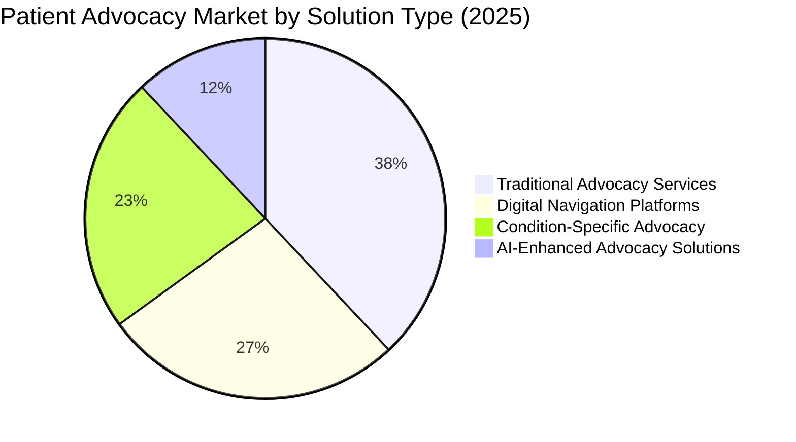

# Patient Advocacy Platform: Competitive Analysis 2025

## Overview

This document provides a detailed competitive analysis for the Patient Advocacy Platform, examining key players in the market, their strengths and weaknesses, and identifying strategic opportunities for differentiation. This analysis complements the broader market analysis and informs our product development and go-to-market strategies.

## Competitive Landscape

### Market Segmentation by Solution Type

## Detailed Competitor Profiles

### Tier 1: Market Leaders

#### 1. Accolade
**Company Overview**: Founded in 2007, Accolade is a leading health and benefits solution that combines technology with human expertise to help people navigate the healthcare system.

**Key Statistics**:
- Revenue (2024): $562 million
- Market Share: 14.2%
- Total Customers: 500+ employers, 10M+ members
- Year-over-Year Growth: 18%

**Product Offering**:
- Accolade Care: Virtual primary care and mental health service
- Accolade Expert MD: Expert medical opinion service
- Accolade Advocacy: Healthcare navigation and advocacy

**Strengths**:
- Strong employer relationships and integration with major health plans
- Comprehensive service offering combining technology and human support
- Established brand recognition and trust in the market
- Strong clinical team with healthcare expertise

**Weaknesses**:
- High cost structure limiting market penetration
- Limited personalization in digital experience
- Fragmented user experience across multiple products
- Slow to innovate compared to newer entrants

**Recent Developments**:
- Acquired PlushCare (2023) to expand virtual primary care capabilities
- Launched integrated mental health platform (2024)
- Expanded Medicare Advantage partnerships

#### 2. Quantum Health
**Company Overview**: Founded in 1999, Quantum Health provides consumer healthcare navigation and care coordination services primarily to self-insured employers.

**Key Statistics**:
- Revenue (2024): $490 million
- Market Share: 11.8%
- Total Customers: 400+ employers, 8M+ members
- Year-over-Year Growth: 14%

**Product Offering**:
- Care Coordination: Healthcare navigation and advocacy
- Provider Connect: Provider recommendation and scheduling
- Claims Resolution: Medical billing and insurance support

**Strengths**:
- Established base of enterprise clients
- Strong clinical expertise and high-touch service model
- Deep integration with employer benefits
- Proven ROI metrics for clients

**Weaknesses**:
- Limited technology innovation
- Primarily human-powered with high operational costs
- Aging digital platform with limited mobile experience
- Slow adaptation to consumer-driven healthcare trends

**Recent Developments**:
- Private equity acquisition (2023) driving expansion
- New analytics platform measuring healthcare outcomes
- Enhanced provider directory with quality metrics

#### 3. Health Advocate (Intrado)
**Company Overview**: Founded in 2001 and acquired by Intrado in 2014, Health Advocate provides clinical and administrative support to help navigate the complex healthcare system.

**Key Statistics**:
- Revenue (2024): $420 million
- Market Share: 9.7%
- Total Customers: 12,500+ organizations, 12M+ members
- Year-over-Year Growth: 8%

**Product Offering**:
- Advocacy Services: Healthcare navigation and claims support
- EAP+Work/Life: Employee assistance and wellness programs
- Chronic Care Management: Condition-specific support programs

**Strengths**:
- Comprehensive service offering beyond healthcare navigation
- Strong brand recognition and established market presence
- Broad distribution through employers and health plans
- Integrated EAP and behavioral health services

**Weaknesses**:
- Aging technology platform with limited innovation
- Fragmented user experience across multiple service lines
- Declining market share and growth rate
- Corporate ownership changes affecting strategic direction

**Recent Developments**:
- New digital portal attempting to unify service offerings
- Expansion into Medicare navigation services
- Strategic focus on behavioral health integration

### Tier 2: Digital Innovators

#### 4. Wellframe
**Company Overview**: Founded in 2011, Wellframe offers a mobile solution for care management and patient engagement, recently acquired by HealthEdge in 2021.

**Key Statistics**:
- Revenue (2024): $180 million
- Market Share: 4.3%
- Total Customers: 60+ health plans
- Year-over-Year Growth: 29%

**Product Offering**:
- Digital Care Management: Mobile-first care management platform
- Advocacy Connect: Digital connection to care teams
- Digital Health Plan: Member engagement and navigation

**Strengths**:
- Strong mobile experience with high engagement metrics
- Care plan integration and care team communication
- Broad health plan adoption
- Data-driven approach to member engagement

**Weaknesses**:
- Limited advocacy expertise compared to traditional players
- Narrow feature set focused primarily on care management
- Requires health plan implementation for member access
- Missing direct provider integration

**Recent Developments**:
- HealthEdge acquisition bringing new resources
- Expanded AI capabilities for member engagement
- Enhanced interoperability with EHR systems

#### 5. Buoy Health
**Company Overview**: Founded in 2014, Buoy Health offers an AI-powered healthcare navigation platform for symptom checking and care guidance.

**Key Statistics**:
- Revenue (2024): $135 million
- Market Share: 3.2%
- Total Customers: 85+ health systems, 20+ health plans
- Year-over-Year Growth: 42%

**Product Offering**:
- Symptom Checker: AI-driven symptom assessment
- Care Navigation: Personalized care guidance
- Back-to-Work: COVID-19 workforce solutions (pivoting to broader services)

**Strengths**:
- Advanced AI technology for symptom analysis
- User-friendly digital experience
- Strong partnerships with leading health systems
- Rapid product innovation cycle

**Weaknesses**:
- Limited human touch in service delivery
- Narrow focus primarily on triage and initial navigation
- Limited support for ongoing care coordination
- Challenges with clinical integration and trust

**Recent Developments**:
- Series D funding ($85M in 2023)
- Expanded health plan partnerships
- New enterprise platform for health systems

#### 6. Grand Rounds Health/Included Health
**Company Overview**: Founded in 2011, Grand Rounds merged with Doctor On Demand in 2021 to form Included Health, offering a comprehensive healthcare navigation platform.

**Key Statistics**:
- Revenue (2024): $295 million
- Market Share: 7.1%
- Total Customers: 300+ employers, 15M+ members
- Year-over-Year Growth: 23%

**Product Offering**:
- Healthcare Navigation: Benefits guidance and care coordination
- Virtual Primary Care: Telehealth services
- Expert Opinions: Specialist second opinion service

**Strengths**:
- Integrated virtual care and navigation platform
- Strong clinical expertise and specialist network
- Comprehensive service offering
- Robust data on provider quality and outcomes

**Weaknesses**:
- High cost structure
- Fragmented digital experience following merger
- Complex implementation for employers
- Challenges scaling human expertise

**Recent Developments**:
- Post-merger integration of platforms
- Enhanced provider quality analytics
- New specialty care programs for complex conditions

### Tier 3: Emerging Disruptors

#### 7. Doctolib
**Company Overview**: Founded in 2013 in France, Doctolib offers a practice management and telehealth platform with expanding patient services including navigation and advocacy.

**Key Statistics**:
- Revenue (2024): $75 million in advocacy services ($650M total)
- Market Share: 1.8% of advocacy market (growing rapidly)
- Total Customers: 300,000+ providers, 70M+ patients (primarily Europe)
- Year-over-Year Growth: 68% in advocacy segment

**Product Offering**:
- Provider Booking: Online appointment scheduling
- Patient Companion: Digital health assistant and records
- Care Navigation: Care coordination and advocacy (newer offering)

**Strengths**:
- Massive European user base providing scale
- Strong provider relationships and integration
- Superior booking and scheduling technology
- Patient-centric approach with direct consumer relationships

**Weaknesses**:
- Limited US presence
- Primary focus on scheduling rather than comprehensive advocacy
- Early-stage advocacy capabilities
- European healthcare model orientation requiring adaptation

**Recent Developments**:
- US market entry strategy
- New patient navigation features
- Healthcare record integration capabilities

#### 8. Aimedis
**Company Overview**: Founded in 2017, Aimedis provides a blockchain-based healthcare platform with patient advocacy and coordination features.

**Key Statistics**:
- Revenue (2024): $48 million
- Market Share: 1.2%
- Total Customers: 120,000+ patients, 3,200+ providers
- Year-over-Year Growth: 112%

**Product Offering**:
- Digital Health Wallet: Blockchain-based health record
- Advocacy Network: Matching patients with advocates
- Provider Marketplace: Direct provider access and booking

**Strengths**:
- Innovative blockchain health records with patient ownership
- Direct patient control of health data sharing
- Growing international presence
- Strong privacy and security focus

**Weaknesses**:
- Complex user experience requiring technical understanding
- Early-stage platform with limited adoption
- Regulatory uncertainty in some markets
- Limited integration with established healthcare systems

**Recent Developments**:
- Series B funding ($65M in 2023)
- US regulatory approval for health record system
- Partnership with major pharmacy chain for data integration

## Feature Comparison Matrix

| Feature | Accolade | Quantum Health | Health Advocate | Wellframe | Buoy Health | Included Health | Doctolib | Aimedis | **Our Platform** |
|---------|----------|---------------|----------------|-----------|------------|----------------|----------|---------|-----------------|
| **Core Navigation** |
| Provider Search | ⭐⭐⭐⭐⭐ | ⭐⭐⭐⭐ | ⭐⭐⭐ | ⭐⭐⭐ | ⭐⭐⭐ | ⭐⭐⭐⭐⭐ | ⭐⭐⭐⭐⭐ | ⭐⭐ | ⭐⭐⭐⭐ |
| Insurance Support | ⭐⭐⭐⭐⭐ | ⭐⭐⭐⭐⭐ | ⭐⭐⭐⭐ | ⭐⭐⭐ | ⭐⭐ | ⭐⭐⭐⭐ | ⭐ | ⭐⭐ | ⭐⭐⭐⭐ |
| Care Coordination | ⭐⭐⭐⭐ | ⭐⭐⭐⭐⭐ | ⭐⭐⭐ | ⭐⭐⭐⭐ | ⭐⭐ | ⭐⭐⭐ | ⭐⭐ | ⭐⭐ | ⭐⭐⭐⭐⭐ |
| **Technology** |
| Mobile Experience | ⭐⭐⭐ | ⭐⭐ | ⭐⭐ | ⭐⭐⭐⭐⭐ | ⭐⭐⭐⭐ | ⭐⭐⭐ | ⭐⭐⭐⭐⭐ | ⭐⭐⭐ | ⭐⭐⭐⭐⭐ |
| AI Capabilities | ⭐⭐⭐ | ⭐⭐ | ⭐⭐ | ⭐⭐⭐ | ⭐⭐⭐⭐⭐ | ⭐⭐⭐ | ⭐⭐⭐ | ⭐⭐⭐ | ⭐⭐⭐⭐⭐ |
| Integration APIs | ⭐⭐⭐⭐ | ⭐⭐⭐ | ⭐⭐ | ⭐⭐⭐⭐ | ⭐⭐⭐ | ⭐⭐⭐ | ⭐⭐⭐⭐ | ⭐⭐⭐⭐ | ⭐⭐⭐⭐ |
| **Service Model** |
| Human Support | ⭐⭐⭐⭐⭐ | ⭐⭐⭐⭐⭐ | ⭐⭐⭐⭐ | ⭐⭐ | ⭐ | ⭐⭐⭐⭐ | ⭐⭐ | ⭐⭐ | ⭐⭐⭐⭐ |
| Self-Service | ⭐⭐⭐ | ⭐⭐ | ⭐⭐ | ⭐⭐⭐⭐ | ⭐⭐⭐⭐⭐ | ⭐⭐⭐ | ⭐⭐⭐⭐ | ⭐⭐⭐ | ⭐⭐⭐⭐⭐ |
| Condition Support | ⭐⭐⭐⭐ | ⭐⭐⭐ | ⭐⭐⭐⭐ | ⭐⭐⭐⭐ | ⭐⭐ | ⭐⭐⭐⭐ | ⭐⭐ | ⭐⭐⭐ | ⭐⭐⭐⭐ |
| **User Experience** |
| Personalization | ⭐⭐⭐ | ⭐⭐ | ⭐⭐ | ⭐⭐⭐ | ⭐⭐⭐⭐ | ⭐⭐⭐ | ⭐⭐⭐ | ⭐⭐ | ⭐⭐⭐⭐⭐ |
| Accessibility | ⭐⭐⭐ | ⭐⭐ | ⭐⭐ | ⭐⭐⭐ | ⭐⭐⭐ | ⭐⭐⭐ | ⭐⭐⭐ | ⭐⭐ | ⭐⭐⭐⭐⭐ |
| Multi-platform | ⭐⭐⭐ | ⭐⭐ | ⭐⭐ | ⭐⭐⭐⭐ | ⭐⭐⭐⭐ | ⭐⭐⭐ | ⭐⭐⭐⭐ | ⭐⭐⭐ | ⭐⭐⭐⭐⭐ |
| **Distribution** |
| Enterprise Reach | ⭐⭐⭐⭐⭐ | ⭐⭐⭐⭐⭐ | ⭐⭐⭐⭐ | ⭐⭐⭐ | ⭐⭐ | ⭐⭐⭐⭐ | ⭐⭐ | ⭐ | ⭐⭐⭐ |
| Consumer Reach | ⭐⭐ | ⭐ | ⭐⭐ | ⭐⭐ | ⭐⭐⭐ | ⭐⭐ | ⭐⭐⭐⭐⭐ | ⭐⭐⭐ | ⭐⭐⭐⭐ |
| Provider Network | ⭐⭐⭐⭐ | ⭐⭐⭐ | ⭐⭐⭐ | ⭐⭐ | ⭐⭐ | ⭐⭐⭐⭐⭐ | ⭐⭐⭐⭐⭐ | ⭐⭐ | ⭐⭐⭐ |

## Strategic Opportunities for Differentiation

Based on our competitive analysis, we've identified several opportunities for the Patient Advocacy Platform to differentiate in the market:

### 1. Multi-Stakeholder Ecosystem
**Gap**: Current solutions typically focus on single stakeholders (patients, employers, or healthcare systems).
**Opportunity**: Create an integrated platform that serves patients, advocates, and providers with role-specific experiences in a unified ecosystem.
**Execution**: Leverage our role-based UI architecture to create tailored experiences within a single platform.

### 2. AI-Driven Personalization with Human Support
**Gap**: Competitors either offer high-touch human services (expensive, not scalable) or purely digital tools (limited personalization and trust).
**Opportunity**: Combine advanced AI for personalization with strategically deployed human advocacy support.
**Execution**: Implement AI for routine navigation and personalization while preserving human connection for complex needs and emotional support.

### 3. Inclusive Design and Health Equity
**Gap**: Most platforms cater to digitally-savvy, higher-income users with strong health literacy.
**Opportunity**: Expand market by focusing on inclusive design that serves diverse populations including underserved communities.
**Execution**: Leverage our accessibility-first design principles, multiple language support, and simplified user journeys.

### 4. Comprehensive Data Integration
**Gap**: Healthcare data remains siloed with limited interoperability between advocacy platforms and clinical systems.
**Opportunity**: Create a unified patient data hub that aggregates and normalizes health information from disparate sources.
**Execution**: Develop robust API integrations with EHRs, claims systems, pharmacy data, and patient-generated information.

### 5. Condition-Specific Advocacy Pathways
**Gap**: Generic navigation fails to address unique needs of specific health conditions.
**Opportunity**: Develop specialized advocacy journeys for high-impact conditions while maintaining a unified platform.
**Execution**: Create customizable advocacy templates for conditions like diabetes, cancer, cardiovascular disease, and mental health.

## Competitive Threat Assessment

### Near-Term Threats (12-18 months)

1. **Accolade's Digital Transformation**
   - Threat Level: High
   - Impact: Potential rapid improvement of digital capabilities through acquisitions
   - Response: Accelerate development of differentiating features and focus on user experience advantage

2. **Buoy Health's Expansion Beyond Triage**
   - Threat Level: Medium
   - Impact: Competition in the AI-first advocacy space
   - Response: Emphasize our integrated human+AI approach and broader service offering

3. **Wellframe's Health Plan Distribution**
   - Threat Level: Medium
   - Impact: Rapid scaling through health plan partnerships
   - Response: Pursue strategic health system partnerships and direct-to-consumer channels

### Long-Term Threats (18-36 months)

1. **Tech Giant Entry (Apple, Google, Amazon)**
   - Threat Level: High
   - Impact: Massive distribution and technical capabilities
   - Response: Establish strong market position in specialized advocacy and focus on healthcare domain expertise

2. **EHR Vendor Expansion (Epic, Cerner)**
   - Threat Level: Medium
   - Impact: Integration advantage with clinical systems
   - Response: Develop superior user experience and multi-system integration capabilities

3. **International Competitors (Doctolib, Babylon Health)**
   - Threat Level: Medium
   - Impact: Expansion of European players with significant resources
   - Response: Leverage US healthcare system expertise and regulatory knowledge

## Strategic Recommendations

Based on this competitive analysis, we recommend the following strategic priorities:

1. **Develop Signature Differentiators**
   - Invest heavily in AI-powered personalization that significantly exceeds current market capabilities
   - Create a best-in-class experience for matching patients with advocates
   - Build robust multi-role collaboration tools that no competitor currently offers

2. **Strategic Targeting**
   - Focus initially on chronic condition management where coordination needs are highest
   - Target mid-sized health systems seeking patient experience improvements
   - Develop direct-to-consumer acquisition for patients underserved by current solutions

3. **Technical Advantage**
   - Maintain modern technology stack advantage (React, TypeScript, modular architecture)
   - Prioritize API development for rapid integration with healthcare systems
   - Create data leverage through aggregation of advocacy interactions

4. **Experience Excellence**
   - Execute flawlessly on accessibility and inclusive design
   - Develop category-leading mobile experience leveraging our responsive design system
   - Create emotional connection through carefully crafted user experience

5. **Ecosystem Development**
   - Build network effects by connecting all stakeholders
   - Create platform for third-party advocacy specialists to participate
   - Develop data insights that improve with scale

## Conclusion

The competitive landscape for patient advocacy platforms is evolving rapidly, with traditional services converging with digital-first solutions. While established players have significant market share and enterprise relationships, their limited technology capabilities and rising costs create opportunities for disruption.

The Patient Advocacy Platform can establish a differentiated position by focusing on a unified ecosystem approach that bridges human expertise with AI capabilities while prioritizing inclusive design and comprehensive health data integration. By executing on the strategic recommendations outlined above, we can capture significant market share in this growing segment while delivering meaningful improvements in healthcare navigation and outcomes.
