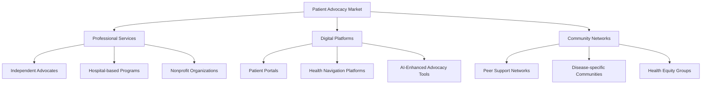
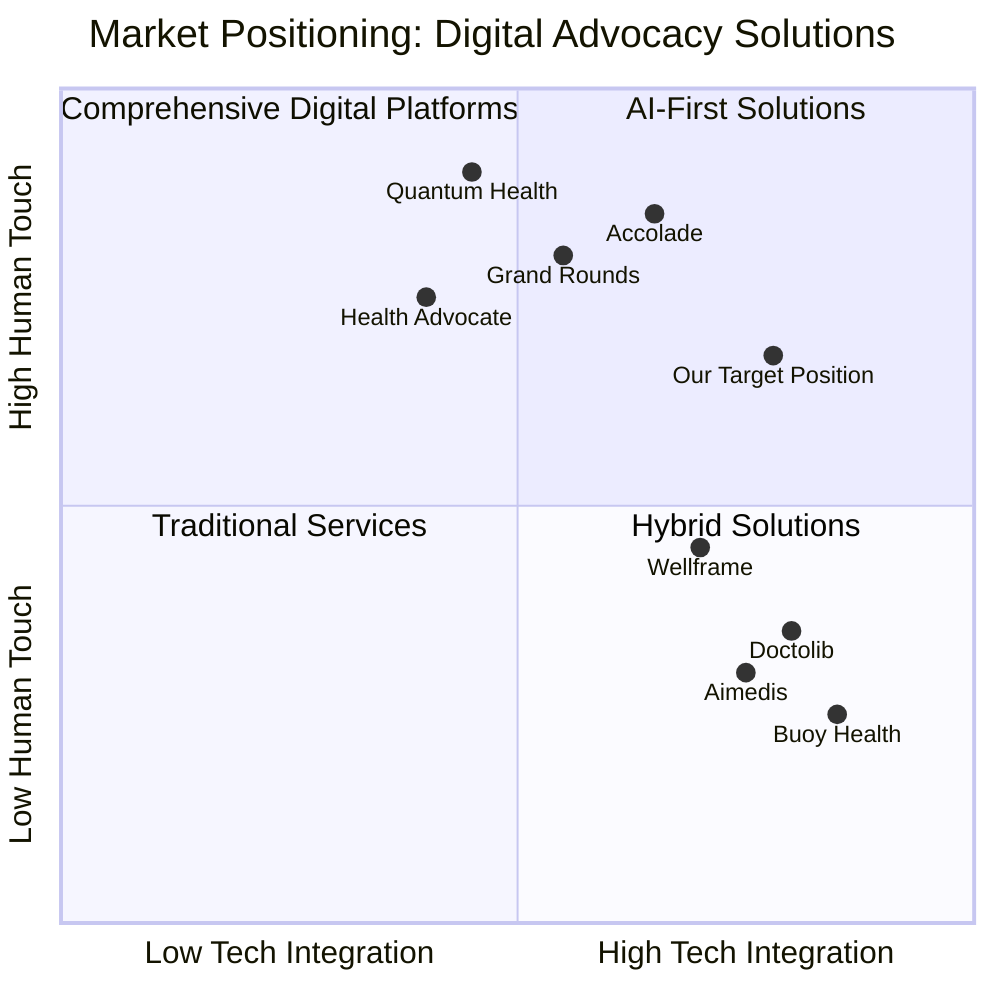
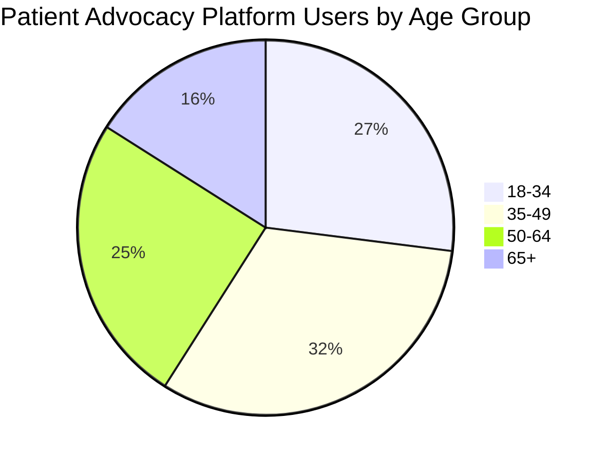

# Patient Advocacy Platform: Market Analysis 2025

## Executive Summary

The patient advocacy market has undergone significant transformation through 2024-2025, driven by digital health acceleration, increased healthcare complexity, and growing consumer demand for personalized support. This analysis examines the current market landscape, identifies key competitors, analyzes target segments, and outlines strategic opportunities for the Patient Advocacy Platform.

The global patient advocacy market is projected to reach $1.7 billion by 2026, growing at a CAGR of 14.3% from 2021. Digital patient advocacy platforms are the fastest-growing segment, with AI-enhanced solutions capturing premium market positioning.

## Market Overview

### Market Size and Growth
- **Global Market Value (2025)**: $1.4 billion
- **Projected Market Value (2028)**: $2.3 billion
- **CAGR (2025-2028)**: 18.2%
- **Digital Advocacy Platforms Segment (2025)**: $580 million (41% of total market)
- **North America Market Share**: 42%
- **Europe Market Share**: 28%
- **Asia-Pacific Market Share**: 22%
- **Rest of World**: 8%

### Key Market Drivers

1. **Healthcare System Complexity**
   - The average patient now navigates 7+ healthcare providers
   - 68% of patients report difficulty coordinating their own care
   - Insurance complexity has increased by 34% since 2020

2. **Consumer Empowerment**
   - 76% of patients research health conditions before provider visits
   - 64% seek second opinions for serious diagnoses
   - 82% want more control over their healthcare decisions

3. **Digital Health Acceleration**
   - Telehealth utilization 38x higher than pre-pandemic levels
   - 71% of patients use at least one health app regularly
   - Virtual care options now standard across 89% of health systems

4. **Value-Based Care Transition**
   - 53% of healthcare payments now tied to quality/outcomes
   - Patient satisfaction metrics directly impact provider reimbursement
   - Health systems investing in advocacy to improve outcomes

5. **Health Equity Focus**
   - Recognition of 14.7 year life expectancy gap between highest and lowest income groups
   - Government initiatives funding advocacy for underserved populations
   - Corporate ESG initiatives increasingly include health equity components

## Competitive Landscape

### Market Segmentation

The patient advocacy market consists of four primary segments:

1. **Traditional Advocacy Services (Market Share: 38%)**
   - Human-centered advocacy services
   - Typically high-touch, high-cost
   - Limited scalability
   - Example players: Patient Advocate Foundation, Health Advocate, Aimedis

2. **Digital Navigation Platforms (Market Share: 27%)**
   - Technology platforms focusing on healthcare navigation
   - Variable levels of human support
   - Moderate scalability
   - Example players: Wellframe, Accolade, Quantum Health

3. **Condition-Specific Advocacy (Market Share: 23%)**
   - Focused on specific disease states or conditions
   - Often nonprofit or pharmaceutical-sponsored
   - Varied digital maturity
   - Example players: American Cancer Society, JDRF Navigator, Teva's Life Effects

4. **AI-Enhanced Advocacy Solutions (Market Share: 12%)**
   - Emerging segment with highest growth rate
   - Leveraging AI for personalization and scale
   - Reduced human resource requirements
   - Example players: Buoy Health, Doctolib, Ada Health, Infermedica

### Key Competitors Analysis

#### Tier 1: Market Leaders

1. **Accolade**
   - **Market Share**: 14.2%
   - **Key Strengths**: Strong employer relationships, integrated with major health plans
   - **Weaknesses**: Limited personalization, high cost structure
   - **Target Audience**: Large employers, health plans
   - **Pricing Model**: PMPM (Per Member Per Month) ranging from $5-12

2. **Quantum Health**
   - **Market Share**: 11.8%
   - **Key Strengths**: Established base of enterprise clients, clinical expertise
   - **Weaknesses**: Limited technology innovation, primarily human-powered
   - **Target Audience**: Self-insured employers, health systems
   - **Pricing Model**: PMPM ranging from $6-15 plus performance fees

3. **Health Advocate (Intrado)**
   - **Market Share**: 9.7%
   - **Key Strengths**: Comprehensive service offering, strong brand recognition
   - **Weaknesses**: Aging technology platform, fragmented user experience
   - **Target Audience**: Mid-market employers, medicare advantage plans
   - **Pricing Model**: PMPM ranging from $3-9 plus additional services

#### Tier 2: Digital Innovators

4. **Wellframe**
   - **Market Share**: 4.3%
   - **Key Strengths**: Strong mobile experience, care plan integration
   - **Weaknesses**: Limited advocacy expertise, narrow feature set
   - **Target Audience**: Health plans, at-risk providers
   - **Pricing Model**: PMPM ranging from $2-7 based on features

5. **Buoy Health**
   - **Market Share**: 3.2%
   - **Key Strengths**: Advanced AI technology, symptom checking capabilities
   - **Weaknesses**: Limited human touch, narrow focus on triage
   - **Target Audience**: Health systems, telemedicine providers
   - **Pricing Model**: Licensing fees plus per-user rates

6. **Grand Rounds Health/Included Health**
   - **Market Share**: 7.1%
   - **Key Strengths**: Second opinion services, provider network
   - **Weaknesses**: High cost, fragmented digital experience
   - **Target Audience**: Large employers, health plans
   - **Pricing Model**: PMPM ranging from $4-10, plus utilization fees

#### Tier 3: Emerging Disruptors

7. **Doctolib**
   - **Market Share**: 1.8% (growing rapidly)
   - **Key Strengths**: Patient engagement, appointment management
   - **Weaknesses**: Limited US presence, focused primarily on scheduling
   - **Target Audience**: European providers, patients seeking direct access
   - **Pricing Model**: SaaS subscription for providers, free for patients

8. **Aimedis**
   - **Market Share**: 1.2%
   - **Key Strengths**: Blockchain health records, patient ownership focus
   - **Weaknesses**: Complex user experience, early-stage platform
   - **Target Audience**: Tech-savvy patients, innovative providers
   - **Pricing Model**: Freemium with premium subscription options

### Competitive Positioning Map

## Target Market Analysis

### Primary Market Segments

1. **Chronic Condition Patients**
   - **Size**: 147 million Americans (45% of population)
   - **Key Needs**: Ongoing care coordination, medication management, specialist navigation
   - **Digital Adoption**: Moderate to high (72% use health apps)
   - **Willingness to Pay**: $15-40/month for premium services
   - **Acquisition Channels**: Condition-specific communities, provider referrals

2. **Healthcare System Navigators**
   - **Size**: 83 million Americans (adults coordinating care for self and others)
   - **Key Needs**: Appointment scheduling, records management, insurance navigation
   - **Digital Adoption**: High (86% use digital scheduling tools)
   - **Willingness to Pay**: $10-30/month for premium services
   - **Acquisition Channels**: Insurance partners, direct-to-consumer marketing

3. **Healthcare Professionals & Advocates**
   - **Size**: 220,000 dedicated patient advocates and care coordinators
   - **Key Needs**: Case management tools, resource databases, communication systems
   - **Digital Adoption**: Variable (dependent on organization)
   - **Willingness to Pay**: $50-200/month per user for professional tools
   - **Acquisition Channels**: Professional associations, health systems, B2B sales

4. **Health System Partners**
   - **Size**: 5,200 hospitals and 230 major health systems in the US
   - **Key Needs**: Patient satisfaction improvement, readmission reduction, care coordination
   - **Digital Adoption**: Moderate (accelerating post-pandemic)
   - **Willingness to Pay**: $3-8 PMPM for managed populations
   - **Acquisition Channels**: Direct enterprise sales, value-based care networks

### Demographic Analysis of Digital Advocacy Users

**Key Demographics of Digital Advocacy Users:**
- **Gender**: 63% female, 37% male, <1% non-binary
- **Education**: 68% college educated
- **Income**: 42% earn $75K+, 37% earn $40-75K, 21% earn <$40K
- **Insurance Status**: 73% private insurance, 18% Medicare, 9% Medicaid
- **Health Status**: 65% have at least one chronic condition
- **Digital Comfort**: 82% rate themselves as "comfortable" or "very comfortable" with digital health tools

### Psychographic Profiles

1. **Proactive Health Managers (38% of target users)**
   - Research-oriented and information-seeking
   - Actively track health metrics
   - Value control and preventive care
   - Willing to pay for premium health services

2. **Care Coordinators (27% of target users)**
   - Managing healthcare for multiple family members
   - Value efficiency and organization
   - Time-constrained and seeking simplification
   - Moderate digital literacy but high adoption intent

3. **Health System Navigators (22% of target users)**
   - Recently diagnosed or new to complex treatment
   - Seeking guidance and education
   - Value expert-backed information
   - Variable digital comfort levels

4. **Healthcare Optimizers (13% of target users)**
   - Highly engaged with healthcare system
   - Seeking best possible care within constraints
   - Value second opinions and specialist access
   - High digital literacy and adoption

## Market Opportunity Analysis

### Unmet Needs & Opportunities

1. **Integrated Care Navigation (TAM: $610M)**
   - Fragmented healthcare journey creates coordination gaps
   - 73% of patients manage multiple providers with no central coordination
   - Opportunity: Unified platform connecting all aspects of care journey

2. **AI-Enhanced Personalization (TAM: $410M)**
   - Current platforms offer limited personalization capabilities
   - 82% of patients want health information tailored to their specific situation
   - Opportunity: AI-driven personalized guidance and recommendations

3. **Underserved Demographics (TAM: $380M)**
   - Current advocacy solutions primarily target educated, higher-income users
   - 57 million Americans face literacy or language barriers to healthcare
   - Opportunity: Accessible solutions for diverse populations

4. **Health System Integration (TAM: $520M)**
   - Limited interoperability between advocacy platforms and health systems
   - 67% of patients report duplicate efforts across care providers
   - Opportunity: Seamlessly integrated platform with bidirectional EHR connectivity

5. **Value-Based Care Alignment (TAM: $490M)**
   - Advocacy services often disconnected from quality metrics
   - Health systems seeking solutions that improve VBC performance
   - Opportunity: Advocacy platform with measurable outcomes tied to reimbursement

### SWOT Analysis for Patient Advocacy Platform

**Strengths:**
- Comprehensive design system and UI/UX specifications
- Modern technology stack (React, TypeScript, Redux)
- Responsive design for all device sizes
- Role-based approach covering patients, advocates, and providers
- Accessibility built into design principles

**Weaknesses:**
- New entrant in established market
- Limited existing partnerships and distribution channels
- Requires critical mass of users for maximum effectiveness
- Complex regulatory environment to navigate

**Opportunities:**
- Growing demand for digital health navigation (18.2% CAGR)
- Increasing healthcare complexity driving advocacy need
- Healthcare consumerization trend
- Health equity initiatives creating new funding streams
- AI advancement enabling personalization at scale

**Threats:**
- Large incumbents with established customer base
- Healthcare system resistance to change
- Potential regulatory changes affecting digital health
- Data privacy concerns limiting adoption
- Health literacy barriers to digital tool adoption

## Go-to-Market Strategy Recommendations

### Positioning Strategy

Position the Patient Advocacy Platform as a **"Comprehensive Digital Health Companion"** that combines:
1. The personalization of AI technology
2. The trust of human advocacy expertise
3. The integration capabilities of a modern digital platform

**Key Differentiators:**
- **Personalized Advocacy Journeys**: Beyond one-size-fits-all approaches
- **Seamless Multi-Role Platform**: Connecting patients, advocates, and providers in one ecosystem
- **Accessibility-First Design**: Reaching underserved populations effectively
- **Outcome-Driven Approach**: Measuring and demonstrating concrete health improvements

### Market Entry Approach

1. **Phase 1: Strategic Focus (Months 1-6)**
   - Target chronic condition management for diabetes and cardiovascular disease
   - Partner with 2-3 mid-sized health systems for pilot implementations
   - Focus on patient-advocate matching and care coordination features

2. **Phase 2: Expansion (Months 7-18)**
   - Expand condition coverage to include oncology, neurology, and mental health
   - Add enterprise features for health system deployment
   - Develop direct-to-consumer marketing channel
   - Implement advanced AI personalization capabilities

3. **Phase 3: Scaling (Months 19-36)**
   - Pursue health plan integrations and partnerships
   - Expand to international markets (Canada, UK, Australia initially)
   - Develop API ecosystem for third-party developers
   - Implement value-based care measurement and reporting tools

### Revenue Model Options

1. **B2B Enterprise Model**
   - **Primary Customers**: Health systems, payers, employers
   - **Pricing Structure**: PMPM ($4-8) with volume tiers
   - **Implementation Fees**: $25,000-100,000 depending on size
   - **Expected Margins**: 65-75% after implementation

2. **B2C Subscription Model**
   - **Primary Customers**: Patients and caregivers
   - **Pricing Structure**: 
     - Freemium base offering
     - Premium tier ($12.99/month or $129/year)
     - Family plan ($19.99/month or $199/year for up to 5 members)
   - **Expected Margins**: 70-80% at scale

3. **Hybrid Partnership Model (Recommended)**
   - **Primary Approach**: Combined B2B and B2C strategies
   - **Enterprise Layer**: Health system and payer partnerships
   - **Consumer Layer**: Direct subscription offering
   - **Revenue Sharing**: With healthcare partners for referred subscriptions
   - **Expected Margins**: 60-70% blended

## Market Risks and Mitigations

### Identified Risks

1. **Market Adoption Risk**
   - **Risk Level**: Medium
   - **Impact**: Slow user growth affecting platform utility
   - **Mitigation**: Phased rollout focusing on high-need populations, feature prioritization based on user feedback

2. **Competitive Response Risk**
   - **Risk Level**: High
   - **Impact**: Increased marketing costs, pricing pressure
   - **Mitigation**: Develop distinctive features, secure strategic partnerships, prioritize user retention

3. **Regulatory Compliance Risk**
   - **Risk Level**: Medium-High
   - **Impact**: Delayed launches, redesign requirements
   - **Mitigation**: Proactive HIPAA compliance, regulatory expertise on team, modular design for regional requirements

4. **Business Model Sustainability Risk**
   - **Risk Level**: Medium
   - **Impact**: Revenue shortfalls, investor concern
   - **Mitigation**: Diversified revenue streams, clear unit economics monitoring, evidence-based value demonstration

5. **Health System Integration Risk**
   - **Risk Level**: High
   - **Impact**: Limited functionality, user frustration
   - **Mitigation**: Open API architecture, strategic EHR partnerships, progressive enhancement design

## Conclusion and Strategic Recommendations

The patient advocacy market presents a significant opportunity for digital innovation that addresses healthcare system complexity while empowering patients. Our analysis suggests the Patient Advocacy Platform is well-positioned to capture market share through its comprehensive design, technical foundation, and multi-stakeholder approach.

**Key Strategic Recommendations:**

1. **Focus on Differentiated Experience**
   - Invest in user experience that dramatically simplifies healthcare navigation
   - Develop proprietary AI capabilities for personalization at scale
   - Create seamless experiences across web and mobile platforms

2. **Build Strategic Partnerships**
   - Prioritize health system relationships for distribution and integration
   - Develop partnerships with patient advocacy organizations for credibility
   - Explore pharmaceutical partnerships for condition-specific support

3. **Implement Phased Go-to-Market**
   - Start with focused condition areas where impact can be clearly demonstrated
   - Build evidence base through pilots before broad market expansion
   - Balance enterprise and direct-to-consumer approaches

4. **Emphasize Measurable Outcomes**
   - Develop clear metrics for platform effectiveness (healthcare utilization, satisfaction, outcomes)
   - Create dashboard reporting for enterprise customers
   - Build case studies demonstrating ROI for different stakeholders

By addressing the critical gaps in today's fragmented patient advocacy landscape while leveraging modern technology and design principles, the Patient Advocacy Platform is positioned to become a market leader in this rapidly growing space.
