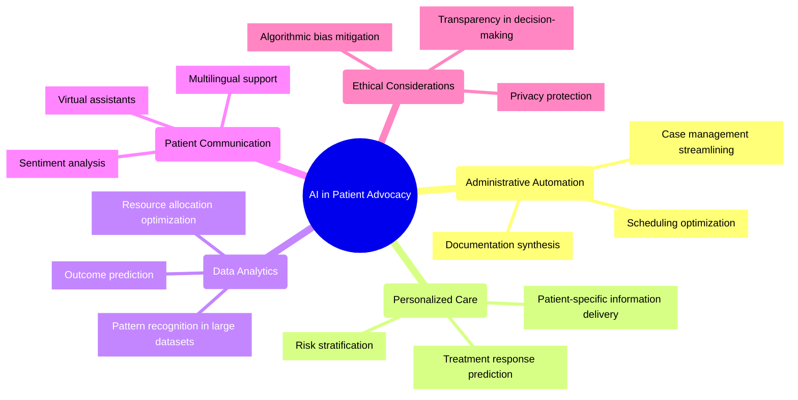
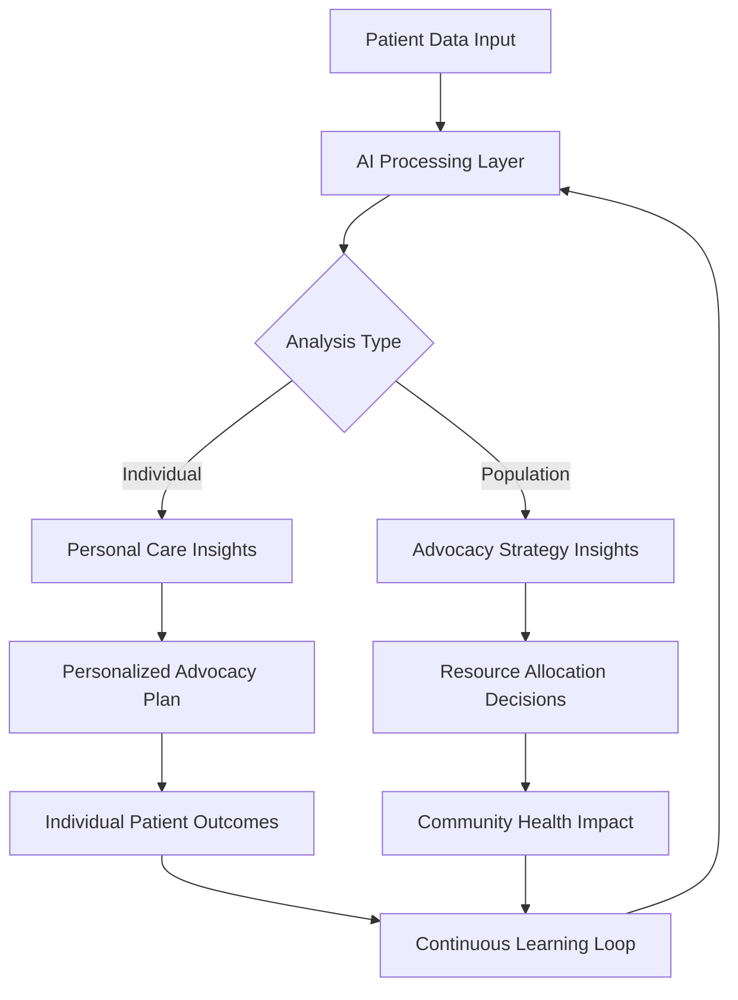

# AI in Patient Advocacy: 2024-2025 Trends

## Overview
Artificial intelligence (AI) is transforming patient advocacy with unprecedented capabilities that extend beyond basic automation. As of 2025, AI has become a cornerstone technology for effective patient advocacy, offering personalized support while addressing critical concerns around privacy, bias, and accessibility.

## Key Trends

## Impact Areas

### Clinical Support
AI systems are now capable of analyzing patient data to provide advocates with clearer, more actionable insights on individual cases. This enables a more personalized care experience while reducing the administrative burden on human advocates.

### Administrative Efficiency
In 2025, AI technologies have been successfully integrated into advocacy software platforms to:
- Generate concise summaries of case histories
- Automate routine documentation
- Identify patterns across patient populations
- Flag high-priority cases requiring immediate attention

### Data-Driven Advocacy
AI allows advocacy organizations to implement more targeted strategies by:
- Identifying underserved patient populations
- Highlighting systemic barriers to care
- Predicting emerging healthcare needs
- Measuring advocacy impact with greater precision

## Implementation Examples

## Challenges and Considerations

### Privacy and Security
As AI systems process increasingly sensitive health data, robust privacy protections have become essential. Patient advocates must ensure:
- Transparent consent processes
- Clear data usage policies
- Secure storage and transmission
- Compliance with evolving regulations

### Algorithmic Bias
Without careful implementation, AI systems can perpetuate or amplify existing healthcare disparities. Advocacy platforms in 2025 address this through:
- Diverse training datasets
- Regular bias audits
- Stakeholder input in system design
- Human oversight of AI recommendations

### Digital Divide
Advanced AI tools must be accessible to all patient populations, regardless of technological literacy or resource access. Modern advocacy platforms incorporate:
- Multiple access modalities (web, mobile, voice)
- Simplified user interfaces
- Offline functionality
- Adaptive technology for users with disabilities

## Future Directions

By late 2025, emerging trends in AI for patient advocacy include:
- Emotion-aware advocacy systems that can detect patient distress
- Federated learning approaches that protect privacy while improving AI models
- Integration with Internet of Medical Things (IoMT) devices
- Blockchain-secured patient data ownership models

## Recommended Implementation Strategy

For organizations looking to integrate AI into patient advocacy efforts:

1. **Start small**: Begin with specific, high-impact use cases
2. **Prioritize transparency**: Ensure patients understand how AI is used
3. **Maintain human oversight**: AI should augment rather than replace human advocates
4. **Measure impact**: Establish clear metrics for success
5. **Continuously train**: Regularly update AI systems with new data and feedback

## References

1. Vitafy Health. (2025). *Healthcare advocacy in 2025: Our trends and predictions*.
2. Powerful Patients. (2025). *The Future of Patient Advocacy: 5 Key Trends for 2025 and Beyond*.
3. BioLaunch Solutions. (2025). *Patient Advocacy Trends to Expect in 2025 and Beyond*.
4. American Society of Health-System Pharmacists. (2024). *ASHP Pharmacy Futures 2024*.
