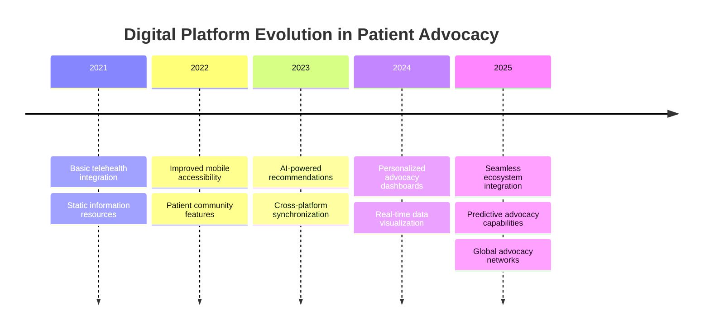
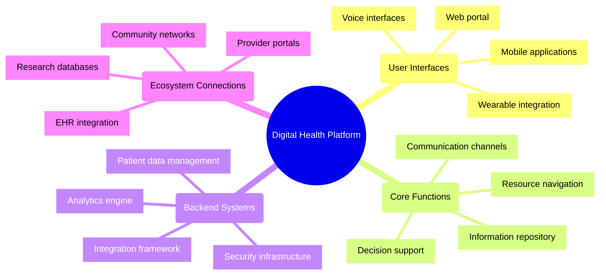
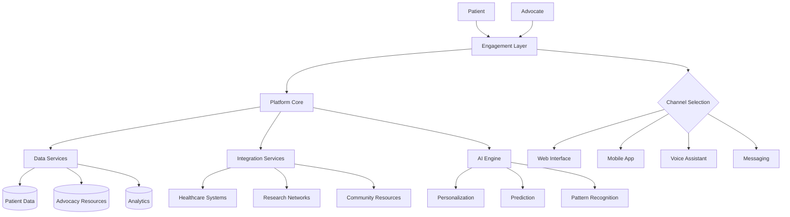

# Digital Health Platforms in Patient Advocacy: 2024-2025

## Overview
Digital platforms have revolutionized patient advocacy by 2025, providing unprecedented connectivity, accessibility, and functionality. These platforms serve as the technological backbone for effective advocacy efforts, connecting patients with resources, information, and support networks while generating valuable data for healthcare improvement.

## Platform Evolution

## Key Components

## Platform Architecture

## Critical Features for 2025

### Real-time Communication
- Integrated messaging systems with priority flagging
- Secure video consultation capabilities
- Contextual translation for multilingual support
- Synchronous and asynchronous communication options

### Resource Navigation
- AI-powered matching of patients to relevant resources
- Geolocation-based service recommendations
- Insurance coverage verification for suggested services
- Personalized educational content libraries

### Community Building
- Secure peer-to-peer connection platforms
- Moderated support groups with expert facilitation
- Experience sharing with privacy controls
- Collective advocacy campaign tools

### Data Analytics
- Outcomes tracking across patient populations
- Identification of service gaps and advocacy priorities
- Impact measurement for advocacy initiatives
- Predictive models for patient needs

## Implementation Considerations

### Accessibility Requirements
By 2025, digital advocacy platforms must address the digital divide through:
- Low-bandwidth options for limited connectivity
- Offline functionality for critical features
- Multiple language support with cultural adaptation
- Compliance with WCAG 2.2 accessibility standards
- Device-agnostic design philosophy

### Integration Standards
Modern platforms require seamless integration with:
- Electronic health record systems
- Insurance and payment systems
- Social service databases
- Research and clinical trial networks
- Smart health devices and wearables

### Security and Privacy Framework
2025 standards include:
- Granular consent management
- Purpose-specific data access controls
- Transparent audit trails
- Advanced encryption throughout the data lifecycle
- Regular security assessments and penetration testing

## Successful Platform Models

### Open-Source Collaborative Platforms
Community-developed platforms with modular architecture allowing:
- Customization for specific patient populations
- Rapid feature development through distributed teams
- Cost efficiency for resource-limited organizations
- Knowledge sharing across advocacy groups

### Enterprise Solutions
Comprehensive commercial platforms offering:
- End-to-end patient journey support
- Advanced analytics and reporting
- Professional implementation and support services
- Extensive integration capabilities
- Compliance guarantees

### Hybrid Ecosystems
Interconnected specialized tools forming complete advocacy systems:
- Best-of-breed approach for specific functionality
- API-first design for seamless integration
- Unified data models across components
- Consistent user experience through design standards

## Future Trends

By late 2025, emerging developments include:
- Ambient computing interfaces requiring minimal direct interaction
- Augmented reality for complex health information visualization
- Blockchain-secured patient data ownership models
- Virtual advocacy assistants with emotional intelligence
- Metaverse support environments for immersive patient communities

## Strategic Recommendations

1. **Prioritize user experience** over feature quantity
2. **Design for inclusion** from the beginning, not as an afterthought
3. **Focus on interoperability** to avoid creating siloed systems
4. **Implement privacy by design** in all platform aspects
5. **Build flexible architecture** that can evolve with changing needs
6. **Measure meaningful outcomes** beyond engagement metrics

## References

1. Powerful Patients. (2025). *The Future of Patient Advocacy: 5 Key Trends for 2025 and Beyond*.
2. BioLaunch Solutions. (2025). *Patient Advocacy Trends to Expect in 2025 and Beyond*.
3. Journal of Digital Health. (2024). *"Platform Approaches to Patient-Centered Advocacy in the Digital Age."*
4. Healthcare Information and Management Systems Society. (2024). *"Digital Platform Standards for Patient Advocacy."*
