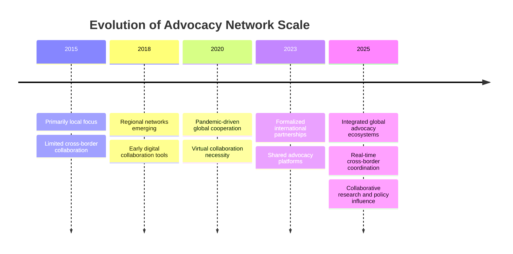
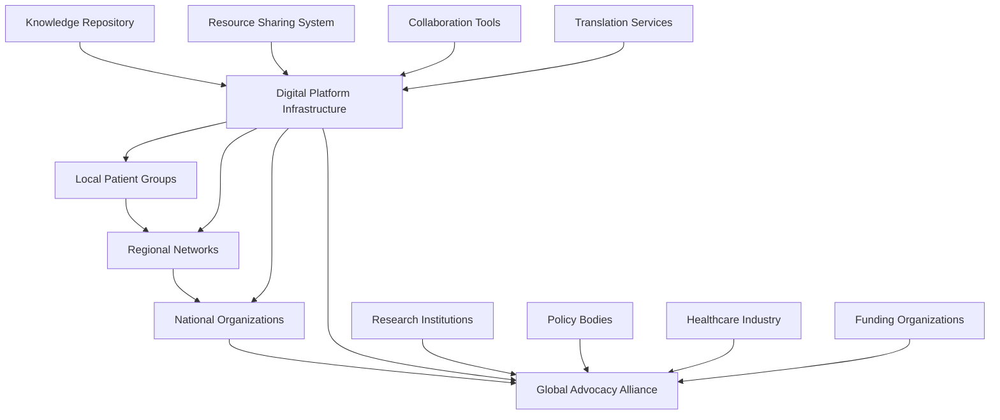
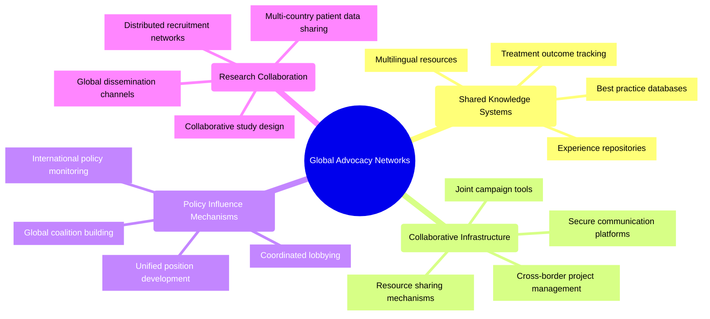

# Global Advocacy Networks: 2024-2025 Trends

## Overview
By 2025, patient advocacy has transcended geographical boundaries to form powerful global networks that share resources, knowledge, and best practices. This interconnected approach has been accelerated by both technological advancements and lessons from global health crises, particularly the COVID-19 pandemic, which demonstrated the interconnected nature of healthcare challenges.

## Transformation of Advocacy Scale

## Network Architecture

## Key Components

## Benefits of Global Networks

### Enhanced Knowledge Sharing
- Rapid dissemination of treatment advances across borders
- Diverse perspective integration leading to innovation
- Reduction of duplicative efforts
- Cross-cultural adaptation of successful advocacy approaches

### Amplified Influence
- Coordinated global campaigns with greater impact
- Leverage of successful policy approaches across regions
- Critical mass achievement for rare disease communities
- Unified voice in international health forums

### Resource Optimization
- Shared infrastructure costs
- Collective funding opportunities
- Efficient division of specialized work
- Technology transfer between resourced and under-resourced regions

### Accelerated Research
- Faster patient recruitment across geographic boundaries
- Diverse population access improving research applicability
- Coordinated priority setting for research agendas
- Collective pressure to adopt patient-centered research approaches

## Implementation Models

### Federated Networks
Autonomous organizations linked through formal alliances with:
- Shared governance structures
- Standardized information exchange
- Coordinated but independent activities
- Preserved local identity and focus

### Hub-and-Spoke Systems
Central coordinating bodies with regional implementation partners:
- Centralized resource development
- Consistent methodologies
- Local adaptation and implementation
- Bidirectional knowledge flow

### Open Collaboration Platforms
Digital ecosystems enabling ad-hoc collaboration:
- Project-based participation
- Open-source resource development
- Fluid membership and contribution
- Technology-enabled coordination

## Technology Enablers

### Translation and Localization
- Real-time translation for synchronous communication
- Cultural adaptation beyond literal translation
- Multilingual knowledge repositories
- Regional context preservation in shared resources

### Secure Data Exchange
- Standardized data models for cross-border sharing
- Privacy-preserving analytics across distributed datasets
- Regulatory-compliant information transfer
- Patient control over international data use

### Virtual Collaboration Tools
- Accessible across varying technology infrastructure levels
- Synchronous and asynchronous communication options
- Cultural sensitivity in collaboration interface design
- Low-bandwidth alternatives for connectivity-challenged regions

## Case Studies

### Global Rare Disease Networks
- Connected previously isolated patient populations
- Pooled limited resources for greater impact
- Accelerated research through collaborative approaches
- Achieved policy changes through coordinated international pressure

### Cancer Patient Coalitions
- Standardized quality of care expectations globally
- Reduced access disparities through shared advocacy strategies
- Created global patient registries improving treatment evidence
- Influenced clinical trial design across international boundaries

### Pandemic Response Networks
- Rapidly shared emerging treatment information
- Coordinated resource allocation during shortages
- Collectively advocated for equitable vaccine distribution
- Built lasting infrastructure for ongoing collaboration

## Implementation Challenges

### Regulatory Diversity
**Challenge**: Navigating varying regulatory frameworks across borders
**Solutions**:
- Regulatory intelligence sharing networks
- Adaptable advocacy frameworks with local customization
- Engagement with international harmonization efforts
- Comparative policy analysis identifying leverage points

### Cultural Adaptation
**Challenge**: Respecting cultural differences while maintaining unified approaches
**Solutions**:
- Cultural competency training for network participants
- Inclusive design of shared resources
- Local leadership in adaptation processes
- Recognition of diverse value systems in advocacy framing

### Sustainable Funding
**Challenge**: Securing stable support for international collaboration
**Solutions**:
- Distributed funding model with regional contribution
- International grant partnerships
- Corporate social responsibility programs with global reach
- Foundation collaboratives focused on global advocacy

## Future Directions

By late 2025, emerging developments include:
- AI-facilitated cross-language knowledge sharing
- Virtual reality international collaboration environments
- Blockchain-verified global patient data contributions
- Integrated advocacy-research platforms spanning continents

## Strategic Recommendations

1. **Prioritize technology equity** to ensure equal participation regardless of regional resources
2. **Develop shared metrics** for measuring advocacy impact across diverse contexts
3. **Invest in relationship building** as the foundation for effective global collaboration
4. **Create flexible governance models** that respect autonomy while enabling coordination
5. **Focus on sustainability** through distributed leadership and funding approaches

## References

1. BioLaunch Solutions. (2025). *Patient Advocacy Trends to Expect in 2025 and Beyond*.
2. International Patient Advocate Alliance. (2024). *"Global Collaboration in the Post-Pandemic Era."*
3. Journal of Global Health. (2024). *"Impact of Transnational Patient Networks on Health Policy."*
4. World Health Organization. (2025). *"Patient Voice in Global Health Governance."*
