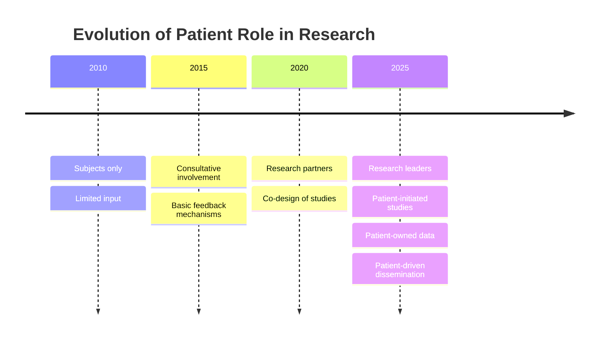
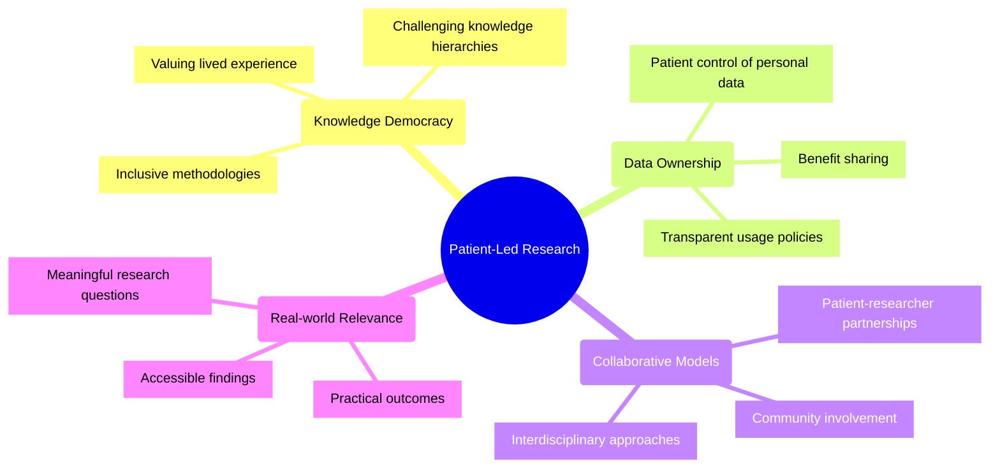
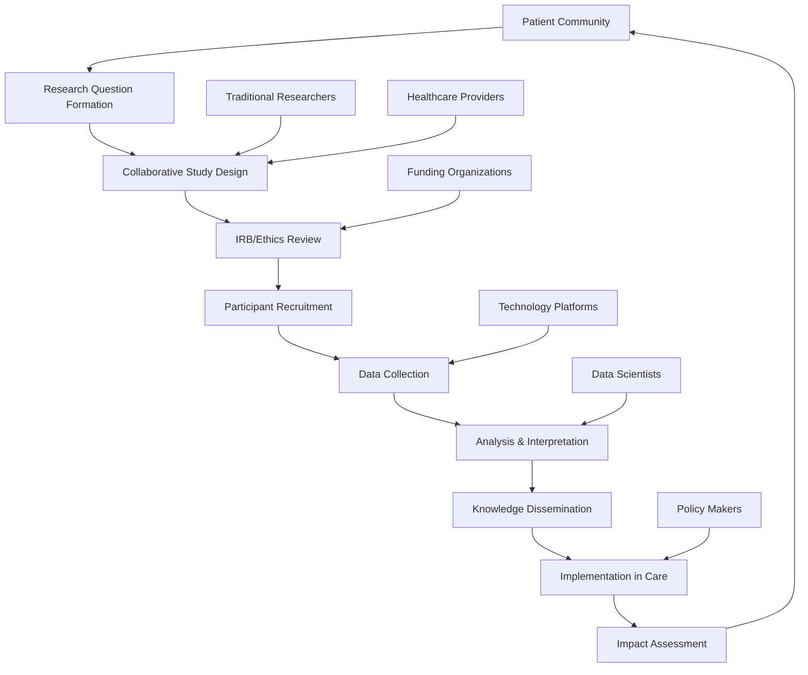

# Patient-Led Research: 2024-2025 Trends

## Overview
By 2025, patient-led research has transformed from an emerging concept to a fundamental component of healthcare innovation. This paradigm shift positions patients as active researchers, study designers, data collectors, and knowledge disseminators rather than passive subjects of traditional research models.

## Evolution of Patient Involvement in Research

## Key Principles

## Implementation Models

### Digital Collaborative Research Platforms
Modern patient-led research relies on platforms that enable:
- Secure data sharing with granular privacy controls
- Collaborative study design tools
- Community discussion and refinement of research questions
- Transparent tracking of research progress
- Open access to findings with patient-friendly explanations

### Successful Examples
1. **Count Me In Initiative**
   - Enables patients to share health data for cancer research
   - Creates large datasets through pooled data contributions
   - Accelerates understanding of cancer mechanisms
   - Has led to discovery of new treatment approaches

2. **Metastatic Breast Cancer Project**
   - Facilitates sharing of tumor samples and clinical data
   - Patient-directed research priorities
   - Has produced significant scientific discoveries
   - Created a model for other disease-specific research

3. **OpenAPS (Artificial Pancreas System)**
   - Patient-developed automated insulin delivery systems
   - Community-driven innovation outside traditional research pathways
   - Has influenced commercial medical device development
   - Demonstrated safety and efficacy through patient-collected data

## Process Framework

## Technical Infrastructure Requirements

### Data Collection Tools
- Mobile applications for symptom and experience tracking
- Wearable integration for passive physiological monitoring
- Secure survey platforms with adaptive questioning
- Image and video documentation capabilities
- Voice recording and transcription for qualitative data

### Data Management Systems
- Federated data models that maintain patient control
- Blockchain verification of data provenance
- Standardized formats for cross-study compatibility
- Automated de-identification with reversibility options
- Version control for evolving datasets

### Analysis Platforms
- Collaborative analysis environments with varying expertise levels
- Visual analytics tools accessible to non-statisticians
- Machine learning assistance for pattern identification
- Natural language processing for qualitative data
- Open source code repositories for analytical transparency

## Key Benefits

### For Patients
- Research addressing questions that matter most to them
- Faster translation of findings into practical applications
- Empowerment through knowledge creation
- Community building around shared research goals

### For Healthcare Systems
- More relevant research outcomes
- Improved treatment adherence through patient buy-in
- Cost-effective research through engaged participants
- Diverse perspectives leading to innovative approaches

### For Medical Science
- Access to previously unavailable real-world data
- New research questions from patient perspective
- Accelerated recruitment through community engagement
- Complementary insights to traditional research approaches

## Challenges and Solutions

### Scientific Rigor
**Challenge**: Ensuring methodological quality without extensive formal training
**Solutions**:
- Collaborative design with methodological experts
- Training programs specifically for patient researchers
- Peer review systems adapted for patient-led work
- Transparent documentation of methods and limitations

### Sustainable Funding
**Challenge**: Securing resources for patient-led initiatives
**Solutions**:
- Dedicated funding streams for patient-led research
- Crowdfunding platforms specifically for health research
- Integration with institutional research programs
- Value-based reimbursement for evidence generation

### Ethical Oversight
**Challenge**: Appropriate governance for non-traditional research
**Solutions**:
- Patient-inclusive ethics committees
- Streamlined review processes for minimal-risk studies
- Community accountability mechanisms
- Continuous ethical evaluation throughout projects

## Future Directions

By late 2025, emerging approaches include:
- AI-assisted patient research design
- Virtual reality for collaborative analysis of complex datasets
- Global patient researcher networks tackling cross-border health issues
- Integrated knowledge translation directly into care pathways

## References

1. Powerful Patients. (2025). *The Future of Patient Advocacy: 5 Key Trends for 2025 and Beyond*.
2. Count Me In Initiative. (2024). *"Patient-Driven Cancer Research: Five Year Impact Report."*
3. Journal of Participatory Medicine. (2024). *"Methodological Frameworks for Patient-Led Research."*
4. International Patient-Researcher Alliance. (2025). *"Best Practices in Patient-Led Health Research."*
