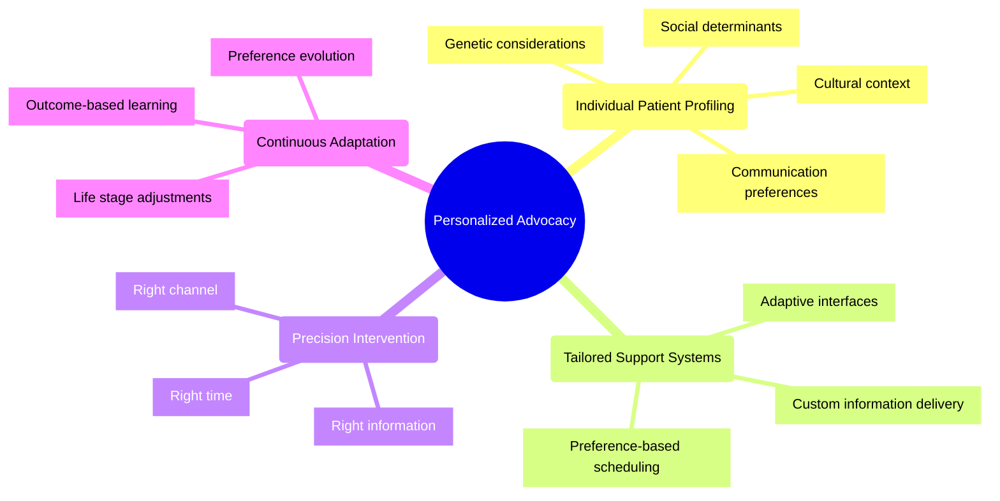
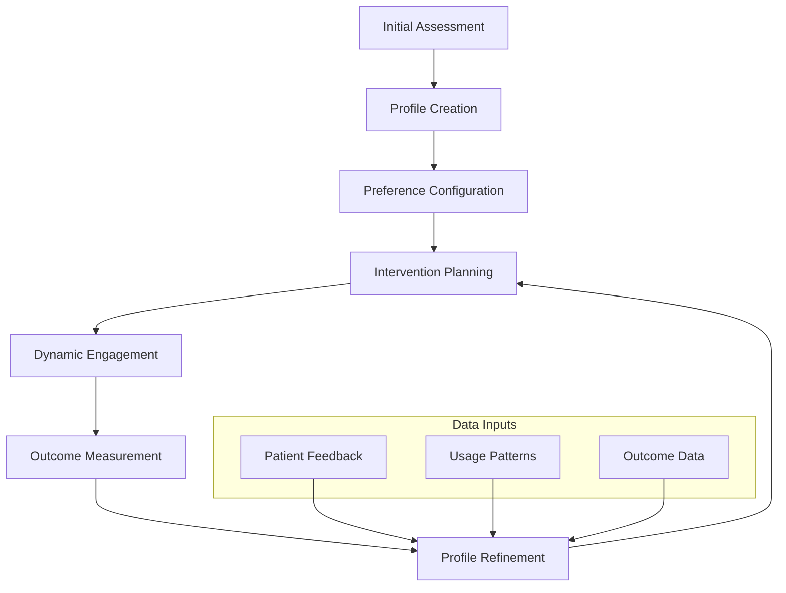

# Personalized Advocacy Approaches: 2024-2025 Trends

## Overview
In 2025, patient advocacy has shifted dramatically from one-size-fits-all approaches to highly personalized support systems. This transformation is driven by technological advancements, deeper understanding of diverse patient needs, and the growing expectation for individualized healthcare experiences.

## Key Principles

## Components of Personalized Advocacy

### Patient Profile Development
Modern advocacy platforms utilize comprehensive patient profiles that include:
- Medical history and genetic information
- Social determinants of health
- Cultural and linguistic preferences
- Learning and communication styles
- Support network details
- Technology access and literacy

### Adaptive Communication Channels
In 2025, advocacy systems dynamically select the most effective communication channels based on:
- Patient preference (e.g., text, video, voice, in-person)
- Message urgency and complexity
- Patient's current context (time, location, activity)
- Previous interaction patterns and outcomes

### Contextualized Information Delivery
Contemporary platforms ensure information is:
- Adjusted for health literacy level
- Culturally appropriate and sensitive
- Delivered at optimal times for patient receptivity
- Formatted for maximum comprehension

## Implementation Framework

## Technology Enablers

### Machine Learning Algorithms
AI systems in 2025 can predict:
- Which advocacy approaches will be most effective for each patient
- When patients are most likely to need support
- How to optimize engagement across diverse populations

### Natural Language Processing
Advanced NLP enables systems to:
- Adjust communication complexity to match patient literacy
- Detect emotional states and concerns from text interactions
- Translate content while preserving cultural nuance

### Behavioral Analysis
Modern platforms track engagement patterns to:
- Identify optimal intervention timing
- Refine outreach strategies
- Predict potential disengagement

## Case Studies

### Chronic Disease Management
Personalized advocacy has proven particularly effective for patients with complex chronic conditions:
- Medication adherence increased by 43% with tailored reminder systems
- Hospital readmissions reduced by 28% through customized discharge planning
- Patient satisfaction scores improved by 35% with personalized education

### Rare Disease Communities
For patients with rare diseases, personalized advocacy provides:
- Connections to relevant clinical trials based on genetic profiles
- Specialized educational content matched to disease progression stage
- Custom navigation support for complex specialist networks

## Implementation Challenges

### Scalability vs. Personalization
Organizations must balance the depth of personalization with the need to serve large populations efficiently.

### Data Integration
Creating truly personalized advocacy requires integration of disparate data sources while maintaining privacy and security.

### Measurement Complexity
Evaluating the impact of personalized approaches requires sophisticated analytics that account for individual variation.

## Future Directions

By late 2025, emerging approaches include:
- Anticipatory advocacy that predicts patient needs before they arise
- Cross-condition personalization for patients with multiple health challenges
- Family-system advocacy that considers the interconnected needs of caregivers and patients

## References

1. BioLaunch Solutions. (2025). *Patient Advocacy Trends to Expect in 2025 and Beyond*.
2. Collins, S. (2024). *"Prioritizing the Human Element in Patient Communication."* Courier Health Resources.
3. Journal of Personalized Medicine. (2024). *"Effectiveness of Tailored Patient Support Systems in Chronic Disease Management."*
