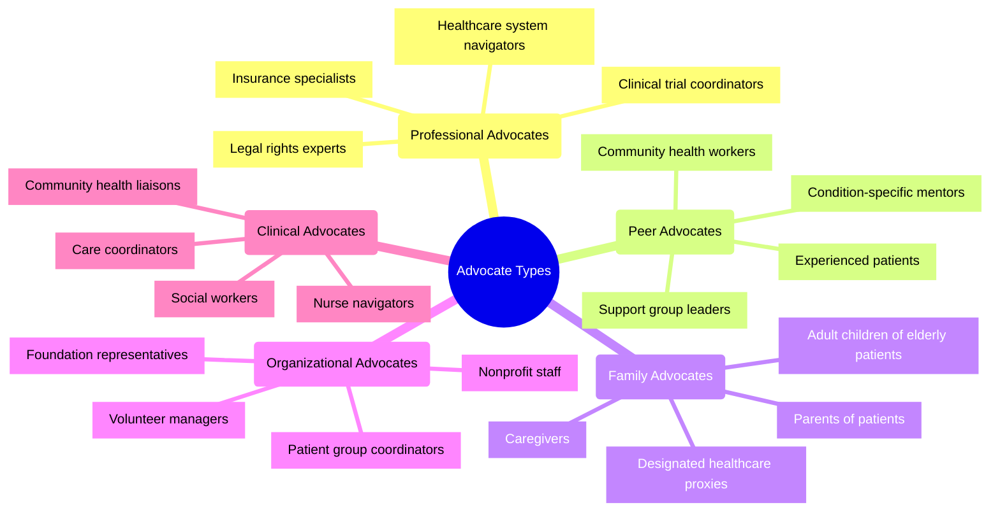
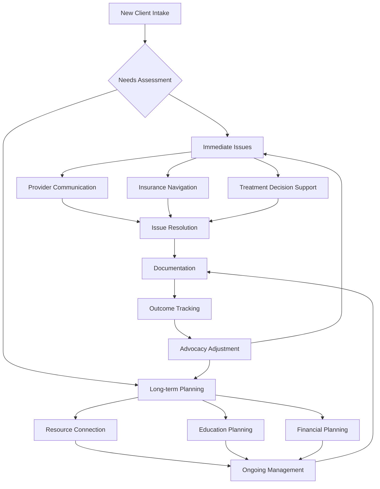
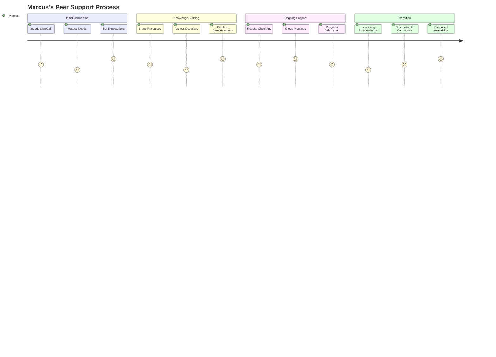
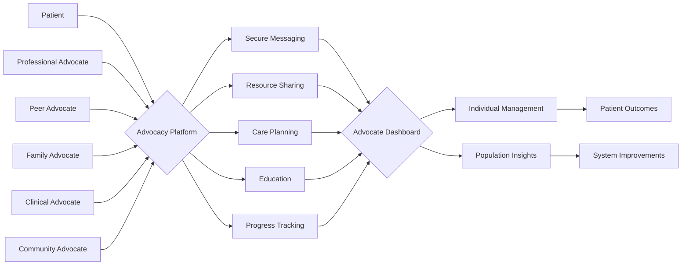

# Advocate Personas: 2024-2025

## Overview
These advocate personas represent the key professional and volunteer supporters who will use the Patient Advocacy Platform to assist patients. Each persona embodies different roles, expertise levels, and working contexts that our platform must accommodate. They guide the development of advocate-facing features and workflows to maximize impact and efficiency.

## Advocate Ecosystem Map

## Primary Personas

### 1. Jessica Park - Professional Patient Advocate

#### Demographics
- **Age:** 38
- **Location:** Urban medical center
- **Role:** Independent patient advocate with healthcare background
- **Experience:** 10 years (former RN, became advocate after personal experience with cancer)
- **Technical Proficiency:** High (early adopter of digital tools)

#### Professional Context
- Manages caseload of 15-20 clients with diverse conditions
- Works with multiple healthcare systems and insurance providers
- Operates own small business with limited administrative support
- Charges hourly rates with sliding scale for lower-income clients

#### Goals
1. Efficiently manage complex cases across multiple clients
2. Provide evidence-based guidance customized to each client
3. Scale her practice without sacrificing personalized care
4. Stay current on healthcare policies and treatment options
5. Document her work thoroughly for continuity and billing

#### Pain Points
1. Fragmented information across multiple provider systems
2. Time-consuming administrative tasks reducing client time
3. Difficulty tracking fast-changing insurance policies
4. Limited tools for securely communicating with clients
5. Challenges in quantifying and demonstrating her impact

#### Technology Usage
- Uses multiple devices across work contexts (laptop, tablet, smartphone)
- Maintains detailed client records in practice management software
- Heavily relies on calendar and task management tools
- Uses secure messaging, but frustrated by healthcare communication barriers

#### Quotes
> "My clients come to me overwhelmed by the healthcare maze. I need to quickly cut through that complexity and find them the right path forward."

> "Every minute I spend on paperwork is a minute I'm not helping someone through a healthcare crisis."

#### Feature Needs
- Comprehensive case management with timeline visualization
- Client-specific resource libraries and care plans
- Integration with healthcare provider and insurance systems
- Automated documentation and reporting tools
- Evidence-based recommendation engine
- Secure multi-channel client communication

---

### 2. Marcus Brown - Peer Support Advocate

#### Demographics
- **Age:** 52
- **Location:** Suburban community
- **Role:** Volunteer peer advocate for diabetes community
- **Experience:** 15 years living with Type 2 diabetes, 5 years as formal peer supporter
- **Technical Proficiency:** Moderate (comfortable with basics, learning advanced features)

#### Professional Context
- Volunteers 10 hours weekly through local hospital's peer support program
- Mentors newly diagnosed patients on self-management strategies
- Facilitates monthly support group meetings
- Works closely with healthcare providers but maintains distinct role
- Has full-time job outside healthcare field

#### Goals
1. Help patients develop practical self-management skills
2. Connect patients with reliable information and resources
3. Build a supportive community around shared health challenges
4. Maintain appropriate boundaries while providing emotional support
5. Continuously improve his own knowledge to better serve others

#### Pain Points
1. Limited visibility into clinical recommendations for mentees
2. Difficulty tracking what resources have been shared with whom
3. Balancing volunteer work with personal commitments
4. Determining when an issue requires professional intervention
5. Finding up-to-date, culturally appropriate resources

#### Technology Usage
- Uses smartphone and home computer for advocacy work
- Communicates with mentees via text and occasional video calls
- Shares resources through email and messaging apps
- Uses social media to promote support group meetings

#### Quotes
> "The doctors can explain the science, but I can share what it's really like to live with this condition day-to-day."

> "My goal isn't just to help people manage diabetes, but to help them live full lives despite it."

#### Feature Needs
- Resource library with readability and cultural relevance indicators
- Basic mentee tracking without clinical record functionality
- Scheduling and communication tools for group coordination
- Clear escalation pathways for clinical concerns
- Personal knowledge development resources
- Community building and event management tools

---

### 3. Dr. Aisha Johnson - Clinical Care Coordinator

#### Demographics
- **Age:** 45
- **Location:** Large teaching hospital
- **Role:** Oncology nurse navigator
- **Experience:** 20 years in nursing, 8 as navigator
- **Technical Proficiency:** Moderate-High (proficient with clinical systems)

#### Professional Context
- Embedded in multidisciplinary cancer care team
- Manages transition points across the care continuum
- Coordinates care for 60-75 active patients
- Works within constraints of hospital IT systems
- Functions as primary point of contact for patients

#### Goals
1. Ensure patients don't get lost in the healthcare system
2. Coordinate complex treatment plans across specialties
3. Identify and address barriers to care proactively
4. Support informed decision-making with evidence
5. Reduce readmissions through effective care transitions

#### Pain Points
1. Limited interoperability between hospital systems
2. High documentation burden reducing patient interaction time
3. Difficulty tracking patients across care settings
4. Communication gaps between specialists
5. Limited visibility into patients' home situations

#### Technology Usage
- Primarily uses hospital-provided workstations and devices
- Experience with electronic health records and clinical systems
- Subject to institutional IT policies and constraints
- Limited ability to adopt new tools without approval

#### Quotes
> "My patients are going through possibly the worst time of their lives. They shouldn't have to navigate the healthcare maze alone."

> "I'm the thread that ties together all the pieces of a patient's care journey."

#### Feature Needs
- Integration with clinical workflows and EHR systems
- Care pathway visualization and barrier identification
- Social determinants screening and resource matching
- Cross-provider communication and coordination tools
- Outcomes tracking and reporting for quality metrics
- Mobile access to critical information during rounds

---

### 4. Elena Diaz - Family Caregiver Advocate

#### Demographics
- **Age:** 49
- **Location:** Mixed urban/suburban area
- **Role:** Primary caregiver for mother with dementia
- **Experience:** 3 years as caregiver, previously uninvolved in healthcare
- **Technical Proficiency:** Moderate (comfortable with consumer technology)

#### Professional Context
- Works full-time while providing care
- Coordinates with multiple siblings for shared caregiving
- Navigates complex Medicare and long-term care systems
- Frequent interaction with healthcare providers
- Learning advocacy skills through necessity rather than training

#### Goals
1. Ensure high-quality care for her mother
2. Balance caregiving with work and personal responsibilities
3. Make informed decisions about treatment and living arrangements
4. Coordinate care responsibilities among family members
5. Plan for future care needs as condition progresses

#### Pain Points
1. Limited understanding of healthcare and insurance systems
2. Difficulty communicating mother's needs to rotating care providers
3. Stress from competing work and caregiving demands
4. Tracking medications, appointments, and care instructions
5. Finding trustworthy resources for home care support

#### Technology Usage
- Smartphone and laptop for personal and caregiving tasks
- Uses calendar apps to coordinate family care schedule
- Manages online patient portals for mother's care
- Researches health information online between appointments

#### Quotes
> "I never expected to become an expert on dementia care, insurance appeals, and medication management overnight."

> "Every provider sees a different piece of Mom's health puzzle. I'm the only one who sees the whole picture."

#### Feature Needs
- Educational resources with progressive complexity
- Shared family access with role-based permissions
- Medication and appointment management tools
- Decision support for care planning
- Provider communication templates and logs
- Caregiver wellness and support resources

---

### 5. Terrell Washington - Community Advocacy Leader

#### Demographics
- **Age:** 41
- **Location:** Urban community with healthcare disparities
- **Role:** Director at community-based health advocacy organization
- **Experience:** 15 years in community health work
- **Technical Proficiency:** Moderate (functional but focused on community rather than technology)

#### Professional Context
- Leads small nonprofit focused on health equity
- Manages team of 5 staff and 25 volunteers
- Works with underserved populations facing systemic barriers
- Collaborates with healthcare institutions on equity initiatives
- Operates with limited funding and resources

#### Goals
1. Address systemic healthcare barriers in his community
2. Empower community members with knowledge and tools
3. Track and demonstrate program impact to funders
4. Build sustainable advocacy programs with limited resources
5. Foster trust between healthcare institutions and community

#### Pain Points
1. Limited technology infrastructure within organization
2. Digital divide among community members served
3. Difficulty scaling support with limited staff
4. Tracking outcomes across community initiatives
5. Translating individual advocacy into systemic change

#### Technology Usage
- Office computer and basic smartphone
- Familiar with community outreach and survey tools
- Uses simple database for community member tracking
- Values face-to-face connection over digital engagement

#### Quotes
> "Technology should be a bridge to better care, not another barrier for our community."

> "We need solutions that work for everyone—including those without smartphones or reliable internet."

#### Feature Needs
- Multi-modal outreach and engagement tools
- Community-level data collection and visualization
- Resource mapping with social determinants of health
- Low-tech alternatives for digital tools
- Impact reporting for grant applications
- Cultural adaptation capabilities for diverse populations

## Interaction Patterns

### Jessica's Client Journey Facilitation

### Marcus's Peer Support Workflow

## Advocate-Patient Interaction Models

## Platform Implications

### Key Advocate-Driven Requirements

1. **Role-Based Functionality**
   - Tailored interfaces for different advocacy roles
   - Appropriate information access based on relationship
   - Feature sets aligned with advocacy responsibilities
   - Clear boundaries for non-clinical supporters

2. **Workflow Integration**
   - Compatibility with existing clinical and organizational systems
   - Efficient documentation and reporting tools
   - Mobile-friendly design for fieldwork and bedside use
   - Time-saving automation of routine tasks

3. **Knowledge Management**
   - Curated resource libraries with vetting indicators
   - Evidence-based recommendation support
   - Policy and procedure updates relevant to patient needs
   - Community knowledge sharing with quality controls

4. **Multi-Party Coordination**
   - Permission-based collaboration tools
   - Care team visibility and communication
   - Shared planning and task assignment
   - Transparent role definition and accountability

5. **Impact Measurement**
   - Outcome tracking appropriate to advocate role
   - Value demonstration for professional services
   - Progress visualization for patients and stakeholders
   - Data collection for program evaluation and improvement

## References

1. National Patient Advocate Foundation. (2024). *"State of Patient Advocacy Report."*
2. Journal of Patient Navigation. (2025). *"Digital Tools in Modern Advocacy Practice."*
3. Healthcare Advocate Association. (2024). *"Professional Standards for Patient Advocates."*
4. Community Health Worker Collaborative. (2025). *"Technology Needs Assessment for Peer Support Programs."*
