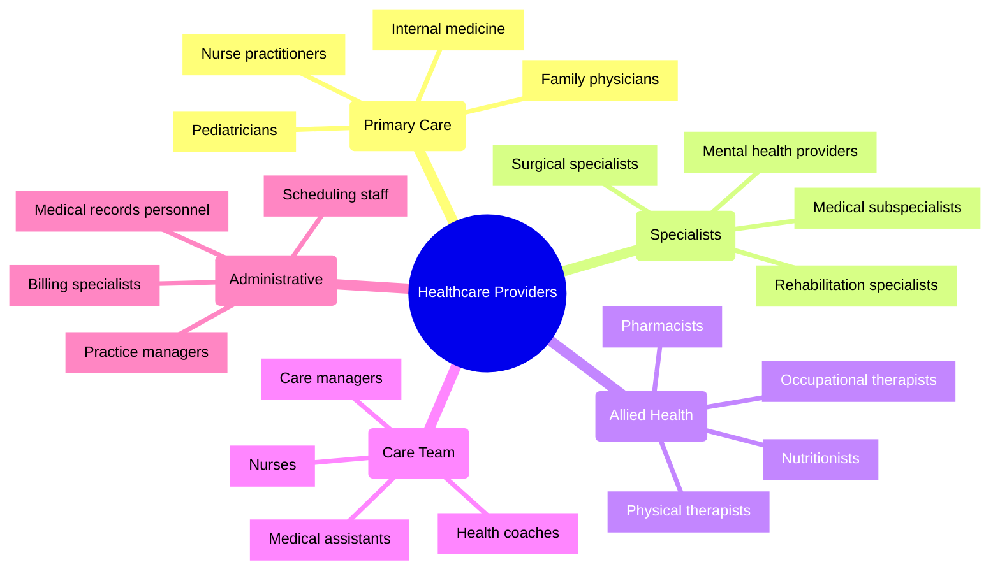
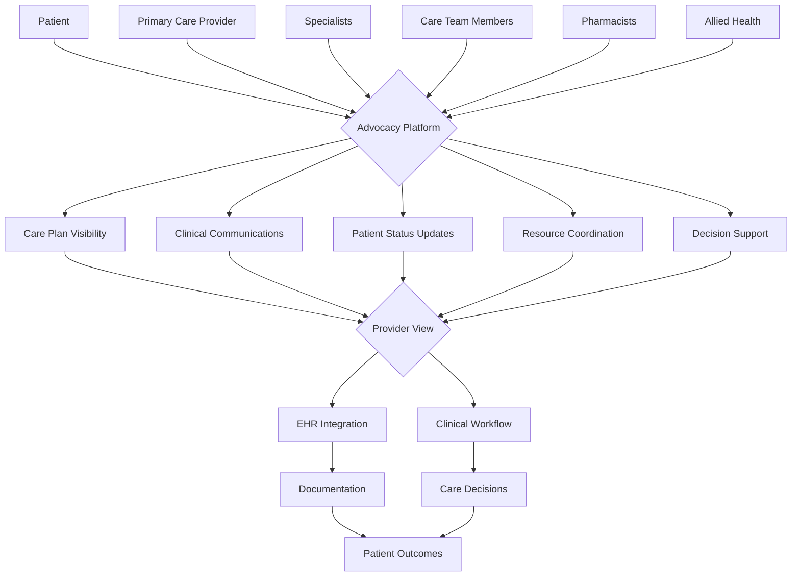
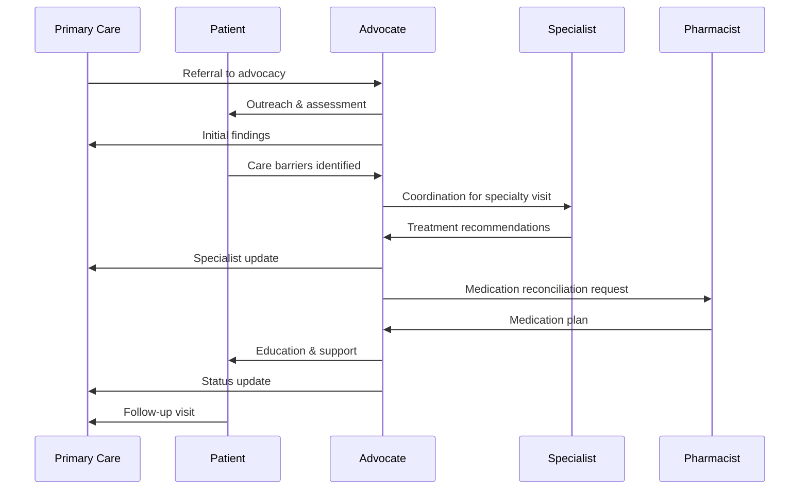

# Healthcare Provider Personas: 2024-2025

## Overview
These healthcare provider personas represent key medical professionals who will interact with the Patient Advocacy Platform. Understanding their workflows, challenges, and goals is essential for developing effective integration points and collaboration features. These personas enable us to design a platform that enhances rather than disrupts clinical workflows while facilitating better patient advocacy.

## Provider Relationship Map

## Primary Personas

### 1. Dr. Michael Chen - Primary Care Physician

#### Demographics
- **Age:** 47
- **Location:** Suburban medical group
- **Role:** Family Medicine Physician
- **Experience:** 18 years in practice
- **Technical Proficiency:** Moderate (proficient with EHR but skeptical of new systems)

#### Professional Context
- Manages panel of 1,800+ patients
- Sees 20-24 patients daily in 15-minute appointments
- Works in medium-sized practice with 8 providers
- Uses Epic EHR system with numerous add-on modules
- Increasing quality reporting and documentation requirements

#### Goals
1. Provide comprehensive care despite time constraints
2. Maintain continuity of care across healthcare settings
3. Stay informed about patients' interactions with specialists
4. Effectively manage complex patients with multiple conditions
5. Achieve quality metrics while maintaining work-life balance

#### Pain Points
1. Information overload from multiple digital systems
2. Limited visibility into patient adherence and home situation
3. Fragmented communication with specialists and hospitals
4. Insufficient time to fully address complex patient needs
5. Difficulty prioritizing patient education in brief encounters

#### Technology Usage
- Primarily uses desktop computer in exam rooms
- Reviews charts on tablet between appointments
- Limited use of patient portal for direct messaging
- Dictates notes using speech recognition software
- Resistant to additional technology that lacks EHR integration

#### Quotes
> "I need to know what's happening with my patients across the healthcare system without having to search through multiple reports and portals."

> "Any new technology needs to save me time, not add to my workload. I can't afford another system that doesn't talk to my EHR."

#### Feature Needs
- Seamless EHR integration with minimal duplicate documentation
- Concise summaries of patient advocacy activities
- Streamlined communication with advocates and care team
- Evidence-based decision support at point of care
- Efficient tracking of care plan adherence
- Delegate-able patient education workflows

---

### 2. Dr. Samantha Patel - Specialist Physician

#### Demographics
- **Age:** 39
- **Location:** Academic medical center
- **Role:** Endocrinologist
- **Experience:** 10 years post-fellowship
- **Technical Proficiency:** High (embraces digital innovation)

#### Professional Context
- Divides time between patient care, research, and teaching
- Manages complex diabetes and metabolic disorder cases
- Collaborates with multidisciplinary care teams
- Participates in clinical trials and research protocols
- Receives referrals from wide geographic region

#### Goals
1. Provide specialized expertise for complex conditions
2. Coordinate care with referring physicians effectively
3. Incorporate latest evidence into treatment plans
4. Manage patient transitions between research and standard care
5. Train next generation of providers in patient-centered specialty care

#### Pain Points
1. Incomplete information from referring providers
2. Poor patient understanding of specialized treatment plans
3. Limited time to coordinate with multiple providers
4. Difficulty tracking patients between visits
5. Managing expectations around experimental treatments

#### Technology Usage
- Comfortable with advanced clinical systems
- Uses multiple devices across work contexts
- Early adopter of digital health innovations
- Participates in telemedicine for remote consultations
- Analyzes patient-generated data from devices

#### Quotes
> "The most valuable information often comes from what happens between appointments—data that patients rarely capture effectively."

> "Coordinating with primary care should be seamless, not a game of telephone that the patient has to manage."

#### Feature Needs
- Comprehensive referral management tools
- Visualization of patient-generated data trends
- Research protocol and treatment plan adherence tracking
- Efficient communication channels with primary care
- Patient education tools for complex conditions
- Consultation summary generation for the care team

---

### 3. Nurse Rebecca Torres - Clinical Care Team

#### Demographics
- **Age:** 34
- **Location:** Community health center
- **Role:** Registered Nurse Care Manager
- **Experience:** 12 years in nursing, 5 in care management
- **Technical Proficiency:** Moderate-High (adaptable to new systems)

#### Professional Context
- Manages panel of high-risk and complex patients
- Implements care plans developed by providers
- Conducts follow-up calls and visits between appointments
- Coordinates resources for patients with social needs
- Works with underserved populations facing multiple barriers

#### Goals
1. Ensure patients understand and can follow treatment plans
2. Identify and address barriers to care promptly
3. Connect patients with appropriate community resources
4. Provide proactive outreach to prevent complications
5. Support patients in self-management skill development

#### Pain Points
1. Limited visibility into patients' social context and barriers
2. Difficulty tracking outreach attempts and outcomes
3. Fragmented documentation across clinical and social systems
4. Inefficient processes for connecting patients to resources
5. Challenge of prioritizing highest-need patients effectively

#### Technology Usage
- Uses clinical workstation and mobile devices
- Manages multiple communication channels with patients
- Documents in EHR and care management platforms
- Utilizes resource directories and referral systems
- Collaborates through secure messaging with team

#### Quotes
> "My patients often face challenges that don't fit neatly into the EHR—housing issues, transportation barriers, food insecurity—but these factors hugely impact their health."

> "I'm the bridge between what happens in the clinic and what happens in patients' real lives."

#### Feature Needs
- Integrated social determinants screening and tracking
- Prioritized patient worklist with risk stratification
- Customizable outreach protocols and templates
- Closed-loop referral tracking for community resources
- Care barrier documentation and resolution tools
- Mobile access for field-based patient support

---

### 4. Dr. David Wilson - Rural Healthcare Provider

#### Demographics
- **Age:** 52
- **Location:** Rural critical access hospital and clinic
- **Role:** General physician with broad scope of practice
- **Experience:** 24 years, all in rural medicine
- **Technical Proficiency:** Low-Moderate (focused on practical tools)

#### Professional Context
- Provides primary, emergency, and some specialty care
- Serves as medical director for small hospital
- Limited local specialist availability
- Covers wide geographic area with sparse population
- Practices with limited resources and support staff

#### Goals
1. Provide comprehensive care despite limited resources
2. Effectively coordinate distant specialty referrals
3. Maintain clinical competence across broad scope
4. Maximize patient care in local setting when possible
5. Balance patient needs with sustainable workload

#### Pain Points
1. Challenges in coordinating with distant specialists
2. Limited bandwidth for patient follow-up and education
3. Difficulty accessing current clinical guidelines at point of care
4. Patient transportation barriers to specialty care
5. Technology limitations in rural practice setting

#### Technology Usage
- Basic EHR system with limited functionality
- Inconsistent internet connectivity in clinical settings
- Uses telemedicine platforms for specialist consultations
- Relies on phone communication for urgent issues
- Limited IT support available locally

#### Quotes
> "When I refer a patient to a specialist three hours away, I often don't hear what happened until their next visit—if they were able to make it at all."

> "I need to know what resources are actually available to my patients, not just what exists in theory."

#### Feature Needs
- Offline-capable clinical decision support
- Streamlined distant referral coordination
- Simplified telemedicine integration
- Resource mapping with geographic relevance
- Low-bandwidth communication options
- Patient transportation coordination tools

---

### 5. Lisa Martinez - Clinical Pharmacist

#### Demographics
- **Age:** 43
- **Location:** Integrated health system
- **Role:** Clinical Pharmacist
- **Experience:** 17 years in pharmacy, 10 in clinical role
- **Technical Proficiency:** High (regularly uses multiple clinical systems)

#### Professional Context
- Performs medication therapy management services
- Conducts medication reconciliation post-discharge
- Provides patient education on complex medication regimens
- Collaborates with physicians on medication optimization
- Participates in interdisciplinary care team meetings

#### Goals
1. Ensure medication safety and optimize therapeutic outcomes
2. Improve medication adherence through patient education
3. Identify and resolve drug therapy problems
4. Coordinate medication management across care transitions
5. Provide evidence-based recommendations to prescribers

#### Pain Points
1. Incomplete medication histories from external sources
2. Limited insight into actual medication-taking behaviors
3. Multiple prescribers making uncoordinated medication changes
4. Patient confusion about medication changes after care transitions
5. Difficulty tracking intervention outcomes systematically

#### Technology Usage
- Proficient with pharmacy information systems
- Uses medication therapy management platforms
3. Works with e-prescribing and medication reconciliation tools
4. Accesses drug information databases regularly
5. Utilizes patient education materials and tools

#### Quotes
> "The medication list in the chart often bears little resemblance to what patients are actually taking at home."

> "Patients with complex regimens need ongoing support between visits, not just education at the point of prescribing."

#### Feature Needs
- Comprehensive medication management tools
- Patient-reported medication adherence tracking
- Drug interaction and side effect monitoring
- Medication cost and assistance program integration
- Customizable patient education materials
- Prescriber communication workflow

## Care Collaboration Models

### Cross-Provider Communication Flow

## Platform Implications

### Key Provider-Driven Requirements

1. **Clinical Workflow Integration**
   - EHR integration with minimal duplicate documentation
   - Alignment with clinical decision-making processes
   - Respect for time constraints and cognitive load
   - Compatibility with existing healthcare IT systems

2. **Information Prioritization**
   - Clinically relevant summarization of advocacy activities
   - Highlight of actionable information for providers
   - Efficient communication without information overload
   - Evidence-based clinical decision support

3. **Care Coordination Support**
   - Visibility across provider boundaries
   - Structured communication between care team members
   - Clear delineation of roles and responsibilities
   - Tracking of referrals and transitions of care

4. **Documentation Efficiency**
   - Automated generation of clinical summaries
   - Integration with quality reporting requirements
   - Support for billing and compliance documentation
   - Minimization of administrative burden

5. **Secure Communication**
   - HIPAA-compliant messaging across care team
   - Patient inclusion in appropriate communications
   - Urgent notification handling and escalation
   - Audit trails for clinical decision-making

## Technical Integration Considerations

For our React Vite and React Native platform, successful integration with provider workflows will require:

1. **API Strategies**
   - FHIR-based interoperability for clinical data exchange
   - SMART on FHIR launch capabilities within EHRs
   - HL7 compatibility for legacy systems
   - Event-based notifications for critical updates

2. **Authentication Frameworks**
   - Single sign-on integration with clinical systems
   - Role-based access controls aligned with clinical responsibilities
   - Context-aware security based on access location and purpose
   - Delegation models for team-based care

3. **Mobile Considerations**
   - Rapid authentication for brief clinical interactions
   - Optimized views for common clinical scenarios
   - Limited data entry requirements on mobile devices
   - Offline capability for rural and unstable connectivity settings

## References

1. American Medical Association. (2024). *"Digital Health Implementation Playbook."*
2. Journal of the American Medical Informatics Association. (2025). *"EHR Integration Standards for Patient Support Applications."*
3. Rural Health Information Hub. (2024). *"Technology Needs Assessment for Rural Providers."*
4. Healthcare Information and Management Systems Society. (2025). *"Clinician Experience in Digital Health Tools."*
