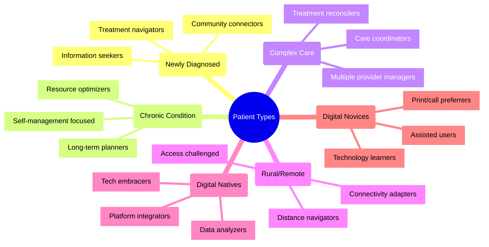
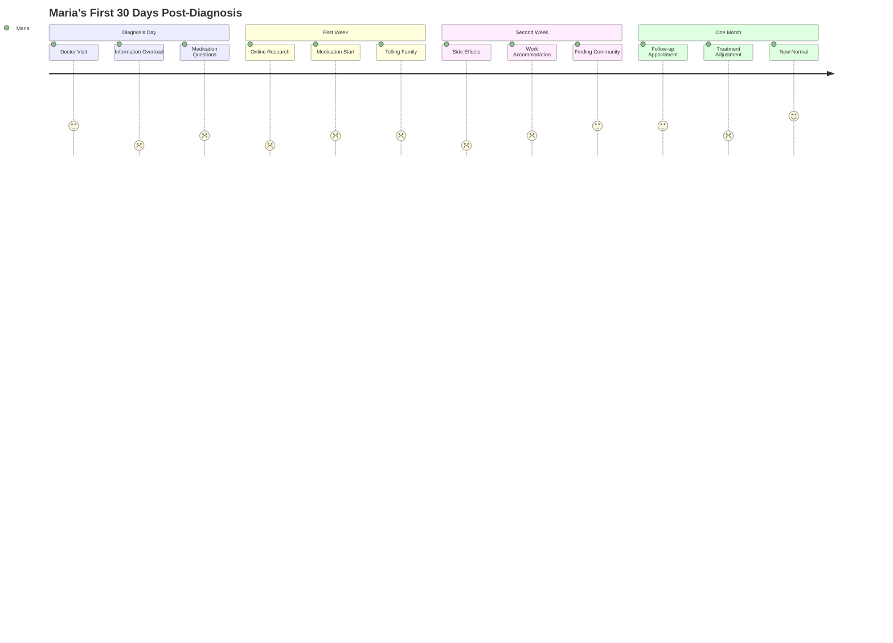
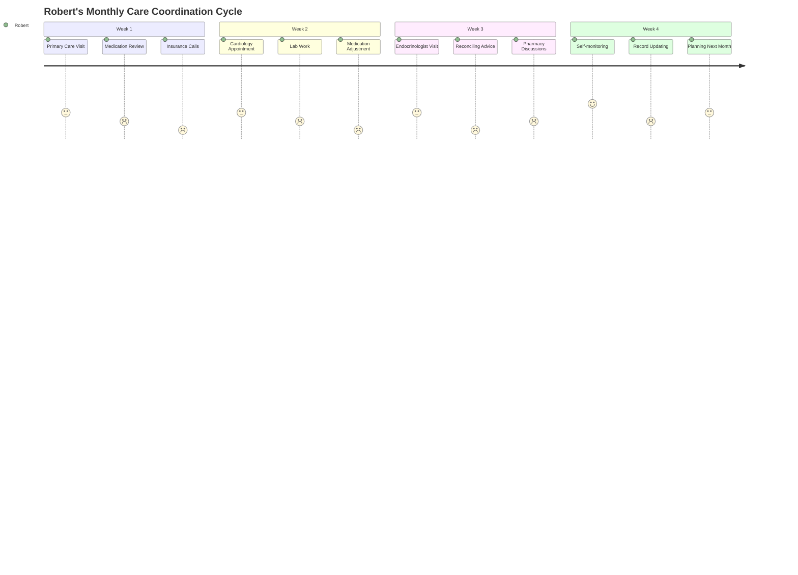

# Patient Personas: 2024-2025

## Overview
These patient personas represent key user profiles for the Patient Advocacy Platform. Each persona embodies different needs, challenges, and goals that our platform must address. They have been developed based on comprehensive research of patient experiences in 2024-2025 and serve as foundational guides for feature development and user experience design.

## Persona Map

## Primary Personas

### 1. Maria Rodriguez - Newly Diagnosed Patient

#### Demographics
- **Age:** 42
- **Location:** Suburban area with good healthcare access
- **Occupation:** Elementary school teacher
- **Tech Comfort:** Moderate (uses smartphone daily, familiar with basic apps)
- **Health Literacy:** Developing (learning medical terminology)

#### Health Context
- Recently diagnosed with rheumatoid arthritis
- Experiencing moderate pain and mobility limitations
- Currently exploring treatment options
- No previous chronic conditions

#### Goals
1. Understand her condition and treatment options thoroughly
2. Find reliable information sources she can trust
3. Connect with others who understand her experience
4. Develop a manageable care routine that fits her busy schedule

#### Pain Points
1. Overwhelmed by conflicting information online
2. Limited time for appointments due to work schedule
3. Concerned about medication side effects
4. Unsure how to discuss condition with family and colleagues

#### Technology Usage
- Uses smartphone for everyday tasks and communication
- Comfortable with video calls and messaging
- Prefers visual explanations of complex information
- Engages with social media but concerned about privacy

#### Quotes
> "I need to understand what's happening to my body in language I can understand."

> "There's so much information out there—I don't know what to trust."

#### Feature Needs
- Clear, trustworthy educational content with reading level options
- Treatment comparison tools with plain-language explanations
- Scheduling assistance for appointments around work hours
- Guided introduction to condition-specific communities

---

### 2. Robert Johnson - Complex Care Coordinator

#### Demographics
- **Age:** 67
- **Location:** Urban area
- **Occupation:** Retired engineer
- **Tech Comfort:** Moderate-High (adopts new technology thoughtfully)
- **Health Literacy:** High (researches extensively, understands medical terminology)

#### Health Context
- Managing multiple conditions: Type 2 diabetes, heart condition, and prostate cancer survivor
- Takes 7 medications daily
- Sees 5 different specialists
- Recent hospitalizations due to medication interactions

#### Goals
1. Coordinate care effectively between multiple providers
2. Prevent medication conflicts and duplications
3. Maintain independence in managing health
4. Optimize insurance benefits and reduce out-of-pocket costs

#### Pain Points
1. Different specialists don't communicate effectively with each other
2. Difficulty tracking medication changes across providers
3. Appointment scheduling conflicts
4. Explaining medical history repeatedly at each visit

#### Technology Usage
- Uses tablet for email, reading, and health tracking
- Maintains spreadsheets for health information
- Comfortable with patient portals but frustrated by having multiple accounts
- Prefers desktop interfaces with larger text

#### Quotes
> "I feel like I'm the only one seeing the full picture of my health."

> "I spend hours every month just coordinating between all my doctors."

#### Feature Needs
- Comprehensive health record integration
- Medication interaction checker
- Appointment coordinator with provider communication
- Treatment plan visualizer across conditions
- Cost estimation and insurance benefit optimization

---

### 3. Sophia Chen - Digital Native with Chronic Condition

#### Demographics
- **Age:** 29
- **Location:** Urban tech hub
- **Occupation:** UX designer at a technology company
- **Tech Comfort:** Very High (early adopter, works in technology)
- **Health Literacy:** High (actively researches and self-advocates)

#### Health Context
- Living with Type 1 diabetes since childhood
- Uses continuous glucose monitor and insulin pump
- Active self-manager who tracks extensive data
- Comfortable with telehealth and digital health tools

#### Goals
1. Optimize health outcomes through data analysis
2. Integrate health management seamlessly into busy lifestyle
3. Stay updated on cutting-edge treatments and research
4. Connect with innovative providers who embrace technology

#### Pain Points
1. Fragmented health data across multiple apps and devices
2. Limited time for manual data entry and analysis
3. Frustration with outdated healthcare interfaces
4. Difficulty finding providers who support patient-generated data

#### Technology Usage
- Uses multiple health apps and wearable devices
- Comfortable with APIs and data integration
- Expects responsive, mobile-first experiences
- Values privacy but willing to share data for personalization

#### Quotes
> "I have years of data about my body, but my doctor can't easily access it."

> "I want my health tools to work as well as my banking app."

#### Feature Needs
- Advanced data integration from wearables and apps
- Customizable dashboards and alerts
- Research and clinical trial matching
- API access for personal health projects
- Community features for tech-savvy patients

---

### 4. James Williams - Rural Patient with Connectivity Challenges

#### Demographics
- **Age:** 58
- **Location:** Rural farming community
- **Occupation:** Small farm owner
- **Tech Comfort:** Low-Moderate (functional but not enthusiastic)
- **Health Literacy:** Moderate (practical understanding but limited terminology)

#### Health Context
- Recovering from knee replacement surgery
- Hypertension and pre-diabetic
- 90-minute drive to nearest specialist
- Limited local healthcare resources

#### Goals
1. Manage recovery while maintaining farm operations
2. Minimize travel for routine care
3. Access specialist care without frequent long trips
4. Understand treatment options within his rural context

#### Pain Points
1. Unreliable internet connectivity (DSL only)
2. Limited cellular service in his area
3. Difficulty attending appointments due to distance and farm responsibilities
4. Lack of local support services for recovery

#### Technology Usage
- Basic smartphone (keeps it for emergencies)
- Desktop computer with older operating system
- Intermittent internet access
- Prefers phone calls to digital communication

#### Quotes
> "I can't just drop everything on the farm to drive three hours round-trip for a 15-minute checkup."

> "The internet at my place comes and goes—I need things to work even when I'm offline."

#### Feature Needs
- Offline functionality with background syncing
- Low-bandwidth options for essential features
- Simplified navigation with minimal steps
- Phone-based alternatives for critical functions
- Proxy access options for family members

---

### 5. Eleanor Washington - Older Adult with Limited Tech Experience

#### Demographics
- **Age:** 76
- **Location:** Suburban retirement community
- **Occupation:** Retired teacher
- **Tech Comfort:** Low (hesitant but willing to learn)
- **Health Literacy:** Moderate (experienced patient but struggles with new terminology)

#### Health Context
- Managing osteoarthritis and glaucoma
- Recent diagnosis of early-stage Alzheimer's
- Takes multiple medications
- Has adult children who help coordinate care

#### Goals
1. Maintain independence in health management as long as possible
2. Keep family informed without becoming a burden
3. Remember medication schedules and appointment details
4. Preserve dignity in healthcare interactions

#### Pain Points
1. Difficulty remembering medical instructions
2. Overwhelmed by complex digital interfaces
3. Vision limitations make small text challenging
4. Concerned about making mistakes in health management

#### Technology Usage
- Basic feature phone, recently got a tablet from family
- Needs step-by-step instructions for new technology
- Prefers large buttons and text
- Values privacy and security highly

#### Quotes
> "I don't want my daughter to have to take time off work for every appointment."

> "I know computers can help me, but they change everything just when I learn it."

#### Feature Needs
- Simplified, consistent interface with minimal changes
- Large text and high contrast options
- Voice interface alternatives
- Family connection features with privacy controls
- Reminder systems with multiple notification options
- Print-friendly information

## User Journey Maps

### Maria's Diagnosis Journey

### Robert's Care Coordination Cycle

## Platform Implications

### Key Persona-Driven Requirements

1. **Accessibility Spectrum**
   - Support for users across the digital literacy spectrum
   - Multiple interface options based on capability and preference
   - Seamless delegation and proxy access for assisted users

2. **Connectivity Adaptations**
   - Offline functionality for essential features
   - Low-bandwidth alternatives
   - Sync optimization for intermittent connections
   - Multi-channel communication options

3. **Information Personalization**
   - Adaptive content complexity based on health literacy
   - Visual learning supports for complex concepts
   - Contextual education tied to personal health situation
   - Progressive disclosure of information to prevent overwhelm

4. **Care Coordination Tools**
   - Cross-provider communication facilitation
   - Medication management across multiple conditions
   - Appointment scheduling with transportation considerations
   - Treatment plan visualization and conflict detection

5. **Data Integration Capability**
   - Connection to patient portals and electronic health records
   - Wearable and device data incorporation
   - Standardized health data exchange
   - Patient-controlled sharing mechanisms

## References

1. Patient Engagement Survey. (2024). *"Digital Health Preferences Across Demographics."*
2. Journal of Patient Experience. (2025). *"Persona Development for Patient-Centered Design."*
3. Rural Health Association. (2024). *"Technology Barriers in Patient Support Programs."*
4. National Institute on Aging. (2025). *"Digital Health Adoption Among Older Adults."*
