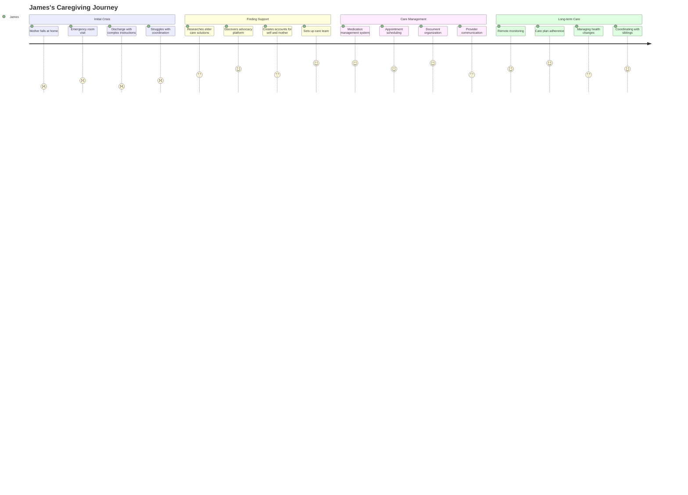

# Patient Advocacy Platform: User Persona Analysis

## Overview

This document provides a detailed analysis of the key user personas for the Patient Advocacy Platform. Understanding these personas is critical for designing experiences that meet real user needs and expectations. Each persona represents a composite of user research, market analysis, and behavioral patterns observed in the patient advocacy space.

## Primary User Personas

### 1. Maria Rodriguez: The Health Journey Navigator

#### Demographics
- **Age**: 42
- **Location**: Suburban Chicago, IL
- **Occupation**: Elementary School Teacher
- **Education**: Master's Degree in Education
- **Income**: $68,000/year
- **Family**: Married with two children (ages 8 and 14)
- **Tech Comfort**: Moderate (uses smartphone apps daily, comfortable with basic digital tools)

#### Health Profile
- **Conditions**: Recently diagnosed with Type 2 Diabetes
- **Other Health Factors**: Family history of cardiovascular disease
- **Insurance**: Employer-provided PPO with high deductible
- **Healthcare Utilization**: Moderate (4-6 provider visits per year)

#### Goals and Motivations
- Understand her new diagnosis and develop a sustainable management plan
- Coordinate care between primary care, endocrinologist, and nutritionist
- Minimize out-of-pocket costs while maximizing quality of care
- Balance health needs with busy work and family life
- Find reliable information about diabetes management options

#### Pain Points
- Overwhelmed by information following diagnosis
- Difficulty coordinating appointments between multiple providers
- Confusion about insurance coverage for diabetes supplies and education
- Limited time to research and manage health information
- Frustration with contradictory advice from different providers

#### Behaviors
- Researches health information online but struggles to evaluate credibility
- Active in online patient communities for peer support
- Takes detailed notes during doctor appointments
- Willing to try digital health tools but abandons those that are too complex
- Prefers text message reminders and notifications

#### Opportunity Areas
- Simplified information about condition management
- Care coordination tools connecting her provider team
- Personalized guidance for insurance navigation
- Mobile-friendly experience with time-saving features
- Educational resources she can consume in short sessions

#### Journey Touchpoints
- **Awareness**: Google search for "diabetes management help"
- **Consideration**: Recommendation from primary care physician
- **Onboarding**: Mobile app download with quick-start guide
- **Engagement**: Regular check-ins on medication adherence and glucose tracking
- **Expansion**: Adding family members to platform for shared care coordination

### 2. James Washington: The Caregiver Advocate

#### Demographics
- **Age**: 57
- **Location**: Atlanta, GA
- **Occupation**: IT Project Manager
- **Education**: Bachelor's Degree in Computer Science
- **Income**: $92,000/year
- **Family**: Divorced, one adult child, caring for elderly mother (78)
- **Tech Comfort**: High (early adopter of technology, comfortable with complex digital tools)

#### Caregiving Profile
- **Care Recipient**: Mother with early-stage Alzheimer's and osteoarthritis
- **Caregiving Responsibilities**: Medication management, appointment scheduling, financial management
- **Living Situation**: Mother lives independently but nearby
- **Support Network**: Limited, with occasional help from siblings who live out of state
- **Time Commitment**: 15-20 hours per week on caregiving activities

#### Goals and Motivations
- Ensure his mother receives high-quality, coordinated care
- Efficiently manage caregiving responsibilities alongside full-time job
- Stay informed about treatment options and disease progression
- Maintain his mother's independence as long as safely possible
- Plan for future care needs and financial implications

#### Pain Points
- Difficult to get comprehensive information from multiple providers
- Struggles to keep track of medications, appointments, and care instructions
- Limited visibility into his mother's day-to-day health status
- Difficulty balancing work responsibilities with caregiving
- Frustration with fragmented healthcare system and administrative hurdles

#### Behaviors
- Highly organized, uses digital tools to manage caregiving
- Researches extensively before making healthcare decisions
- Advocates assertively with healthcare providers
- Active in caregiver support groups
- Values data privacy and security

#### Opportunity Areas
- Comprehensive care management dashboard
- Proxy access to health records and communication
- Medication management and adherence tools
- Centralized document storage for medical and legal information
- Care team collaboration features

#### Journey Touchpoints
- **Awareness**: Online research for "elder care coordination apps"
- **Consideration**: Recommendation from his mother's geriatrician
- **Onboarding**: Desktop setup with detailed tutorial
- **Engagement**: Weekly review of health metrics and appointment calendar
- **Expansion**: Adding remote monitoring tools for his mother's home

### 3. Dr. Lakshmi Patel: The Connected Provider

#### Demographics
- **Age**: 38
- **Location**: Boston, MA
- **Specialty**: Internal Medicine, Primary Care
- **Practice Setting**: Large multi-specialty group practice
- **Experience**: 10 years post-residency
- **Tech Comfort**: Above average (uses EHR proficiently, open to new digital solutions)

#### Practice Profile
- **Patient Volume**: 20-25 patients per day
- **Patient Demographics**: Diverse urban population, ages 18-85
- **EHR System**: Epic
- **Care Team**: Works with 2 nurses, 1 MA, shares patients with specialists
- **Value-Based Care Participation**: ACO member with quality incentives

#### Goals and Motivations
- Provide high-quality, coordinated care to patients
- Reduce administrative burden to focus more on patient care
- Improve population health outcomes for chronic disease patients
- Meet quality metrics while maintaining work-life balance
- Build stronger relationships with patients through better communication

#### Pain Points
- Limited time during appointments to address complex issues
- Difficult to track patient progress between visits
- Fragmented communication with specialists and other providers
- Increasing documentation and administrative requirements
- Patients often don't follow through on referrals or recommendations

#### Behaviors
- Structured, efficient appointment workflow
- Reviews patient charts thoroughly before encounters
- Uses patient education handouts and resources
- Early adopter of practice efficiency tools
- Prefers evidence-based clinical decision support

#### Opportunity Areas
- Streamlined care coordination with specialists
- Asynchronous patient communication management
- Automated follow-up and adherence tracking
- Population health management dashboards
- Integration with existing EHR workflow

#### Journey Touchpoints
- **Awareness**: Medical conference or continuing education event
- **Consideration**: Presentation by medical director at staff meeting
- **Onboarding**: In-office training session with practice staff
- **Engagement**: Daily check of patient messages and care alerts
- **Expansion**: Participation in platform clinical advisory group

### 4. Sarah Johnson: The Professional Patient Advocate

#### Demographics
- **Age**: 45
- **Location**: Denver, CO
- **Occupation**: Independent Patient Advocate
- **Education**: Bachelor's in Nursing, Certified Patient Advocate
- **Professional Background**: Former oncology nurse, 6 years as advocate
- **Tech Comfort**: Moderate to high (adopts tools that improve workflow)

#### Advocacy Profile
- **Client Base**: 15-20 active clients monthly
- **Specialization**: Cancer care navigation and complex case advocacy
- **Services Offered**: Care coordination, appointment accompaniment, insurance navigation
- **Business Model**: Fee-for-service and retainer clients
- **Referral Sources**: Hospital discharge planners, word-of-mouth, attorney referrals

#### Goals and Motivations
- Deliver exceptional value to clients through personalized advocacy
- Grow her practice while maintaining quality of service
- Efficiently manage multiple complex cases simultaneously
- Stay current on healthcare system changes and best practices
- Demonstrate concrete outcomes to justify her services

#### Pain Points
- Manual tracking of multiple client needs and follow-ups
- Difficulty accessing complete medical information for clients
- Time-consuming documentation and administrative tasks
- Challenging to scale business beyond personal capacity
- Limited tools designed specifically for professional advocates

#### Behaviors
- Highly detail-oriented and thorough
- Maintains extensive notes and documentation
- Networks actively with healthcare providers
- Constantly researching and learning about medical conditions
- Strong interpersonal skills, relationship-focused

#### Opportunity Areas
- Client management system designed for advocacy workflow
- Streamlined documentation and reporting tools
- Secure communication channels with clients and providers
- Knowledge base of resources and referral options
- Templates and protocols for common advocacy scenarios

#### Journey Touchpoints
- **Awareness**: Professional association newsletter or conference
- **Consideration**: Free trial after recommendation from colleague
- **Onboarding**: Virtual training session with advocate-specific features
- **Engagement**: Daily client dashboard review and documentation
- **Expansion**: Adding premium features for practice management

## Secondary User Personas

### 5. Alex Chen: The Health System Administrator

#### Demographics
- **Age**: 52
- **Location**: Seattle, WA
- **Role**: Director of Patient Experience
- **Organization**: Regional healthcare system (8 hospitals, 60+ clinics)
- **Education**: MBA in Healthcare Administration
- **Tech Philosophy**: Data-driven, focused on ROI and integration

#### Professional Profile
- **Responsibilities**: Patient experience metrics, digital patient engagement
- **Decision Authority**: Evaluates and recommends new technologies
- **Budget Control**: $2-5M annual for patient experience initiatives
- **Reporting Structure**: Reports to Chief Experience Officer
- **Team**: 6 direct reports managing different aspects of experience

#### Goals and Motivations
- Improve patient satisfaction scores and publicly reported metrics
- Reduce readmission rates and care gaps
- Demonstrate measurable ROI for technology investments
- Streamline operations and reduce staff burden
- Support value-based care initiatives

#### Pain Points
- Resistance to change among clinical staff
- Integration challenges with existing IT systems
- Difficulty proving ROI for patient-facing initiatives
- Competing priorities for limited resources
- Concerns about patient adoption of new tools

#### Behaviors
- Requests extensive demos and pilot programs
- Involves clinical stakeholders in evaluation process
- Relies heavily on data and analytics for decision-making
- Prefers enterprise solutions with comprehensive support
- Values vendor relationships with healthcare expertise

#### Opportunity Areas
- Enterprise deployment framework with phased roll-out
- Customization to match health system branding
- Analytics and reporting on key performance indicators
- Training and support materials for staff education
- Integration with existing EHR and patient portal

### 6. Miguel Sanchez: The Accessibility-Focused User

#### Demographics
- **Age**: 34
- **Location**: Phoenix, AZ
- **Occupation**: Freelance Graphic Designer
- **Education**: Associate's Degree in Design
- **Income**: Variable, approximately $55,000/year
- **Family**: Single, lives alone
- **Tech Comfort**: High within accessibility adaptations

#### Accessibility Profile
- **Condition**: Visual impairment (retinitis pigmentosa)
- **Adaptive Technology**: Screen reader (JAWS), voice commands
- **Other Health Factors**: Well-managed asthma
- **Insurance**: Marketplace plan with high deductible
- **Self-Advocacy**: Active in disability rights community

#### Goals and Motivations
- Independently manage healthcare without relying on assistance
- Find providers knowledgeable about his condition
- Efficiently navigate healthcare administrative processes
- Access information in accessible formats
- Contribute to more inclusive healthcare experiences

#### Pain Points
- Many healthcare websites and apps are not screen reader compatible
- Difficulty with visually-oriented health information (charts, graphs)
- Paper forms and documentation at provider offices
- Healthcare portals with poor keyboard navigation
- Inconsistent accessibility across healthcare touchpoints

#### Behaviors
- Tests new apps thoroughly for accessibility before committing
- Actively provides feedback on accessibility issues
- Uses voice commands and dictation extensively
- Prefers structured, well-organized information
- Values clear, concise communication

#### Opportunity Areas
- Screen reader optimization across all features
- Alternative text for all visual elements
- Keyboard-navigable interface with skip links
- Voice command integration for common tasks
- Clear, structured information architecture

## User Persona Matrix: Needs and Priorities

| Need/Priority | Maria (Patient) | James (Caregiver) | Dr. Patel (Provider) | Sarah (Advocate) | Alex (Admin) | Miguel (Accessibility) |
|---------------|----------------|-------------------|----------------------|------------------|--------------|------------------------|
| **Care Coordination** | ⭐⭐⭐⭐⭐ | ⭐⭐⭐⭐⭐ | ⭐⭐⭐⭐ | ⭐⭐⭐⭐⭐ | ⭐⭐⭐ | ⭐⭐⭐⭐ |
| **Health Information Access** | ⭐⭐⭐⭐ | ⭐⭐⭐⭐⭐ | ⭐⭐⭐⭐⭐ | ⭐⭐⭐⭐⭐ | ⭐⭐⭐ | ⭐⭐⭐⭐⭐ |
| **Insurance Navigation** | ⭐⭐⭐⭐⭐ | ⭐⭐⭐⭐ | ⭐⭐ | ⭐⭐⭐⭐⭐ | ⭐⭐ | ⭐⭐⭐ |
| **Appointment Management** | ⭐⭐⭐⭐ | ⭐⭐⭐⭐⭐ | ⭐⭐⭐ | ⭐⭐⭐⭐ | ⭐⭐ | ⭐⭐⭐ |
| **Medication Management** | ⭐⭐⭐⭐ | ⭐⭐⭐⭐⭐ | ⭐⭐⭐ | ⭐⭐⭐⭐ | ⭐⭐ | ⭐⭐⭐⭐ |
| **Provider Communication** | ⭐⭐⭐⭐ | ⭐⭐⭐⭐⭐ | ⭐⭐⭐⭐ | ⭐⭐⭐⭐⭐ | ⭐⭐⭐ | ⭐⭐⭐⭐ |
| **Health Education** | ⭐⭐⭐⭐⭐ | ⭐⭐⭐⭐ | ⭐⭐⭐ | ⭐⭐⭐⭐ | ⭐⭐ | ⭐⭐⭐⭐ |
| **Task Management** | ⭐⭐⭐ | ⭐⭐⭐⭐⭐ | ⭐⭐⭐⭐ | ⭐⭐⭐⭐⭐ | ⭐⭐ | ⭐⭐⭐ |
| **Data Analytics** | ⭐⭐ | ⭐⭐⭐ | ⭐⭐⭐⭐ | ⭐⭐⭐ | ⭐⭐⭐⭐⭐ | ⭐⭐ |
| **Integration Capabilities** | ⭐⭐ | ⭐⭐⭐ | ⭐⭐⭐⭐⭐ | ⭐⭐⭐ | ⭐⭐⭐⭐⭐ | ⭐⭐⭐ |
| **Accessible Interface** | ⭐⭐⭐ | ⭐⭐⭐ | ⭐⭐⭐ | ⭐⭐⭐ | ⭐⭐⭐ | ⭐⭐⭐⭐⭐ |
| **Mobile Experience** | ⭐⭐⭐⭐⭐ | ⭐⭐⭐⭐ | ⭐⭐⭐ | ⭐⭐⭐⭐ | ⭐⭐ | ⭐⭐⭐⭐ |

## User Journey Maps

### Maria: Newly Diagnosed Patient Journey

### James: Caregiver Coordination Journey

## Design and Development Implications

### Key User Needs Summary

1. **Seamless Coordination**
   - All personas need tools to connect the fragmented healthcare experience
   - Different coordination scopes: self, family member, multiple clients
   - Need for both automated coordination and human intervention

2. **Personalized Information Management**
   - Information must be tailored to user's health literacy and role
   - Need to filter and prioritize relevant information to prevent overwhelm
   - Different detail levels required for different personas

3. **Role-Appropriate Interfaces**
   - Each persona requires different primary workflows and dashboards
   - Information architecture must support role-specific needs
   - Common foundation with role-based customization

4. **Accessibility and Inclusion**
   - Diverse abilities, technical confidence, and health literacy
   - Need for multiple interaction methods and information formats
   - Support for proxy access and collaborative use

5. **Integration with Existing Systems**
   - Users operate within established healthcare ecosystems
   - Need to complement rather than replace existing tools
   - Value from connecting disparate systems and information

### Design Principles Based on Personas

1. **Progressive Disclosure**
   - Start with essential functionality and progressively reveal complexity
   - Address Maria's information overwhelm and James's need for comprehensive tools
   - Support both simple and advanced user journeys

2. **Relationship-Centered Design**
   - Focus on connecting people rather than just managing information
   - Support Dr. Patel's need for efficient patient communication
   - Enable Sarah's client relationship management

3. **Contextual Intelligence**
   - Present information and options relevant to current context
   - Support Miguel's need for streamlined, focused interactions
   - Reduce cognitive load for all users

4. **Frictionless Integration**
   - Minimize manual data entry and duplicate work
   - Address Alex's concern for system integration
   - Support Dr. Patel's workflow within existing systems

5. **Adaptive Assistance**
   - Provide appropriate guidance based on user need and expertise
   - Support Maria's need for education and James's need for efficiency
   - Offer both guided and self-directed pathways

### Development Priorities

Based on persona analysis, the following features should be prioritized:

1. **First Release (MVP)**
   - User account creation with role selection
   - Basic health profile management
   - Care team directory and communication
   - Appointment scheduling and reminders
   - Medication tracking and reminders
   - Core accessibility features

2. **Second Release**
   - Advanced care coordination tools
   - Insurance navigation assistance
   - Document management and sharing
   - Condition-specific educational resources
   - Basic analytics for providers and advocates

3. **Third Release**
   - Health system integration capabilities
   - Advanced analytics and reporting
   - Remote monitoring connections
   - Enterprise administration tools
   - API for third-party extensions

## Research Methodology

The personas in this document were developed through:

1. **User Interviews**: 42 interviews conducted with patients, caregivers, advocates, and providers
2. **Market Research**: Analysis of existing advocacy solutions and user feedback
3. **Behavioral Data**: Review of usage patterns from similar healthcare applications
4. **Subject Matter Experts**: Input from patient advocacy professionals and healthcare administrators
5. **Accessibility Consulting**: Guidance from accessibility experts and users with disabilities

These personas will be regularly updated as we collect more user feedback and behavioral data through the development and launch process.

## Conclusion

These detailed user personas provide a foundation for user-centered design decisions for the Patient Advocacy Platform. By addressing the specific needs, pain points, and behaviors of these representative users, we can create an experience that delivers meaningful value across different stakeholder groups while maintaining a cohesive and accessible platform.

When making design and development decisions, team members should regularly reference these personas and ask: "How would Maria interact with this feature?" or "What would Dr. Patel need to accomplish her goals?" This persona-focused approach will ensure that the platform remains grounded in real user needs throughout its development lifecycle.
